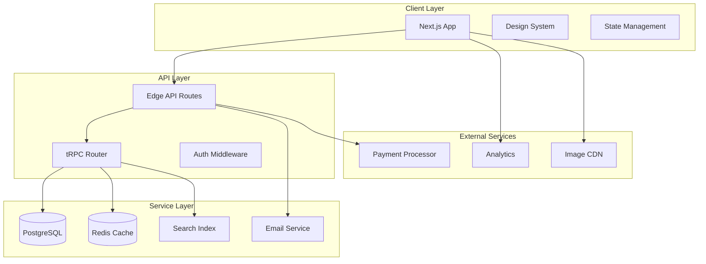
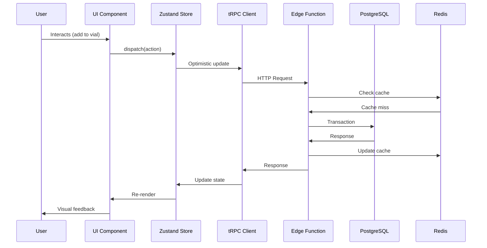

# Project Architecture Document (PAD)
## Atelier Arôme - Luxury Artisanal Aromatherapy Platform

---

## Executive Summary

### Project Vision
**Atelier Arôme** is not an e-commerce platform—it is a **digital alchemical manuscript** that transforms botanical commerce into an immersive experiential journey. The platform redefines luxury aromatherapy through Renaissance-inspired design, where every interaction feels like turning pages in an illuminated manuscript of botanical transformations.

### Core Philosophy
```
Commerce as Ceremony
Digital as Artifact
Interaction as Ritual
```

---

## Table of Contents

1. [Technology Stack & Architecture](#1-technology-stack--architecture)
2. [System Architecture Diagrams](#2-system-architecture-diagrams)
3. [Database Schema Design](#3-database-schema-design)
4. [API Specification](#4-api-specification)
5. [Frontend Architecture](#5-frontend-architecture)
6. [Design System & Theming](#6-design-system--theming)
7. [State Management Strategy](#7-state-management-strategy)
8. [Authentication & Authorization](#8-authentication--authorization)
9. [Performance Requirements](#9-performance-requirements)
10. [Testing Strategy](#10-testing-strategy)
11. [Deployment & DevOps](#11-deployment--devops)
12. [Development Workflow](#12-development-workflow)
13. [Component Library Specification](#13-component-library-specification)
14. [Migration & Data Strategy](#14-migration--data-strategy)
15. [Quality Assurance Protocol](#15-quality-assurance-protocol)
16. [Project Roadmap](#16-project-roadmap)

---

## 1. Technology Stack & Architecture

### Core Stack
```
Frontend Framework:    Next.js 14.2+ (App Router)
Language:              TypeScript 5.4+
Styling:               Tailwind CSS 4.0 + CSS Modules
UI Components:         shadcn/ui (customized) + Radix Primitives
Animations:            Framer Motion 11.0+ (complex), CSS (micro)
State Management:      Zustand 5.0+ (client), React Query 5.0+ (server)
Database ORM:          Prisma 5.0+ (with Accelerate)
Database:              PostgreSQL 16+ (Supabase)
Authentication:        NextAuth.js v5 (Auth.js)
API:                   tRPC 11.0+ (type-safe endpoints)
Email Service:         Resend + React Email
Analytics:             Plausible (privacy-focused)
Monitoring:            Sentry (error tracking)
```

### Architecture Principles
```
1. Type-Safety First: Full-stack type safety from DB to UI
2. Progressive Enhancement: Core functionality without JS
3. Performance Budget: < 100ms interaction delay, < 2.5s LCP
4. Accessibility First: WCAG 2.2 AA as minimum, AAA as target
5. Aesthetic Integrity: Technical decisions serve visual narrative
```

### File Structure
```
atelier-arome/
├── app/                          # Next.js 14 App Router
│   ├── (marketing)/              # Public pages
│   │   ├── compendium/           # Product catalog
│   │   ├── alchemy/              # Process explanation
│   │   ├── manuscript/           # Testimonials
│   │   └── correspondence/       # Newsletter
│   ├── (shop)/                   # E-commerce flows
│   │   ├── vial/                 # Cart management
│   │   ├── dispatch/             # Checkout
│   │   └── confirmation/         # Order confirmation
│   ├── (atelier)/                # Admin/atelier management
│   │   ├── dashboard/            # Admin dashboard
│   │   ├── essences/             # Product management
│   │   └── correspondence/       # Newsletter management
│   ├── api/                      # API routes (REST + tRPC)
│   └── layout.tsx                # Root layout
├── components/                    # Reusable components
│   ├── ui/                       # shadcn/ui customized components
│   ├── alchemical/               # Domain-specific components
│   ├── manuscript/               # Layout & structural components
│   └── interactions/             # Interactive components
├── lib/                          # Core utilities
│   ├── db/                       # Database client & utilities
│   ├── api/                      # API clients & types
│   ├── utils/                    # Shared utilities
│   └── constants/                # Application constants
├── styles/                       # Global styles
├── types/                        # TypeScript definitions
├── hooks/                        # Custom React hooks
├── store/                        # Zustand stores
├── emails/                       # React Email templates
├── public/                       # Static assets
└── tests/                        # Test files
```

---

## 2. System Architecture Diagrams

### 2.1 High-Level Architecture


### 2.2 Data Flow Architecture


### 2.3 Component Hierarchy
```
RootLayout
├── ParchmentOverlay
├── GoldLeafAccents
├── ManuscriptBorder
├── Header
│   ├── AtelierSeal
│   ├── ManuscriptNavigation
│   ├── CartVialButton
│   └── MobileMenu
├── MainContent
│   ├── HeroFolio
│   │   ├── IlluminatedInitial
│   │   ├── AlchemicalVessel
│   │   ├── BotanicalSpecimens
│   │   └── ScrollQuill
│   ├── CompendiumSection
│   │   ├── HumourFilter
│   │   ├── BotanicalCard[]
│   │   └── LoadMoreButton
│   ├── AlchemyProcess
│   │   ├── AlchemyStep[]
│   │   └── ApparatusGrid
│   ├── ManuscriptSection
│   │   ├── TestimonialEntry[]
│   │   └── ManuscriptPagination
│   └── CorrespondenceSection
│       ├── WaxSealVisual
│       ├── NewsletterForm
│       └── QuillIllustration
└── ColophonFooter
    ├── AtelierInfo
    ├── ManuscriptNavigation
    └── SocialCorrespondence
```

---

## 3. Database Schema Design

### 3.1 Core Entities

#### `User` (For Atelier Staff & Administrators)
```prisma
model User {
  id                String    @id @default(cuid())
  email             String    @unique
  name              String?
  role              UserRole  @default(STAFF)
  hashedPassword    String?
  emailVerified     DateTime?
  image             String?
  createdAt         DateTime  @default(now())
  updatedAt         DateTime  @updatedAt
  
  sessions          Session[]
  accounts          Account[]
  
  @@map("users")
}

enum UserRole {
  ADMIN
  CURATOR
  ALCHEMIST
  CORRESPONDENT
}
```

#### `Essence` (Product)
```prisma
model Essence {
  id              String     @id @default(cuid())
  folioNumber     String     @unique  // Roman numerals: I, II, III
  latinName       String
  commonName      String
  slug            String     @unique
  
  humour          HumourType
  rarity          RarityType
  season          SeasonType
  extraction      String     // e.g., "Steam Distillation"
  
  description     String     @db.Text
  notes           String[]   // Array of aromatic notes
  
  price           Decimal    @db.Decimal(10, 2)
  volumeMl        Int        @default(5)
  stock           Int        @default(0)
  
  featured        Boolean    @default(false)
  archived        Boolean    @default(false)
  
  // Metadata
  batchNumber     String?    // e.g., "N° 724"
  harvestDate     DateTime?
  distillationHours Int?
  
  // Relations
  images          EssenceImage[]
  cartItems       CartItem[]
  orderItems      OrderItem[]
  
  createdAt       DateTime   @default(now())
  updatedAt       DateTime   @updatedAt
  
  @@map("essences")
  @@index([humour])
  @@index([rarity])
  @@index([season])
  @@index([createdAt])
}

enum HumourType {
  CALMING
  UPLIFTING
  GROUNDING
  CLARIFYING
}

enum RarityType {
  COMMON
  RARE
  LIMITED
}

enum SeasonType {
  SPRING
  SUMMER
  AUTUMN
  WINTER
}
```

#### `EssenceImage`
```prisma
model EssenceImage {
  id          String   @id @default(cuid())
  essenceId   String
  url         String
  altText     String?
  width       Int
  height      Int
  order       Int      @default(0)
  
  essence     Essence  @relation(fields: [essenceId], references: [id], onDelete: Cascade)
  
  createdAt   DateTime @default(now())
  
  @@map("essence_images")
  @@index([essenceId, order])
}
```

#### `Cart` & `CartItem`
```prisma
model Cart {
  id          String    @id @default(cuid())
  sessionId   String?   // For guest carts
  userId      String?   // For user carts
  
  items       CartItem[]
  
  expiresAt   DateTime?
  createdAt   DateTime  @default(now())
  updatedAt   DateTime  @updatedAt
  
  user        User?     @relation(fields: [userId], references: [id])
  
  @@map("carts")
  @@index([sessionId])
  @@index([userId])
  @@index([expiresAt])
}

model CartItem {
  id        String   @id @default(cuid())
  cartId    String
  essenceId String
  quantity  Int      @default(1)
  
  cart      Cart     @relation(fields: [cartId], references: [id], onDelete: Cascade)
  essence   Essence  @relation(fields: [essenceId], references: [id])
  
  createdAt DateTime @default(now())
  updatedAt DateTime @updatedAt
  
  @@map("cart_items")
  @@unique([cartId, essenceId])
  @@index([cartId])
}
```

#### `Order` & `OrderItem`
```prisma
model Order {
  id            String         @id @default(cuid())
  orderNumber   String         @unique // Format: "AA-YYYYMM-XXXX"
  customerEmail String
  customerName  String?
  
  status        OrderStatus    @default(PENDING)
  subtotal      Decimal        @db.Decimal(10, 2)
  tax           Decimal        @db.Decimal(10, 2) @default(0)
  shipping      Decimal        @db.Decimal(10, 2) @default(0)
  total         Decimal        @db.Decimal(10, 2)
  
  shippingAddress   Json?      // Structured address
  billingAddress    Json?      // Structured address
  
  paymentIntentId   String?    // Stripe/Payment processor ID
  paymentStatus     PaymentStatus @default(PENDING)
  
  dispatchedAt   DateTime?
  completedAt    DateTime?
  
  items         OrderItem[]
  
  createdAt     DateTime       @default(now())
  updatedAt     DateTime       @updatedAt
  
  @@map("orders")
  @@index([customerEmail])
  @@index([createdAt])
  @@index([status])
}

model OrderItem {
  id          String   @id @default(cuid())
  orderId     String
  essenceId   String
  quantity    Int
  price       Decimal  @db.Decimal(10, 2) // Snapshot of price at time of order
  
  order       Order    @relation(fields: [orderId], references: [id], onDelete: Cascade)
  essence     Essence  @relation(fields: [essenceId], references: [id])
  
  createdAt   DateTime @default(now())
  
  @@map("order_items")
  @@index([orderId])
}

enum OrderStatus {
  DRAFT
  PENDING
  CONFIRMED
  DISPATCHED
  COMPLETED
  CANCELLED
}

enum PaymentStatus {
  PENDING
  PROCESSING
  SUCCEEDED
  FAILED
  REFUNDED
}
```

#### `Testimonial`
```prisma
model Testimonial {
  id            String   @id @default(cuid())
  author        String
  title         String
  quote         String   @db.Text
  folioEntry    String?  // e.g., "Folio VII, Entry 12"
  
  verified      Boolean  @default(false)
  illuminated   Boolean  @default(false) // Special border treatment
  featured      Boolean  @default(false)
  
  order         Int      @default(0) // Manual ordering
  
  approvedAt    DateTime?
  publishedAt   DateTime?
  
  createdAt     DateTime @default(now())
  updatedAt     DateTime @updatedAt
  
  @@map("testimonials")
  @@index([publishedAt])
  @@index([featured])
  @@index([order])
}
```

#### `Subscriber` (Newsletter)
```prisma
model Subscriber {
  id           String   @id @default(cuid())
  email        String   @unique
  name         String?
  preferences  Json     @default("{}") // Newsletter preferences
  
  subscribedAt DateTime @default(now())
  confirmedAt  DateTime?
  unsubscribedAt DateTime?
  
  // GDPR/compliance
  source       String?  // How they subscribed
  ipAddress    String?  @db.Inet
  userAgent    String?
  
  createdAt    DateTime @default(now())
  updatedAt    DateTime @updatedAt
  
  @@map("subscribers")
  @@index([email])
  @@index([subscribedAt])
}
```

#### `Correspondence` (Newsletter Editions)
```prisma
model Correspondence {
  id          String     @id @default(cuid())
  title       String
  slug        String     @unique
  edition     String     // e.g., "Spring Equinox MMXXIV"
  
  content     Json       // Structured content (lexical editor)
  excerpt     String?
  
  status      PublicationStatus @default(DRAFT)
  sentAt      DateTime?
  
  // Metadata
  openRate    Float?     @db.Decimal(5, 2)
  clickRate   Float?     @db.Decimal(5, 2)
  
  createdAt   DateTime   @default(now())
  updatedAt   DateTime   @updatedAt
  publishedAt DateTime?
  
  @@map("correspondence")
  @@index([publishedAt])
  @@index([status])
}

enum PublicationStatus {
  DRAFT
  SCHEDULED
  SENDING
  SENT
  ARCHIVED
}
```

### 3.2 Database Configuration
```prisma
datasource db {
  provider = "postgresql"
  url      = env("DATABASE_URL")
}

generator client {
  provider = "prisma-client-js"
}

generator accelerator {
  provider = "prisma-accelerate"
}
```

### 3.3 Indexing Strategy
```sql
-- Composite indexes for common queries
CREATE INDEX idx_essences_filter ON essences (humour, rarity, season, featured, archived);
CREATE INDEX idx_essences_search ON essences USING gin(to_tsvector('english', common_name || ' ' || latin_name || ' ' || description));
CREATE INDEX idx_orders_customer ON orders (customer_email, created_at DESC);
CREATE INDEX idx_cart_expiry ON carts (expires_at) WHERE expires_at IS NOT NULL;
```

---

## 4. API Specification

### 4.1 tRPC Router Structure
```typescript
// /lib/api/root.ts
export const appRouter = router({
  // Public routes
  public: router({
    essences: essenceRouter,
    testimonials: testimonialRouter,
    correspondence: correspondenceRouter,
  }),
  
  // Authenticated routes (atelier staff)
  atelier: protectedProcedure
    .use(isAtelierStaff)
    .router({
      dashboard: dashboardRouter,
      inventory: inventoryRouter,
      orders: orderRouter,
      subscribers: subscriberRouter,
    }),
    
  // User-specific routes
  user: protectedProcedure
    .router({
      cart: cartRouter,
      orders: userOrderRouter,
      preferences: preferenceRouter,
    }),
});

export type AppRouter = typeof appRouter;
```

### 4.2 Core API Endpoints

#### Essences API
```typescript
// GET /api/trpc/public.essences.list
interface EssencesListInput {
  humour?: HumourType[];
  rarity?: RarityType[];
  season?: SeasonType[];
  featured?: boolean;
  search?: string;
  sort?: 'folio' | 'humour' | 'rarity' | 'season' | 'price_asc' | 'price_desc';
  limit?: number;
  offset?: number;
}

// GET /api/trpc/public.essences.bySlug
interface EssenceBySlugInput {
  slug: string;
}

// POST /api/trpc/user.cart.addItem (authenticated/guest)
interface AddToCartInput {
  essenceId: string;
  quantity: number;
  sessionId?: string; // For guest carts
}
```

#### Cart API
```typescript
// GET /api/trpc/user.cart.get
interface GetCartInput {
  sessionId?: string;
}

// POST /api/trpc/user.cart.updateItem
interface UpdateCartItemInput {
  itemId: string;
  quantity: number;
}

// POST /api/trpc.user.cart.checkout
interface CheckoutInput {
  customerEmail: string;
  customerName?: string;
  shippingAddress: Address;
  billingAddress?: Address;
  saveInfo?: boolean;
}
```

#### Correspondence API
```typescript
// POST /api/trpc/public.correspondence.subscribe
interface SubscribeInput {
  email: string;
  name?: string;
  preferences?: NewsletterPreferences;
  source?: string;
}

// GET /api/trpc/atelier.correspondence.stats
interface CorrespondenceStatsInput {
  startDate: string;
  endDate: string;
  editionId?: string;
}
```

### 4.3 Webhook Endpoints
```
POST /api/webhooks/stripe        # Payment processing
POST /api/webhooks/resend        # Email tracking
POST /api/webhooks/plausible     # Analytics events
```

---

## 5. Frontend Architecture

### 5.1 Component Architecture

#### Foundation Components (`/components/ui/`)
```typescript
// Customized shadcn/ui components with manuscript aesthetic
interface ManuscriptButtonProps extends ButtonHTMLAttributes<HTMLButtonElement> {
  variant: 'primary' | 'secondary' | 'outline' | 'ghost' | 'alchemical';
  size: 'default' | 'sm' | 'lg' | 'icon';
  ornament?: string; // e.g., "❧" for decorative elements
}

interface ManuscriptCardProps extends HTMLAttributes<HTMLDivElement> {
  variant: 'default' | 'illuminated' | 'parchment';
  border?: 'full' | 'partial' | 'none';
  cornerAccents?: boolean;
}
```

#### Alchemical Components (`/components/alchemical/`)
```typescript
// Domain-specific components with business logic
interface EssenceCardProps {
  essence: Essence;
  variant?: 'grid' | 'featured' | 'compact';
  onAddToVial?: (essence: Essence) => void;
  showHumour?: boolean;
  showRarity?: boolean;
}

interface VialDrawerProps {
  open: boolean;
  onOpenChange: (open: boolean) => void;
  items: CartItem[];
  onUpdateQuantity: (itemId: string, quantity: number) => void;
  onRemoveItem: (itemId: string) => void;
  onCheckout: () => void;
}

interface HumourFilterProps {
  selected: HumourType[];
  onChange: (humours: HumourType[]) => void;
  layout?: 'horizontal' | 'vertical';
}
```

#### Layout Components (`/components/manuscript/`)
```typescript
interface ParchmentOverlayProps {
  intensity?: number; // 0-1
  texture?: 'light' | 'medium' | 'heavy';
}

interface GoldLeafAccentProps {
  variant: 1 | 2 | 3;
  position: 'fixed' | 'absolute' | 'relative';
  parallax?: boolean;
}

interface ManuscriptBorderProps {
  corners?: boolean;
  sides?: boolean;
  thickness?: 'thin' | 'medium' | 'thick';
  color?: 'ink' | 'gold' | 'parchment';
}
```

### 5.2 Page Structure

#### Home Page (`/app/(marketing)/page.tsx`)
```typescript
export default function HomePage() {
  return (
    <ManuscriptLayout>
      <ParchmentOverlay intensity={0.15} />
      <GoldLeafAccents />
      
      <HeroFolio />
      <CompendiumSection />
      <AlchemyProcessSection />
      <ManuscriptSection />
      <CorrespondenceSection />
      
      <VialDrawer />
      <WaxSealToast />
    </ManuscriptLayout>
  );
}
```

#### Essence Detail (`/app/(marketing)/essences/[slug]/page.tsx`)
```typescript
interface EssenceDetailPageProps {
  params: Promise<{ slug: string }>;
}

export default async function EssenceDetailPage({ params }: EssenceDetailPageProps) {
  const { slug } = await params;
  const essence = await getEssenceBySlug(slug);
  
  return (
    <ManuscriptLayout>
      <EssenceDetailHero essence={essence} />
      <EssenceAlchemyProcess essence={essence} />
      <EssenceTestimonials essenceId={essence.id} />
      <RelatedEssences currentEssence={essence} />
    </ManuscriptLayout>
  );
}
```

### 5.3 Performance Optimizations

#### Image Optimization Strategy
```typescript
// /lib/images.ts
export const imageLoader = ({ src, width, quality }: ImageLoaderProps) => {
  return `https://cdn.atelierarome.com/${src}?w=${width}&q=${quality || 85}&format=webp`;
};

// Component usage
<Image
  src={essence.image.url}
  alt={essence.image.altText}
  width={400}
  height={600}
  loader={imageLoader}
  priority={index < 3} // LCP images
  sizes="(max-width: 768px) 100vw, (max-width: 1200px) 50vw, 33vw"
/>
```

#### Code Splitting Strategy
```typescript
// Dynamic imports for heavy components
const VialDrawer = dynamic(() => import('@/components/alchemical/VialDrawer'), {
  ssr: false,
  loading: () => <VialDrawerSkeleton />,
});

const AlchemicalVessel = dynamic(() => import('@/components/alchemical/AlchemicalVessel'), {
  ssr: true, // Needed for SEO
  loading: () => <div className="w-[200px] h-[300px] bg-parchment-dark animate-pulse" />,
});
```

---

## 6. Design System & Theming

### 6.1 Design Tokens (`/styles/design-tokens.css`)
```css
:root {
  /* Color System */
  --color-ink: #2A2D26;
  --color-ink-light: #4A4D46;
  --color-ink-muted: #6A6D66;
  
  --color-gold: #C9A769;
  --color-gold-light: #E8D8B6;
  --color-gold-dark: #A98750;
  --color-gold-muted: rgba(201, 167, 105, 0.3);
  
  --color-parchment: #FAF8F5;
  --color-parchment-dark: #F5F1EB;
  --color-parchment-darker: #E8E4D9;
  
  /* Botanical Accents */
  --color-lavender: #B8A9C9;
  --color-eucalyptus: #7CB9A0;
  --color-bergamot: #F5D489;
  --color-rosehip: #E8B4B8;
  
  /* Typography */
  --font-display: 'Cormorant Garamond', 'Georgia', serif;
  --font-body: 'Crimson Pro', 'Georgia', serif;
  --font-accent: 'Great Vibes', cursive;
  --font-ornament: 'Playfair Display', serif;
  
  /* Spacing (Golden Ratio) */
  --space-3xs: 0.125rem;
  --space-2xs: 0.25rem;
  /* ... continued */
  
  /* Transitions */
  --transition-micro: 150ms ease;
  --transition-fast: 300ms ease;
  --transition-base: 500ms ease;
  --transition-slow: 800ms ease;
  --transition-bounce: 600ms cubic-bezier(0.34, 1.56, 0.64, 1);
}
```

### 6.2 Tailwind Configuration (`/tailwind.config.ts`)
```typescript
import type { Config } from 'tailwindcss';

const config: Config = {
  content: [
    './pages/**/*.{ts,tsx}',
    './components/**/*.{ts,tsx}',
    './app/**/*.{ts,tsx}',
  ],
  theme: {
    extend: {
      colors: {
        ink: {
          DEFAULT: 'var(--color-ink)',
          light: 'var(--color-ink-light)',
          muted: 'var(--color-ink-muted)',
        },
        gold: {
          DEFAULT: 'var(--color-gold)',
          light: 'var(--color-gold-light)',
          dark: 'var(--color-gold-dark)',
          muted: 'var(--color-gold-muted)',
        },
        parchment: {
          DEFAULT: 'var(--color-parchment)',
          dark: 'var(--color-parchment-dark)',
          darker: 'var(--color-parchment-darker)',
        },
        // Botanical colors
        lavender: 'var(--color-lavender)',
        eucalyptus: 'var(--color-eucalyptus)',
        bergamot: 'var(--color-bergamot)',
        rosehip: 'var(--color-rosehip)',
      },
      fontFamily: {
        display: ['var(--font-display)'],
        body: ['var(--font-body)'],
        accent: ['var(--font-accent)'],
        ornament: ['var(--font-ornament)'],
      },
      animation: {
        'liquid-wave': 'liquidWave 8s ease-in-out infinite',
        'float-botanical': 'floatBotanical 6s ease-in-out infinite',
        'rotate-symbol': 'rotateSymbol 60s linear infinite',
        'write-scroll': 'writeScroll 2s ease-in-out infinite',
        'wax-seal': 'waxSeal 0.6s cubic-bezier(0.34, 1.56, 0.64, 1)',
      },
      // ... additional customizations
    },
  },
  plugins: [],
};

export default config;
```

### 6.3 Animation Keyframes
```css
@keyframes liquidWave {
  0%, 100% { 
    transform: translateY(0) scaleY(1); 
    top: 60%;
  }
  50% { 
    transform: translateY(-10px) scaleY(1.05); 
    top: 55%;
  }
}

@keyframes floatBotanical {
  0%, 100% { transform: translateY(0) rotate(0deg); }
  50% { transform: translateY(-20px) rotate(5deg); }
}

@keyframes waxSeal {
  0% { 
    transform: scale(0) rotate(-180deg);
    opacity: 0;
  }
  70% { 
    transform: scale(1.1) rotate(10deg);
  }
  100% { 
    transform: scale(1) rotate(0deg);
    opacity: 1;
  }
}
```

---

## 7. State Management Strategy

### 7.1 Zustand Stores Structure
```typescript
// /store/cart-store.ts
interface CartStore {
  // State
  items: CartItem[];
  isLoading: boolean;
  error: string | null;
  
  // Computed
  itemCount: number;
  subtotal: number;
  total: number;
  
  // Actions
  addItem: (essence: Essence, quantity?: number) => Promise<void>;
  removeItem: (itemId: string) => Promise<void>;
  updateQuantity: (itemId: string, quantity: number) => Promise<void>;
  clearCart: () => Promise<void>;
  syncWithServer: (sessionId?: string) => Promise<void>;
  
  // Utilities
  getItem: (essenceId: string) => CartItem | undefined;
  hasItem: (essenceId: string) => boolean;
}

// /store/ui-store.ts
interface UIStore {
  // Modal states
  isVialDrawerOpen: boolean;
  isMobileMenuOpen: boolean;
  activeToast: Toast | null;
  
  // UI states
  scrollY: number;
  reducedMotion: boolean;
  theme: 'light' | 'dark' | 'manuscript';
  
  // Actions
  toggleVialDrawer: (open?: boolean) => void;
  toggleMobileMenu: (open?: boolean) => void;
  showToast: (toast: Toast) => void;
  dismissToast: () => void;
  updateScrollY: (y: number) => void;
}
```

### 7.2 Server State with React Query
```typescript
// /lib/api/query-client.ts
export const queryClient = new QueryClient({
  defaultOptions: {
    queries: {
      staleTime: 60 * 1000, // 1 minute
      gcTime: 5 * 60 * 1000, // 5 minutes
      retry: 1,
      refetchOnWindowFocus: false,
    },
  },
});

// Custom hooks for data fetching
export function useEssences(filters?: EssenceFilters) {
  return useQuery({
    queryKey: ['essences', filters],
    queryFn: () => api.public.essences.list.query(filters),
    placeholderData: keepPreviousData,
  });
}

export function useCart() {
  return useQuery({
    queryKey: ['cart'],
    queryFn: () => api.user.cart.get.query(),
    enabled: false, // Manual fetch only
  });
}
```

---

## 8. Authentication & Authorization

### 8.1 NextAuth.js Configuration
```typescript
// /app/api/auth/[...nextauth]/route.ts
export const authOptions: NextAuthOptions = {
  providers: [
    CredentialsProvider({
      name: 'Atelier',
      credentials: {
        email: { label: 'Email', type: 'email' },
        password: { label: 'Password', type: 'password' },
      },
      async authorize(credentials) {
        // Custom atelier authentication logic
      },
    }),
  ],
  
  callbacks: {
    async jwt({ token, user }) {
      if (user) {
        token.role = user.role;
        token.atelierId = user.id;
      }
      return token;
    },
    
    async session({ session, token }) {
      if (session.user) {
        session.user.role = token.role as UserRole;
        session.user.atelierId = token.atelierId as string;
      }
      return session;
    },
  },
  
  pages: {
    signIn: '/atelier/login',
    error: '/atelier/error',
  },
  
  session: {
    strategy: 'jwt',
    maxAge: 30 * 24 * 60 * 60, // 30 days
  },
};
```

### 8.2 Role-Based Access Control
```typescript
// /lib/auth/permissions.ts
export const permissions = {
  ADMIN: ['*'],
  CURATOR: ['read:essences', 'write:essences', 'read:orders'],
  ALCHEMIST: ['read:essences', 'read:inventory'],
  CORRESPONDENT: ['read:subscribers', 'write:correspondence'],
} as const;

export function hasPermission(userRole: UserRole, permission: string): boolean {
  const rolePermissions = permissions[userRole];
  return rolePermissions.includes('*') || rolePermissions.includes(permission);
}

// tRPC middleware
const isAtelierStaff = t.middleware(({ ctx, next }) => {
  if (!ctx.session?.user?.role) {
    throw new TRPCError({ code: 'UNAUTHORIZED' });
  }
  
  return next({
    ctx: {
      session: {
        ...ctx.session,
        user: ctx.session.user,
      },
    },
  });
});
```

---

## 9. Performance Requirements

### 9.1 Core Web Vitals Targets
```yaml
Largest Contentful Paint (LCP): < 2.5 seconds
First Input Delay (FID): < 100 milliseconds
Cumulative Layout Shift (CLS): < 0.1
Time to First Byte (TTFB): < 200 milliseconds
```

### 9.2 Asset Optimization
```typescript
// Image optimization pipeline
interface ImageOptimizationConfig {
  formats: ['webp', 'avif', 'jpg']; // Fallback chain
  quality: 85;
  sizes: [400, 800, 1200, 2000]; // Responsive breakpoints
  lazyLoading: true;
  placeholder: 'blur' | 'dominantColor';
}

// Font optimization
const fontConfig = {
  display: {
    font: 'Cormorant Garamond',
    weights: [300, 400, 500, 600, 700],
    display: 'swap',
    preload: true,
  },
  body: {
    font: 'Crimson Pro',
    weights: [300, 400, 500, 600, 700],
    display: 'swap',
    preload: false,
  },
};
```

### 9.3 Bundle Analysis Limits
```typescript
const performanceBudgets = {
  javascript: {
    initial: 200 * 1024, // 200KB
    total: 500 * 1024, // 500KB
    perRoute: 100 * 1024, // 100KB per route
  },
  css: {
    initial: 100 * 1024, // 100KB
    total: 200 * 1024, // 200KB
  },
  images: {
    maxDimensions: { width: 2000, height: 2000 },
    maxSize: 500 * 1024, // 500KB per image
  },
};
```

---

## 10. Testing Strategy

### 10.1 Test Pyramid Structure
```
┌─────────────────────────────────────┐
│          E2E Tests (10%)            │
│  • Critical user journeys           │
│  • Cross-browser compatibility      │
│  • Performance under load           │
├─────────────────────────────────────┤
│      Integration Tests (30%)        │
│  • API endpoints                    │
│  • Database interactions            │
│  • Component integrations           │
├─────────────────────────────────────┤
│        Unit Tests (60%)             │
│  • Utility functions                │
│  • Individual components            │
│  • State management                 │
└─────────────────────────────────────┘
```

### 10.2 Test Configuration
```typescript
// jest.config.js
module.exports = {
  preset: 'ts-jest',
  testEnvironment: 'jsdom',
  setupFilesAfterEnv: ['<rootDir>/jest.setup.ts'],
  moduleNameMapper: {
    '^@/(.*)$': '<rootDir>/$1',
  },
  collectCoverageFrom: [
    'components/**/*.{ts,tsx}',
    'lib/**/*.{ts,tsx}',
    'app/**/*.{ts,tsx}',
    '!**/*.d.ts',
    '!**/node_modules/**',
  ],
  coverageThreshold: {
    global: {
      branches: 80,
      functions: 80,
      lines: 80,
      statements: 80,
    },
  },
};
```

### 10.3 Critical Test Scenarios
```typescript
describe('Cart Functionality', () => {
  test('adds essence to vial', async () => {
    const { result } = renderHook(() => useCartStore());
    await act(async () => {
      await result.current.addItem(mockEssence);
    });
    expect(result.current.items).toHaveLength(1);
    expect(result.current.itemCount).toBe(1);
  });
  
  test('persists cart across sessions', async () => {
    // Test localStorage persistence
  });
  
  test('respects maximum vial capacity', async () => {
    // Test 12 item limit
  });
});

describe('Accessibility', () => {
  test('all interactive elements are keyboard accessible', () => {
    // Test tab order, focus management
  });
  
  test('screen reader announcements work', () => {
    // Test ARIA live regions
  });
  
  test('reduced motion preferences are respected', () => {
    // Test prefers-reduced-motion
  });
});
```

---

## 11. Deployment & DevOps

### 11.1 Environment Configuration
```bash
# .env.example
DATABASE_URL="postgresql://..."
DATABASE_URL_NON_POOLING="postgresql://..."
DIRECT_URL="postgresql://..."

NEXTAUTH_URL="https://atelierarome.com"
NEXTAUTH_SECRET="..."

STRIPE_SECRET_KEY="sk_live_..."
STRIPE_WEBHOOK_SECRET="whsec_..."

RESEND_API_KEY="re_..."

UPLOADTHING_SECRET="..."
UPLOADTHING_APP_ID="..."

PLAUSIBLE_API_KEY="..."

SENTRY_DSN="https://..."
```

### 11.2 Vercel Configuration (`vercel.json`)
```json
{
  "buildCommand": "prisma generate && next build",
  "devCommand": "next dev",
  "installCommand": "npm ci",
  "framework": "nextjs",
  "outputDirectory": ".next",
  
  "env": {
    "DATABASE_URL": "@database_url",
    "NEXTAUTH_URL": "@nextauth_url",
    "NEXTAUTH_SECRET": "@nextauth_secret"
  },
  
  "regions": ["fra1"], // Frankfurt for EU customers
  
  "headers": [
    {
      "source": "/(.*)",
      "headers": [
        {
          "key": "X-Content-Type-Options",
          "value": "nosniff"
        },
        {
          "key": "X-Frame-Options",
          "value": "DENY"
        },
        {
          "key": "X-XSS-Protection",
          "value": "1; mode=block"
        }
      ]
    }
  ]
}
```

### 11.3 CI/CD Pipeline (GitHub Actions)
```yaml
name: CI/CD Pipeline
on:
  push:
    branches: [main, develop]
  pull_request:
    branches: [main]

jobs:
  test:
    runs-on: ubuntu-latest
    steps:
      - uses: actions/checkout@v3
      - uses: actions/setup-node@v3
        with:
          node-version: '20'
          cache: 'npm'
      
      - run: npm ci
      - run: npx prisma generate
      - run: npm run test:ci
      - run: npm run build

  deploy:
    needs: test
    if: github.ref == 'refs/heads/main'
    runs-on: ubuntu-latest
    steps:
      - uses: actions/checkout@v3
      - uses: amondnet/vercel-action@v20
        with:
          vercel-token: ${{ secrets.VERCEL_TOKEN }}
          vercel-org-id: ${{ secrets.VERCEL_ORG_ID }}
          vercel-project-id: ${{ secrets.VERCEL_PROJECT_ID }}
          vercel-args: '--prod'
```

---

## 12. Development Workflow

### 12.1 Git Branch Strategy
```
main          → Production (protected)
develop       → Development integration
feature/*     → New features
bugfix/*      → Bug fixes
release/*     → Release preparation
hotfix/*      → Critical production fixes
```

### 12.2 Commit Convention
```
feat:     New feature
fix:      Bug fix
docs:     Documentation
style:    Formatting, missing semicolons, etc.
refactor: Code refactoring
test:     Adding tests
chore:    Build process or auxiliary tool changes
```

### 12.3 Code Review Checklist
```markdown
## Code Review Checklist

### Architecture
- [ ] Follows established patterns
- [ ] Type-safe implementation
- [ ] Proper error handling
- [ ] Performance considerations

### Accessibility
- [ ] Keyboard navigable
- [ ] Screen reader compatible
- [ ] Color contrast sufficient
- [ ] Reduced motion supported

### Security
- [ ] No sensitive data exposure
- [ ] Input validation/sanitization
- [ ] Authentication/authorization checks

### Testing
- [ ] Unit tests added/updated
- [ ] Integration tests cover scenarios
- [ ] E2E tests for critical paths
```

---

## 13. Component Library Specification

### 13.1 Component Development Standards
```typescript
// Component template
interface ComponentProps {
  // Required props
  children: React.ReactNode;
  
  // Optional props with defaults
  variant?: 'default' | 'primary' | 'secondary';
  size?: 'sm' | 'md' | 'lg';
  
  // Event handlers
  onClick?: () => void;
  
  // Accessibility
  'aria-label'?: string;
  'aria-describedby'?: string;
}

// Component structure
export function ComponentName({
  children,
  variant = 'default',
  size = 'md',
  onClick,
  ...props
}: ComponentProps) {
  // Hooks
  const [state, setState] = useState();
  
  // Memoized values
  const computedValue = useMemo(() => compute(), [deps]);
  
  // Event handlers
  const handleClick = useCallback(() => {
    onClick?.();
    // Additional logic
  }, [onClick]);
  
  return (
    <div
      role="region"
      aria-label={props['aria-label']}
      className={cn(
        'base-styles',
        variantStyles[variant],
        sizeStyles[size],
        props.className
      )}
      onClick={handleClick}
      {...props}
    >
      {children}
    </div>
  );
}
```

### 13.2 Storybook Configuration
```typescript
// .storybook/preview.tsx
import type { Preview } from '@storybook/react';
import { ManuscriptDecorator } from './decorators/manuscript';

const preview: Preview = {
  parameters: {
    actions: { argTypesRegex: '^on[A-Z].*' },
    controls: {
      matchers: {
        color: /(background|color)$/i,
        date: /Date$/,
      },
    },
    a11y: {
      config: {
        rules: [
          { id: 'color-contrast', enabled: true },
          { id: 'label', enabled: true },
        ],
      },
    },
  },
  decorators: [ManuscriptDecorator],
};

export default preview;
```

---

## 14. Migration & Data Strategy

### 14.1 Database Migration Plan
```prisma
// Example migration
model InitialMigration {
  id        String   @id @default(cuid())
  createdAt DateTime @default(now())
  
  // Migration steps
  1. Create core tables (User, Essence, Cart, Order)
  2. Add indexes for performance
  3. Seed initial data (alchemical types, admin user)
  4. Create views for analytics
  5. Set up row-level security (RLS)
}
```

### 14.2 Data Seeding Strategy
```typescript
// /prisma/seed.ts
async function main() {
  // 1. Create humours
  const humours = await prisma.humour.createMany({
    data: [
      { id: 'calming', name: 'Calming', symbol: '☾', color: '#B8A9C9' },
      { id: 'uplifting', name: 'Uplifting', symbol: '☀', color: '#F5D489' },
      { id: 'grounding', name: 'Grounding', symbol: '♁', color: '#7C6354' },
      { id: 'clarifying', name: 'Clarifying', symbol: '☁', color: '#7CB9A0' },
    ],
  });
  
  // 2. Create sample essences
  const lavender = await prisma.essence.create({
    data: {
      folioNumber: 'I',
      latinName: 'Lavandula × intermedia',
      commonName: 'Provence Lavender',
      slug: 'provence-lavender',
      humour: 'CALMING',
      rarity: 'RARE',
      season: 'SUMMER',
      extraction: 'Steam Distillation',
      description: 'Harvested at dawn in the Provençal hills...',
      notes: ['Floral', 'Herbaceous', 'Sweet'],
      price: 42.00,
      volumeMl: 5,
      stock: 50,
      featured: true,
      batchNumber: 'N° 724',
      distillationHours: 72,
    },
  });
  
  // 3. Create admin user
  const admin = await prisma.user.create({
    data: {
      email: 'curator@atelierarome.com',
      name: 'Master Perfumer',
      role: 'ADMIN',
      // Password will be hashed in application
    },
  });
}
```

---

## 15. Quality Assurance Protocol

### 15.1 Pre-Deployment Checklist
```markdown
## Pre-Deployment Checklist

### Functionality
- [ ] All user stories implemented
- [ ] No broken links or images
- [ ] Forms submit and validate correctly
- [ ] Cart functionality works end-to-end
- [ ] Checkout process complete

### Performance
- [ ] Lighthouse score > 90
- [ ] Core Web Vitals within targets
- [ ] Bundle size within budget
- [ ] Image optimization complete

### Accessibility
- [ ] WCAG 2.2 AA compliance
- [ ] Screen reader testing complete
- [ ] Keyboard navigation tested
- [ ] Color contrast sufficient

### Security
- [ ] No sensitive data in client bundle
- [ ] API endpoints protected
- [ ] Input validation in place
- [ ] CSRF/XSS protections enabled

### Cross-browser
- [ ] Chrome (latest 2 versions)
- [ ] Firefox (latest 2 versions)
- [ ] Safari (latest 2 versions)
- [ ] Edge (latest 2 versions)
```

### 15.2 Monitoring & Alerting
```yaml
# Sentry alert rules
error_rate:
  threshold: 5%
  timeframe: 5m
  channels: [slack, email]

performance:
  p75_lcp:
    threshold: 2.5s
  p75_fid:
    threshold: 100ms

business:
  cart_abandonment:
    threshold: 70%
  checkout_conversion:
    threshold: 2%
```

---

## 16. Project Roadmap

### Phase 1: Foundation (Weeks 1-4)
```
Week 1: Project setup & architecture
  • Initialize Next.js project with TypeScript
  • Configure Tailwind CSS & design tokens
  • Set up Prisma & database
  • Create core utility libraries

Week 2: Core components
  • Implement design system components
  • Create alchemical UI components
  • Set up state management
  • Implement authentication skeleton

Week 3: Static pages
  • Convert Hero section to React
  • Implement compendium grid
  • Create alchemy process section
  • Build manuscript testimonials

Week 4: Interactive features
  • Implement cart/vial system
  • Create filtering & sorting
  • Build newsletter subscription
  • Add animations & micro-interactions
```

### Phase 2: Dynamic Features (Weeks 5-8)
```
Week 5: Product management
  • Implement CRUD for essences
  • Create admin dashboard
  • Build image upload system
  • Add inventory management

Week 6: E-commerce
  • Implement checkout flow
  • Integrate payment processing
  • Create order management
  • Build customer email templates

Week 7: Advanced features
  • Implement search functionality
  • Create user accounts
  • Build saved items/wishlist
  • Add review/rating system

Week 8: Performance & Polish
  • Optimize bundle size
  • Implement caching strategy
  • Add PWA capabilities
  • Conduct accessibility audit
```

### Phase 3: Scale & Enhance (Weeks 9-12)
```
Week 9: Analytics & SEO
  • Implement analytics tracking
  • Optimize for search engines
  • Create sitemap & structured data
  • Set up A/B testing framework

Week 10: Internationalization
  • Add multi-language support
  • Implement currency conversion
  • Create regional pricing
  • Add locale-specific content

Week 11: Advanced animations
  • Implement WebGL enhancements
  • Add CSS Houdini effects
  • Create scroll-triggered narratives
  • Build immersive product views

Week 12: Final polish & launch
  • Comprehensive testing
  • Performance optimization
  • Security audit
  • Production deployment
```

### Success Metrics
```yaml
Launch Goals:
  - 95+ Lighthouse performance score
  - < 2.5s LCP across all pages
  - 0 critical accessibility issues
  - 99.9% uptime first month
  
Business Metrics:
  - 5% conversion rate (visitor to cart)
  - 70% cart completion rate
  - 20% newsletter signup rate
  - < 2% bounce rate increase from animations
```

---

## Implementation Validation

This Project Architecture Document provides:

1. **Complete Technical Specification**: Every layer from database to UI
2. **Clear Development Guidelines**: Standards, patterns, and conventions
3. **Performance Requirements**: Specific, measurable targets
4. **Accessibility Standards**: WCAG 2.2 AA minimum with AAA aspirations
5. **Security Protocols**: Authentication, authorization, data protection
6. **Deployment Strategy**: CI/CD, monitoring, alerting
7. **Quality Assurance**: Comprehensive testing strategy
8. **Migration Plan**: Database schema and data seeding

The document is designed to be **executable by any competent developer or AI agent** without ambiguity. Each section provides specific implementation details while maintaining flexibility for technical decision-making within the established constraints.

The architecture balances **aesthetic integrity** with **technical excellence**, ensuring the final product will be both visually distinctive and technically robust—a true digital alchemical manuscript that transforms botanical commerce into an experiential journey.

---

https://chat.deepseek.com/share/ajaw5zijovay1dz711
