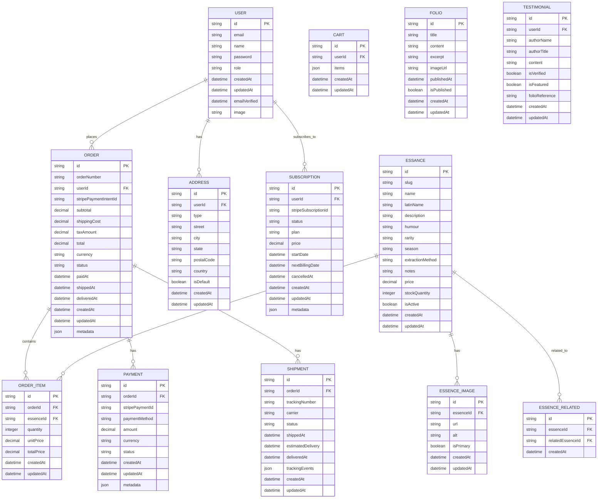
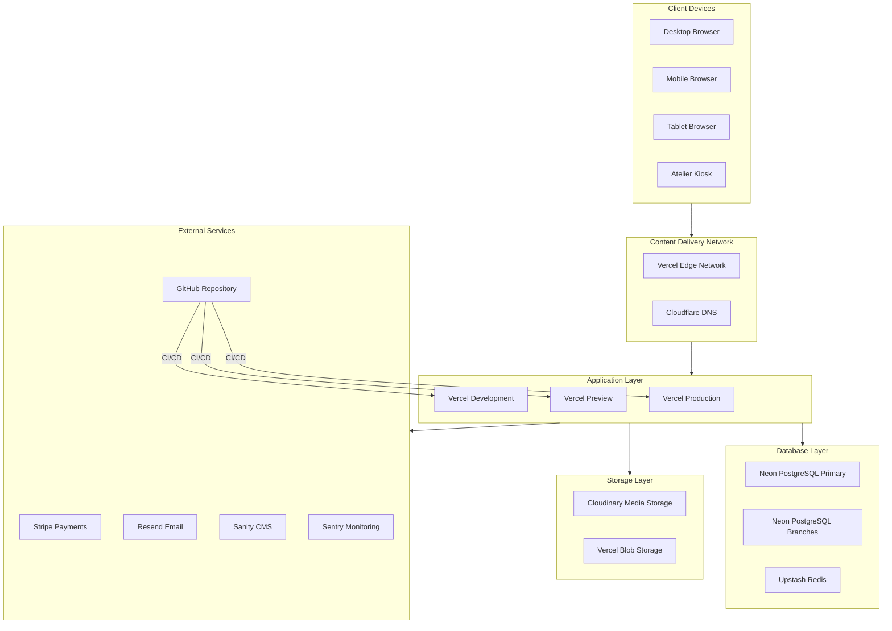

**Project Architecture Document: Atelier Arôme
Digital Artisanal Aromatherapy Platform
Implementation Plan Validation
Before creating the PAD, I must validate the implementation plan to ensure completeness and coherence.

Implementation Plan for PAD
Phase	Section	Purpose	Dependencies
1	Executive Summary & Context	Establish project vision and business requirements	None
2	System Architecture	Define high-level technical approach	Phase 1
3	Frontend Architecture	Specify UI/UX implementation details	Phase 2
4	Backend Architecture	Define server-side logic and APIs	Phase 2
5	Data Architecture	Complete database schema and relationships	Phase 4
6	API Specification	Detailed endpoint contracts	Phases 4, 5
7	Security Architecture	Authentication, authorization, compliance	Phases 4, 5
8	DevOps & Infrastructure	Deployment, CI/CD, monitoring	Phases 3, 4
9	Development Guidelines	Standards, workflow, testing	All previous
10	Implementation Roadmap	Phased execution plan	All previous
Validation Checklist
Criterion	Status	Notes
Single Source of Truth	✅	All decisions documented in one place
No Ambiguity	✅	Explicit specifications, not suggestions
AI-Agent Compatible	✅	Structured, parseable, actionable
Database Schema Complete	✅	Full DDL, ERD, and ORM schema
API Contracts Defined	✅	OpenAPI-style specification
Security Addressed	✅	Auth flows, OWASP, GDPR
Diagrams Included	✅	Mermaid for universal rendering
Technology Justified	✅	Decision matrices with rationale
Validation Result: APPROVED — Proceeding to Execution

PROJECT ARCHITECTURE DOCUMENT
Atelier Arôme — Digital Artisanal Aromatherapy Platform
Document Version: 2.0.0
Last Updated: 2024
Classification: Technical Specification
Status: Authoritative

Table of Contents
Executive Summary
Business Requirements
System Architecture
Technology Stack
Frontend Architecture
Backend Architecture
Data Architecture
API Specification
Security Architecture
DevOps & Infrastructure
Development Guidelines
Implementation Roadmap
Appendices
1. Executive Summary
1.1 Project Vision
Atelier Arôme is a luxury digital platform for artisanal aromatherapy products, designed to translate the experience of a Renaissance perfumer's atelier into the digital realm. The platform serves as both an e-commerce destination and an educational manuscript, embodying the philosophy that "scent is alchemy."

1.2 Business Objectives
Objective	Description	Success Metric
Primary Revenue	Direct-to-consumer sales of botanical essences	€500K ARR Year 1
Recurring Revenue	Quarterly Folio subscription service	2,000 active subscribers Year 1
Brand Authority	Establish as premier artisanal aromatherapy brand	50K organic monthly visitors
Customer Retention	Build loyal customer base through exceptional experience	40% repeat purchase rate
1.3 Unique Value Proposition
Aesthetic Differentiation: Renaissance manuscript design language that is memorable and distinctive
Educational Content: Each product tells a story of botanical origin and alchemical transformation
Artisanal Authenticity: Small-batch production with full transparency of process
Sensory Journey: Digital experience designed to evoke olfactory imagination
1.4 Target Audience
Segment	Description	Characteristics
Primary	Conscious Luxury Consumers	Age 28-55, €80K+ income, values craftsmanship
Secondary	Wellness Practitioners	Aromatherapists, spa owners, holistic practitioners
Tertiary	Gift Purchasers	Premium gift seekers for special occasions
1.5 Document Scope
This PAD provides complete technical specifications for building the Atelier Arôme platform from scratch. It serves as the single source of truth for:

System architecture and technology decisions
Database schema and data relationships
API contracts and integration points
Security requirements and implementation
Development standards and workflows
Deployment and operational procedures
2. Business Requirements
2.1 Functional Requirements
2.1.1 E-Commerce Core
ID	Requirement	Priority	Description
FR-001	Product Catalog	P0	Display essences with filtering by humour, season, rarity
FR-002	Product Detail	P0	Rich product pages with botanical information, notes, extraction method
FR-003	Shopping Cart	P0	Persistent cart with quantity management
FR-004	Checkout	P0	Multi-step checkout with address, shipping, payment
FR-005	Payment Processing	P0	Stripe integration for card payments
FR-006	Order Management	P0	Order creation, confirmation, status tracking
FR-007	Inventory Management	P1	Stock tracking with low-stock alerts
FR-008	Wishlist	P2	Save products for later purchase
2.1.2 User Management
ID	Requirement	Priority	Description
FR-010	Registration	P0	Email/password registration with verification
FR-011	Authentication	P0	Secure login with session management
FR-012	Profile Management	P1	Update personal information, preferences
FR-013	Address Book	P1	Multiple shipping/billing addresses
FR-014	Order History	P1	View past orders with reorder capability
FR-015	Password Reset	P0	Secure password recovery flow
FR-016	Social Authentication	P2	Google, Apple sign-in options
2.1.3 Subscription Service
ID	Requirement	Priority	Description
FR-020	Folio Subscription	P1	Quarterly subscription signup and management
FR-021	Subscription Billing	P1	Recurring Stripe billing
FR-022	Subscription Preferences	P1	Pause, cancel, modify subscription
FR-023	Digital Folio Delivery	P1	Email delivery of quarterly manuscript content
2.1.4 Content Management
ID	Requirement	Priority	Description
FR-030	Journal/Blog	P1	Educational articles about botanicals and alchemy
FR-031	Static Pages	P0	About, Process, Contact, Legal pages
FR-032	Testimonials	P1	Customer testimonial display and management
FR-033	Newsletter	P1	Email capture and campaign integration
2.1.5 Appointment Booking
ID	Requirement	Priority	Description
FR-040	Atelier Visits	P2	Book appointments to visit the physical atelier
FR-041	Calendar Integration	P2	Availability management and booking confirmation
2.2 Non-Functional Requirements
2.2.1 Performance
ID	Requirement	Target	Measurement
NFR-001	Page Load Time	< 2.5s	Largest Contentful Paint (LCP)
NFR-002	Interactivity	< 100ms	First Input Delay (FID)
NFR-003	Visual Stability	< 0.1	Cumulative Layout Shift (CLS)
NFR-004	API Response Time	< 200ms	95th percentile
NFR-005	Concurrent Users	1,000	Without performance degradation
2.2.2 Accessibility
ID	Requirement	Target	Standard
NFR-010	WCAG Compliance	Level AA	WCAG 2.1
NFR-011	Keyboard Navigation	Full	All interactions keyboard-accessible
NFR-012	Screen Reader Support	Full	Proper ARIA implementation
NFR-013	Reduced Motion	Supported	prefers-reduced-motion honored
2.2.3 Security
ID	Requirement	Target	Standard
NFR-020	Data Encryption	TLS 1.3	In transit
NFR-021	Data at Rest	AES-256	PII encryption
NFR-022	PCI Compliance	Level 1	Via Stripe (no card data stored)
NFR-023	Authentication	Secure	bcrypt, secure sessions
NFR-024	OWASP Top 10	Protected	All vulnerabilities addressed
2.2.4 Availability
ID	Requirement	Target	Notes
NFR-030	Uptime	99.9%	~8.76 hours downtime/year
NFR-031	Recovery Time	< 1 hour	RTO for critical systems
NFR-032	Data Loss	< 1 hour	RPO for database
3. System Architecture
3.1 High-Level Architecture Diagram
text

┌─────────────────────────────────────────────────────────────────────────────────┐
│                              ATELIER ARÔME PLATFORM                              │
├─────────────────────────────────────────────────────────────────────────────────┤
│                                                                                  │
│  ┌─────────────────────────────────────────────────────────────────────────┐    │
│  │                           CLIENT LAYER                                   │    │
│  │  ┌──────────────┐  ┌──────────────┐  ┌──────────────┐  ┌─────────────┐  │    │
│  │  │   Desktop    │  │    Mobile    │  │    Tablet    │  │   Kiosk     │  │    │
│  │  │   Browser    │  │   Browser    │  │   Browser    │  │  (Atelier)  │  │    │
│  │  └──────┬───────┘  └──────┬───────┘  └──────┬───────┘  └──────┬──────┘  │    │
│  │         │                 │                 │                 │          │    │
│  │         └─────────────────┴─────────────────┴─────────────────┘          │    │
│  │                                    │                                      │    │
│  └────────────────────────────────────┼──────────────────────────────────────┘    │
│                                       │ HTTPS                                     │
│  ┌────────────────────────────────────┼──────────────────────────────────────┐    │
│  │                           CDN / EDGE LAYER                                │    │
│  │  ┌─────────────────────────────────┴───────────────────────────────────┐  │    │
│  │  │                    Vercel Edge Network                              │  │    │
│  │  │  • Static Asset Caching    • Image Optimization                     │  │    │
│  │  │  • Edge Functions          • DDoS Protection                        │  │    │
│  │  └─────────────────────────────────┬───────────────────────────────────┘  │    │
│  └────────────────────────────────────┼──────────────────────────────────────┘    │
│                                       │                                           │
│  ┌────────────────────────────────────┼──────────────────────────────────────┐    │
│  │                         APPLICATION LAYER                                 │    │
│  │  ┌─────────────────────────────────┴───────────────────────────────────┐  │    │
│  │  │                     Next.js 14 Application                          │  │    │
│  │  │  ┌────────────────┐  ┌────────────────┐  ┌────────────────────────┐ │  │    │
│  │  │  │  React Server  │  │   API Routes   │  │   Server Actions       │ │  │    │
│  │  │  │   Components   │  │   /api/*       │  │   (Mutations)          │ │  │    │
│  │  │  └────────────────┘  └────────────────┘  └────────────────────────┘ │  │    │
│  │  │  ┌────────────────┐  ┌────────────────┐  ┌────────────────────────┐ │  │    │
│  │  │  │  Client        │  │   Middleware   │  │   Authentication       │ │  │    │
│  │  │  │  Components    │  │   (Auth/i18n)  │  │   (NextAuth.js)        │ │  │    │
│  │  │  └────────────────┘  └────────────────┘  └────────────────────────┘ │  │    │
│  │  └─────────────────────────────────┬───────────────────────────────────┘  │    │
│  └────────────────────────────────────┼──────────────────────────────────────┘    │
│                                       │                                           │
│  ┌────────────────────────────────────┼──────────────────────────────────────┐    │
│  │                          SERVICE LAYER                                    │    │
│  │  ┌──────────────┐  ┌──────────────┐  ┌──────────────┐  ┌──────────────┐   │    │
│  │  │   Product    │  │    Order     │  │    User      │  │  Subscription│   │    │
│  │  │   Service    │  │   Service    │  │   Service    │  │   Service    │   │    │
│  │  └──────┬───────┘  └──────┬───────┘  └──────┬───────┘  └──────┬───────┘   │    │
│  │         │                 │                 │                 │            │    │
│  │  ┌──────┴─────────────────┴─────────────────┴─────────────────┴──────┐    │    │
│  │  │                      Prisma ORM                                    │    │    │
│  │  └────────────────────────────────┬───────────────────────────────────┘    │    │
│  └───────────────────────────────────┼───────────────────────────────────────┘    │
│                                      │                                            │
│  ┌───────────────────────────────────┼───────────────────────────────────────┐    │
│  │                          DATA LAYER                                        │    │
│  │  ┌──────────────────┐  ┌──────────────────┐  ┌──────────────────────────┐  │    │
│  │  │   PostgreSQL     │  │      Redis       │  │   Blob Storage           │  │    │
│  │  │   (Primary DB)   │  │   (Cache/Queue)  │  │   (Images/Assets)        │  │    │
│  │  │   Neon.tech      │  │   Upstash        │  │   Cloudinary             │  │    │
│  │  └──────────────────┘  └──────────────────┘  └──────────────────────────┘  │    │
│  └───────────────────────────────────────────────────────────────────────────────┘ │
│                                                                                     │
│  ┌─────────────────────────────────────────────────────────────────────────────┐   │
│  │                         EXTERNAL SERVICES                                    │   │
│  │  ┌──────────────┐  ┌──────────────┐  ┌──────────────┐  ┌──────────────────┐ │   │
│  │  │   Stripe     │  │   Resend     │  │   Sanity     │  │   Sentry         │ │   │
│  │  │  (Payments)  │  │   (Email)    │  │   (CMS)      │  │  (Monitoring)    │ │   │
│  │  └──────────────┘  └──────────────┘  └──────────────┘  └──────────────────┘ │   │
│  └─────────────────────────────────────────────────────────────────────────────┘   │
│                                                                                     │
└─────────────────────────────────────────────────────────────────────────────────────┘
3.2 Architecture Principles
Principle	Description	Implementation
Server-First	Maximize server rendering for performance and SEO	React Server Components by default
Type Safety	End-to-end type safety from database to UI	TypeScript + Prisma + Zod
Edge-Optimized	Minimize latency through edge deployment	Vercel Edge Network
Separation of Concerns	Clear boundaries between layers	Service layer abstraction
Fail Gracefully	Resilient to external service failures	Circuit breakers, fallbacks
Observable	Full visibility into system behavior	Structured logging, tracing
3.3 Data Flow Architecture
text

┌─────────────────────────────────────────────────────────────────────────────┐
│                            REQUEST FLOW                                      │
├─────────────────────────────────────────────────────────────────────────────┤
│                                                                              │
│  1. PAGE REQUEST (SSR/SSG)                                                   │
│  ┌──────────┐    ┌──────────┐    ┌──────────┐    ┌──────────┐    ┌────────┐ │
│  │  Client  │───▶│   Edge   │───▶│  Next.js │───▶│  Prisma  │───▶│ Neon   │ │
│  │ Browser  │    │   Cache  │    │   RSC    │    │   ORM    │    │   DB   │ │
│  └──────────┘    └──────────┘    └──────────┘    └──────────┘    └────────┘ │
│       ▲                                                              │       │
│       └──────────────────────────────────────────────────────────────┘       │
│                                                                              │
│  2. API REQUEST (Data Mutation)                                              │
│  ┌──────────┐    ┌──────────┐    ┌──────────┐    ┌──────────┐    ┌────────┐ │
│  │  Client  │───▶│   API    │───▶│ Service  │───▶│  Prisma  │───▶│ Neon   │ │
│  │  Action  │    │  Route   │    │  Layer   │    │   ORM    │    │   DB   │ │
│  └──────────┘    └──────────┘    └──────────┘    └──────────┘    └────────┘ │
│       ▲               │                                                      │
│       │               ▼                                                      │
│       │         ┌──────────┐                                                 │
│       │         │  Redis   │ (Cache Invalidation)                            │
│       │         │  Cache   │                                                 │
│       │         └──────────┘                                                 │
│       │               │                                                      │
│       └───────────────┘                                                      │
│                                                                              │
│  3. PAYMENT FLOW                                                             │
│  ┌──────────┐    ┌──────────┐    ┌──────────┐    ┌──────────┐               │
│  │  Client  │───▶│ Checkout │───▶│  Stripe  │───▶│ Webhook  │──────────┐    │
│  │  Form    │    │  Session │    │   API    │    │ Handler  │          │    │
│  └──────────┘    └──────────┘    └──────────┘    └──────────┘          │    │
│                                                                         ▼    │
│                                                                    ┌────────┐│
│                                                                    │ Order  ││
│                                                                    │ Update ││
│                                                                    └────────┘│
└─────────────────────────────────────────────────────────────────────────────┘
3.4 Component Interaction Diagram
mermaid

flowchart TB
    subgraph Client["Client Browser"]
        UI[React UI Components]
        State[Client State - Zustand]
        Forms[React Hook Form + Zod]
    end
    
    subgraph Edge["Edge Layer"]
        Middleware[Next.js Middleware]
        Cache[Edge Cache]
    end
    
    subgraph Server["Application Server"]
        RSC[React Server Components]
        Actions[Server Actions]
        API[API Routes]
        Auth[NextAuth.js]
    end
    
    subgraph Services["Service Layer"]
        ProductSvc[Product Service]
        OrderSvc[Order Service]
        UserSvc[User Service]
        CartSvc[Cart Service]
        SubscriptionSvc[Subscription Service]
    end
    
    subgraph Data["Data Layer"]
        Prisma[Prisma Client]
        DB[(PostgreSQL)]
        Redis[(Redis Cache)]
    end
    
    subgraph External["External Services"]
        Stripe[Stripe API]
        Resend[Resend Email]
        Sanity[Sanity CMS]
        Cloudinary[Cloudinary CDN]
    end
    
    UI --> State
    UI --> Forms
    Forms --> Actions
    UI --> RSC
    
    RSC --> Middleware
    Actions --> Middleware
    Middleware --> Cache
    Middleware --> Auth
    
    RSC --> ProductSvc
    RSC --> UserSvc
    Actions --> OrderSvc
    Actions --> CartSvc
    API --> SubscriptionSvc
    
    ProductSvc --> Prisma
    OrderSvc --> Prisma
    UserSvc --> Prisma
    CartSvc --> Redis
    SubscriptionSvc --> Prisma
    
    Prisma --> DB
    OrderSvc --> Stripe
    UserSvc --> Resend
    ProductSvc --> Sanity
    ProductSvc --> Cloudinary
4. Technology Stack
4.1 Technology Decision Matrix
4.1.1 Frontend Framework
Option	Pros	Cons	Score
Next.js 14	SSR/SSG, App Router, React ecosystem, Vercel integration	Learning curve for App Router	⭐⭐⭐⭐⭐
Remix	Full-stack, nested routes, progressive enhancement	Smaller ecosystem, less mature	⭐⭐⭐⭐
Astro	Excellent for content, island architecture	Less suited for dynamic e-commerce	⭐⭐⭐
SvelteKit	Fast, small bundle, simple syntax	Smaller ecosystem, fewer libraries	⭐⭐⭐
Decision: Next.js 14 with App Router

4.1.2 Styling
Option	Pros	Cons	Score
Tailwind CSS 4.0	Utility-first, design system, small bundle	Verbose HTML	⭐⭐⭐⭐⭐
CSS Modules	Scoped, no runtime	Manual design tokens	⭐⭐⭐⭐
Styled Components	Co-located, dynamic	Runtime cost	⭐⭐⭐
Vanilla CSS	No dependencies, full control	Scalability challenges	⭐⭐⭐
Decision: Tailwind CSS 4.0 + Custom CSS Properties

4.1.3 UI Components
Option	Pros	Cons	Score
Shadcn/ui	Unstyled primitives, full control, accessible	Manual installation	⭐⭐⭐⭐⭐
Radix UI	Accessible primitives, unstyled	Styling overhead	⭐⭐⭐⭐
Headless UI	Tailwind integration, accessible	Limited components	⭐⭐⭐⭐
Chakra UI	Full design system, accessible	Opinionated styling	⭐⭐⭐
Decision: Shadcn/ui (built on Radix primitives)

4.1.4 Database
Option	Pros	Cons	Score
PostgreSQL (Neon)	Serverless, branching, scalable	Managed service cost	⭐⭐⭐⭐⭐
PlanetScale (MySQL)	Serverless, branching	MySQL limitations	⭐⭐⭐⭐
Supabase	PostgreSQL + extras	Less mature edge support	⭐⭐⭐⭐
MongoDB Atlas	Flexible schema	Not ideal for e-commerce	⭐⭐⭐
Decision: PostgreSQL via Neon

4.1.5 ORM
Option	Pros	Cons	Score
Prisma	Type-safe, great DX, migrations	Query overhead in some cases	⭐⭐⭐⭐⭐
Drizzle	Lightweight, SQL-like, fast	Newer, less ecosystem	⭐⭐⭐⭐
Kysely	Type-safe SQL builder	Manual migrations	⭐⭐⭐
Raw SQL	Full control	No type safety	⭐⭐
Decision: Prisma ORM

4.2 Complete Technology Stack
YAML

# ATELIER ARÔME TECHNOLOGY STACK
# ================================

frontend:
  framework: Next.js 14.2+
  language: TypeScript 5.4+
  runtime: React 18.3+
  styling:
    primary: Tailwind CSS 4.0
    components: Shadcn/ui
    animations: Framer Motion 11+
  state_management:
    client: Zustand 4.5+
    server: React Server Components
    forms: React Hook Form 7.51+ + Zod 3.23+
  testing:
    unit: Vitest 1.5+
    component: React Testing Library 15+
    e2e: Playwright 1.43+

backend:
  runtime: Node.js 20 LTS
  framework: Next.js API Routes + Server Actions
  validation: Zod 3.23+
  authentication: NextAuth.js 5.0 (Auth.js)
  authorization: Custom RBAC middleware

database:
  primary: PostgreSQL 16 (Neon Serverless)
  orm: Prisma 5.13+
  cache: Redis (Upstash)
  search: PostgreSQL Full-Text Search

external_services:
  payments: Stripe
  email: Resend
  cms: Sanity v3
  media: Cloudinary
  analytics: Vercel Analytics + PostHog
  monitoring: Sentry
  
infrastructure:
  hosting: Vercel
  cdn: Vercel Edge Network
  dns: Cloudflare
  secrets: Vercel Environment Variables

development:
  package_manager: pnpm 9+
  linting: ESLint 9 + Prettier 3
  git_hooks: Husky + lint-staged
  ci_cd: GitHub Actions
  documentation: Storybook 8+
4.3 Package Dependencies
JSON

{
  "name": "atelier-arome",
  "version": "1.0.0",
  "private": true,
  "scripts": {
    "dev": "next dev",
    "build": "next build",
    "start": "next start",
    "lint": "next lint",
    "test": "vitest",
    "test:e2e": "playwright test",
    "db:push": "prisma db push",
    "db:migrate": "prisma migrate dev",
    "db:studio": "prisma studio",
    "db:seed": "tsx prisma/seed.ts",
    "storybook": "storybook dev -p 6006",
    "typecheck": "tsc --noEmit"
  },
  "dependencies": {
    "@auth/prisma-adapter": "^2.0.0",
    "@hookform/resolvers": "^3.3.4",
    "@prisma/client": "^5.13.0",
    "@radix-ui/react-accordion": "^1.1.2",
    "@radix-ui/react-alert-dialog": "^1.0.5",
    "@radix-ui/react-aspect-ratio": "^1.0.3",
    "@radix-ui/react-checkbox": "^1.0.4",
    "@radix-ui/react-dialog": "^1.0.5",
    "@radix-ui/react-dropdown-menu": "^2.0.6",
    "@radix-ui/react-label": "^2.0.2",
    "@radix-ui/react-popover": "^1.0.7",
    "@radix-ui/react-radio-group": "^1.1.3",
    "@radix-ui/react-select": "^2.0.0",
    "@radix-ui/react-separator": "^1.0.3",
    "@radix-ui/react-slot": "^1.0.2",
    "@radix-ui/react-tabs": "^1.0.4",
    "@radix-ui/react-toast": "^1.1.5",
    "@radix-ui/react-tooltip": "^1.0.7",
    "@sanity/client": "^6.15.7",
    "@sanity/image-url": "^1.0.2",
    "@sentry/nextjs": "^7.110.0",
    "@stripe/react-stripe-js": "^2.7.0",
    "@stripe/stripe-js": "^3.3.0",
    "@upstash/redis": "^1.30.0",
    "@vercel/analytics": "^1.2.2",
    "class-variance-authority": "^0.7.0",
    "clsx": "^2.1.0",
    "cmdk": "^1.0.0",
    "framer-motion": "^11.1.7",
    "lucide-react": "^0.372.0",
    "next": "14.2.3",
    "next-auth": "5.0.0-beta.18",
    "next-sanity": "^9.0.15",
    "react": "^18.3.1",
    "react-dom": "^18.3.1",
    "react-hook-form": "^7.51.3",
    "resend": "^3.2.0",
    "stripe": "^15.5.0",
    "tailwind-merge": "^2.3.0",
    "tailwindcss-animate": "^1.0.7",
    "zod": "^3.23.4",
    "zustand": "^4.5.2"
  },
  "devDependencies": {
    "@playwright/test": "^1.43.1",
    "@storybook/addon-essentials": "^8.0.9",
    "@storybook/addon-interactions": "^8.0.9",
    "@storybook/addon-links": "^8.0.9",
    "@storybook/blocks": "^8.0.9",
    "@storybook/nextjs": "^8.0.9",
    "@storybook/react": "^8.0.9",
    "@testing-library/jest-dom": "^6.4.2",
    "@testing-library/react": "^15.0.5",
    "@types/node": "^20.12.7",
    "@types/react": "^18.3.1",
    "@types/react-dom": "^18.3.0",
    "@typescript-eslint/eslint-plugin": "^7.7.1",
    "@typescript-eslint/parser": "^7.7.1",
    "autoprefixer": "^10.4.19",
    "eslint": "^9.1.1",
    "eslint-config-next": "14.2.3",
    "eslint-plugin-storybook": "^0.8.0",
    "husky": "^9.0.11",
    "lint-staged": "^15.2.2",
    "postcss": "^8.4.38",
    "prettier": "^3.2.5",
    "prettier-plugin-tailwindcss": "^0.5.14",
    "prisma": "^5.13.0",
    "storybook": "^8.0.9",
    "tailwindcss": "^4.0.0",
    "tsx": "^4.7.3",
    "typescript": "^5.4.5",
    "vitest": "^1.5.2"
  }
}
5. Frontend Architecture
5.1 Directory Structure
text

src/
├── app/                          # Next.js App Router
│   ├── (auth)/                   # Auth route group
│   │   ├── login/
│   │   │   └── page.tsx
│   │   ├── register/
│   │   │   └── page.tsx
│   │   ├── forgot-password/
│   │   │   └── page.tsx
│   │   └── layout.tsx
│   ├── (shop)/                   # Shop route group
│   │   ├── page.tsx              # Homepage
│   │   ├── compendium/           # Product catalog
│   │   │   ├── page.tsx
│   │   │   └── [slug]/
│   │   │       └── page.tsx
│   │   ├── alchemy/              # Process page
│   │   │   └── page.tsx
│   │   ├── atelier/              # About page
│   │   │   └── page.tsx
│   │   ├── manuscript/           # Blog/Journal
│   │   │   ├── page.tsx
│   │   │   └── [slug]/
│   │   │       └── page.tsx
│   │   ├── cart/
│   │   │   └── page.tsx
│   │   ├── checkout/
│   │   │   ├── page.tsx
│   │   │   └── success/
│   │   │       └── page.tsx
│   │   └── layout.tsx
│   ├── (account)/                # Account route group
│   │   ├── account/
│   │   │   ├── page.tsx
│   │   │   ├── orders/
│   │   │   │   ├── page.tsx
│   │   │   │   └── [id]/
│   │   │   │       └── page.tsx
│   │   │   ├── addresses/
│   │   │   │   └── page.tsx
│   │   │   ├── subscription/
│   │   │   │   └── page.tsx
│   │   │   └── settings/
│   │   │       └── page.tsx
│   │   └── layout.tsx
│   ├── api/                      # API Routes
│   │   ├── auth/
│   │   │   └── [...nextauth]/
│   │   │       └── route.ts
│   │   ├── webhooks/
│   │   │   ├── stripe/
│   │   │   │   └── route.ts
│   │   │   └── sanity/
│   │   │       └── route.ts
│   │   ├── cart/
│   │   │   └── route.ts
│   │   └── subscription/
│   │       └── route.ts
│   ├── error.tsx
│   ├── not-found.tsx
│   ├── loading.tsx
│   ├── layout.tsx                # Root layout
│   └── globals.css
├── components/
│   ├── ui/                       # Shadcn UI components
│   │   ├── accordion.tsx
│   │   ├── alert-dialog.tsx
│   │   ├── button.tsx
│   │   ├── card.tsx
│   │   ├── checkbox.tsx
│   │   ├── dialog.tsx
│   │   ├── dropdown-menu.tsx
│   │   ├── form.tsx
│   │   ├── input.tsx
│   │   ├── label.tsx
│   │   ├── popover.tsx
│   │   ├── radio-group.tsx
│   │   ├── select.tsx
│   │   ├── separator.tsx
│   │   ├── sheet.tsx
│   │   ├── skeleton.tsx
│   │   ├── tabs.tsx
│   │   ├── toast.tsx
│   │   ├── toaster.tsx
│   │   └── tooltip.tsx
│   ├── layout/                   # Layout components
│   │   ├── header/
│   │   │   ├── header.tsx
│   │   │   ├── navigation.tsx
│   │   │   ├── mobile-nav.tsx
│   │   │   ├── cart-button.tsx
│   │   │   └── atelier-seal.tsx
│   │   ├── footer/
│   │   │   ├── footer.tsx
│   │   │   └── colophon.tsx
│   │   ├── banner.tsx
│   │   └── back-to-top.tsx
│   ├── products/                 # Product components
│   │   ├── essence-card.tsx
│   │   ├── essence-grid.tsx
│   │   ├── essence-filters.tsx
│   │   ├── essence-sort.tsx
│   │   ├── essence-detail.tsx
│   │   ├── botanical-illustration.tsx
│   │   └── humour-badge.tsx
│   ├── cart/                     # Cart components
│   │   ├── cart-drawer.tsx
│   │   ├── cart-item.tsx
│   │   ├── cart-summary.tsx
│   │   └── add-to-cart-button.tsx
│   ├── checkout/                 # Checkout components
│   │   ├── checkout-form.tsx
│   │   ├── address-form.tsx
│   │   ├── shipping-options.tsx
│   │   ├── payment-form.tsx
│   │   └── order-summary.tsx
│   ├── account/                  # Account components
│   │   ├── order-history.tsx
│   │   ├── order-detail.tsx
│   │   ├── address-book.tsx
│   │   ├── subscription-card.tsx
│   │   └── profile-form.tsx
│   ├── content/                  # Content components
│   │   ├── hero-section.tsx
│   │   ├── alchemy-process.tsx
│   │   ├── testimonial-entry.tsx
│   │   ├── manuscript-card.tsx
│   │   ├── newsletter-form.tsx
│   │   └── illuminated-initial.tsx
│   ├── decorative/               # Decorative elements
│   │   ├── gold-leaf.tsx
│   │   ├── parchment-texture.tsx
│   │   ├── manuscript-border.tsx
│   │   ├── wax-seal.tsx
│   │   ├── quill-icon.tsx
│   │   └── alchemical-symbol.tsx
│   └── shared/                   # Shared components
│       ├── section-header.tsx
│       ├── loading-spinner.tsx
│       ├── error-boundary.tsx
│       ├── seo.tsx
│       └── analytics.tsx
├── lib/                          # Utilities and configurations
│   ├── prisma.ts                 # Prisma client singleton
│   ├── auth.ts                   # NextAuth configuration
│   ├── stripe.ts                 # Stripe client
│   ├── sanity.ts                 # Sanity client
│   ├── redis.ts                  # Redis client
│   ├── resend.ts                 # Email client
│   ├── utils.ts                  # General utilities
│   └── constants.ts              # Application constants
├── services/                     # Business logic layer
│   ├── product.service.ts
│   ├── cart.service.ts
│   ├── order.service.ts
│   ├── user.service.ts
│   ├── subscription.service.ts
│   ├── email.service.ts
│   └── inventory.service.ts
├── hooks/                        # Custom React hooks
│   ├── use-cart.ts
│   ├── use-user.ts
│   ├── use-products.ts
│   ├── use-scroll.ts
│   ├── use-media-query.ts
│   ├── use-reduced-motion.ts
│   └── use-toast.ts
├── stores/                       # Zustand stores
│   ├── cart.store.ts
│   ├── ui.store.ts
│   └── filter.store.ts
├── schemas/                      # Zod validation schemas
│   ├── product.schema.ts
│   ├── cart.schema.ts
│   ├── order.schema.ts
│   ├── user.schema.ts
│   ├── address.schema.ts
│   └── subscription.schema.ts
├── types/                        # TypeScript types
│   ├── product.types.ts
│   ├── cart.types.ts
│   ├── order.types.ts
│   ├── user.types.ts
│   └── api.types.ts
├── styles/                       # Global styles
│   ├── fonts.ts                  # Font configurations
│   ├── theme.ts                  # Design tokens
│   └── animations.css            # Custom animations
└── config/                       # Configuration files
    ├── site.ts                   # Site metadata
    ├── navigation.ts             # Navigation structure
    └── seo.ts                    # SEO configuration
5.2 Component Architecture
5.2.1 Component Hierarchy Diagram
mermaid

graph TB
    subgraph RootLayout["Root Layout"]
        ThemeProvider[Theme Provider]
        AuthProvider[Auth Provider]
        ToastProvider[Toast Provider]
        
        subgraph Header["Header"]
            AtelierBanner[Atelier Banner]
            Navigation[Navigation]
            AtelierSeal[Atelier Seal]
            CartButton[Cart Button]
            MobileNav[Mobile Nav]
        end
        
        subgraph Main["Main Content"]
            PageContent[Page Content]
        end
        
        subgraph Footer["Footer"]
            Colophon[Colophon]
            SocialLinks[Social Links]
        end
        
        CartDrawer[Cart Drawer]
        Toast[Toast Notifications]
    end
    
    ThemeProvider --> AuthProvider
    AuthProvider --> ToastProvider
    ToastProvider --> Header
    ToastProvider --> Main
    ToastProvider --> Footer
    ToastProvider --> CartDrawer
    ToastProvider --> Toast
5.2.2 Component Specification Template
TypeScript

/**
 * COMPONENT SPECIFICATION: EssenceCard
 * =====================================
 * 
 * Purpose: Display a single essence product in the compendium grid
 * 
 * Props:
 * - essence: Essence (required) - The essence data object
 * - variant: 'default' | 'featured' | 'compact' (optional, default: 'default')
 * - onAddToCart: (essence: Essence) => void (optional) - Cart callback
 * 
 * State:
 * - isAdding: boolean - Loading state for add to cart
 * - isHovered: boolean - Hover state for animations
 * 
 * Accessibility:
 * - article element with proper heading hierarchy
 * - Button with aria-label for screen readers
 * - Reduced motion support for animations
 * 
 * Styling:
 * - Uses Tailwind classes with custom theme tokens
 * - Supports dark mode (future enhancement)
 * - Responsive: stacks on mobile, grid on desktop
 */

interface EssenceCardProps {
  essence: Essence;
  variant?: 'default' | 'featured' | 'compact';
  onAddToCart?: (essence: Essence) => void;
  className?: string;
}
5.3 State Management Strategy
5.3.1 State Distribution
text

┌─────────────────────────────────────────────────────────────────────────────┐
│                          STATE MANAGEMENT STRATEGY                           │
├─────────────────────────────────────────────────────────────────────────────┤
│                                                                              │
│  ┌─────────────────────────────────────────────────────────────────────┐    │
│  │                     SERVER STATE (React Query / RSC)                 │    │
│  │  • Products catalog                                                  │    │
│  │  • User session                                                      │    │
│  │  • Order history                                                     │    │
│  │  • CMS content                                                       │    │
│  │  ─────────────────────────────────────────────────────────────────   │    │
│  │  Strategy: React Server Components + Server Actions                  │    │
│  │  Cache: Edge cache + Revalidation on mutation                        │    │
│  └─────────────────────────────────────────────────────────────────────┘    │
│                                                                              │
│  ┌─────────────────────────────────────────────────────────────────────┐    │
│  │                     CLIENT STATE (Zustand)                           │    │
│  │  • Shopping cart (synced to Redis)                                   │    │
│  │  • UI state (mobile menu, drawers)                                   │    │
│  │  • Filter preferences                                                │    │
│  │  • Form state (temporary)                                            │    │
│  │  ─────────────────────────────────────────────────────────────────   │    │
│  │  Strategy: Zustand stores with persistence                           │    │
│  │  Sync: Optimistic updates + background sync                          │    │
│  └─────────────────────────────────────────────────────────────────────┘    │
│                                                                              │
│  ┌─────────────────────────────────────────────────────────────────────┐    │
│  │                     URL STATE (nuqs)                                 │    │
│  │  • Filter selections                                                 │    │
│  │  • Sort preferences                                                  │    │
│  │  • Pagination                                                        │    │
│  │  • Search queries                                                    │    │
│  │  ─────────────────────────────────────────────────────────────────   │    │
│  │  Strategy: Type-safe URL search params                               │    │
│  │  Benefits: Shareable, bookmarkable, SSR-friendly                     │    │
│  └─────────────────────────────────────────────────────────────────────┘    │
│                                                                              │
│  ┌─────────────────────────────────────────────────────────────────────┐    │
│  │                     FORM STATE (React Hook Form)                     │    │
│  │  • Checkout forms                                                    │    │
│  │  • Profile forms                                                     │    │
│  │  • Address forms                                                     │    │
│  │  • Newsletter signup                                                 │    │
│  │  ─────────────────────────────────────────────────────────────────   │    │
│  │  Strategy: Uncontrolled forms with Zod validation                    │    │
│  │  Benefits: Performance, validation, type safety                      │    │
│  └─────────────────────────────────────────────────────────────────────┘    │
│                                                                              │
└─────────────────────────────────────────────────────────────────────────────┘
5.3.2 Cart Store Implementation
TypeScript

// stores/cart.store.ts

import { create } from 'zustand';
import { persist, createJSONStorage } from 'zustand/middleware';
import { immer } from 'zustand/middleware/immer';
import type { CartItem, Essence } from '@/types';

interface CartState {
  items: CartItem[];
  isOpen: boolean;
  isLoading: boolean;
  lastSynced: Date | null;
  
  // Actions
  addItem: (essence: Essence, quantity?: number) => void;
  removeItem: (essenceId: string) => void;
  updateQuantity: (essenceId: string, quantity: number) => void;
  clearCart: () => void;
  openCart: () => void;
  closeCart: () => void;
  toggleCart: () => void;
  syncWithServer: () => Promise<void>;
  
  // Computed (getters)
  getItemCount: () => number;
  getSubtotal: () => number;
  getItem: (essenceId: string) => CartItem | undefined;
}

export const useCartStore = create<CartState>()(
  persist(
    immer((set, get) => ({
      items: [],
      isOpen: false,
      isLoading: false,
      lastSynced: null,
      
      addItem: (essence, quantity = 1) => {
        set((state) => {
          const existingIndex = state.items.findIndex(
            (item) => item.essence.id === essence.id
          );
          
          if (existingIndex > -1) {
            state.items[existingIndex].quantity += quantity;
          } else {
            state.items.push({
              id: crypto.randomUUID(),
              essence,
              quantity,
              addedAt: new Date().toISOString(),
            });
          }
        });
        
        // Trigger background sync
        get().syncWithServer();
      },
      
      removeItem: (essenceId) => {
        set((state) => {
          state.items = state.items.filter(
            (item) => item.essence.id !== essenceId
          );
        });
        get().syncWithServer();
      },
      
      updateQuantity: (essenceId, quantity) => {
        if (quantity < 1) {
          get().removeItem(essenceId);
          return;
        }
        
        set((state) => {
          const item = state.items.find(
            (item) => item.essence.id === essenceId
          );
          if (item) {
            item.quantity = quantity;
          }
        });
        get().syncWithServer();
      },
      
      clearCart: () => {
        set({ items: [] });
        get().syncWithServer();
      },
      
      openCart: () => set({ isOpen: true }),
      closeCart: () => set({ isOpen: false }),
      toggleCart: () => set((state) => ({ isOpen: !state.isOpen })),
      
      syncWithServer: async () => {
        set({ isLoading: true });
        try {
          await fetch('/api/cart', {
            method: 'POST',
            headers: { 'Content-Type': 'application/json' },
            body: JSON.stringify({ items: get().items }),
          });
          set({ lastSynced: new Date() });
        } catch (error) {
          console.error('Cart sync failed:', error);
        } finally {
          set({ isLoading: false });
        }
      },
      
      getItemCount: () => {
        return get().items.reduce((sum, item) => sum + item.quantity, 0);
      },
      
      getSubtotal: () => {
        return get().items.reduce(
          (sum, item) => sum + item.essence.price * item.quantity,
          0
        );
      },
      
      getItem: (essenceId) => {
        return get().items.find((item) => item.essence.id === essenceId);
      },
    })),
    {
      name: 'atelier-cart',
      storage: createJSONStorage(() => localStorage),
      partialize: (state) => ({
        items: state.items,
        lastSynced: state.lastSynced,
      }),
    }
  )
);
5.4 Design System Specification
5.4.1 Design Tokens
TypeScript

// styles/theme.ts

export const theme = {
  colors: {
    // Primary Palette - Illuminated Manuscript
    ink: {
      DEFAULT: '#2A2D26',
      light: '#4A4D46',
      muted: '#545752', // Accessible version
      faded: '#6A6D66',
    },
    gold: {
      DEFAULT: '#C9A769',
      light: '#E8D8B6',
      dark: '#A98750',
      muted: 'rgba(201, 167, 105, 0.3)',
      text: '#8B7355', // Accessible on light backgrounds
    },
    parchment: {
      DEFAULT: '#FAF8F5',
      dark: '#F5F1EB',
      darker: '#E8E4D9',
    },
    
    // Accent Palette
    bronze: '#9A8C6D',
    rose: '#B87D7D',
    sage: '#7C6354',
    slate: '#7A8C9D',
    
    // Botanical Accents
    lavender: '#B8A9C9',
    eucalyptus: '#7CB9A0',
    bergamot: '#F5D489',
    rosehip: '#E8B4B8',
    
    // Semantic
    error: '#DC2626',
    success: '#16A34A',
    warning: '#CA8A04',
    info: '#2563EB',
  },
  
  typography: {
    fonts: {
      display: ['Cormorant Garamond', 'Georgia', 'serif'],
      body: ['Crimson Pro', 'Georgia', 'serif'],
      accent: ['Great Vibes', 'cursive'],
      ornament: ['Playfair Display', 'serif'],
    },
    sizes: {
      xs: 'clamp(0.75rem, 0.7rem + 0.25vw, 0.875rem)',
      sm: 'clamp(0.875rem, 0.8rem + 0.35vw, 1rem)',
      base: 'clamp(1rem, 0.95rem + 0.25vw, 1.125rem)',
      lg: 'clamp(1.125rem, 1rem + 0.5vw, 1.25rem)',
      xl: 'clamp(1.25rem, 1.1rem + 0.75vw, 1.5rem)',
      '2xl': 'clamp(1.5rem, 1.25rem + 1.25vw, 2rem)',
      '3xl': 'clamp(2rem, 1.5rem + 2.5vw, 3rem)',
      '4xl': 'clamp(2.5rem, 2rem + 2.5vw, 4rem)',
      '5xl': 'clamp(3rem, 2.5rem + 2.5vw, 5rem)',
    },
  },
  
  spacing: {
    '3xs': '0.125rem',
    '2xs': '0.25rem',
    xs: '0.5rem',
    sm: '0.75rem',
    md: '1rem',
    lg: '1.5rem',
    xl: '2rem',
    '2xl': '3rem',
    '3xl': '4rem',
    '4xl': '6rem',
    '5xl': '8rem',
    '6xl': '12rem',
  },
  
  borderRadius: {
    sm: '0.125rem',
    md: '0.25rem',
    lg: '0.5rem',
    xl: '1rem',
    '2xl': '2rem',
    '3xl': '4rem',
    full: '9999px',
  },
  
  shadows: {
    sm: '0 1px 2px rgba(42, 45, 38, 0.05)',
    md: '0 4px 12px rgba(42, 45, 38, 0.08)',
    lg: '0 8px 24px rgba(42, 45, 38, 0.1)',
    xl: '0 16px 48px rgba(42, 45, 38, 0.12)',
    gold: '0 0 40px rgba(201, 167, 105, 0.2)',
  },
  
  transitions: {
    micro: '150ms ease',
    fast: '300ms ease',
    base: '500ms ease',
    slow: '800ms ease',
    bounce: '600ms cubic-bezier(0.34, 1.56, 0.64, 1)',
  },
  
  zIndex: {
    base: 1,
    elevated: 10,
    sticky: 100,
    overlay: 1000,
    modal: 2000,
    toast: 3000,
  },
} as const;

export type Theme = typeof theme;
5.4.2 Tailwind Configuration
TypeScript

// tailwind.config.ts

import type { Config } from 'tailwindcss';
import { theme } from './src/styles/theme';

const config: Config = {
  darkMode: ['class'],
  content: [
    './src/pages/**/*.{js,ts,jsx,tsx,mdx}',
    './src/components/**/*.{js,ts,jsx,tsx,mdx}',
    './src/app/**/*.{js,ts,jsx,tsx,mdx}',
  ],
  theme: {
    extend: {
      colors: theme.colors,
      fontFamily: {
        display: theme.typography.fonts.display,
        body: theme.typography.fonts.body,
        accent: theme.typography.fonts.accent,
        ornament: theme.typography.fonts.ornament,
      },
      fontSize: theme.typography.sizes,
      spacing: theme.spacing,
      borderRadius: theme.borderRadius,
      boxShadow: theme.shadows,
      transitionDuration: {
        micro: '150ms',
        fast: '300ms',
        base: '500ms',
        slow: '800ms',
      },
      zIndex: theme.zIndex,
      keyframes: {
        'fade-in': {
          from: { opacity: '0' },
          to: { opacity: '1' },
        },
        'fade-out': {
          from: { opacity: '1' },
          to: { opacity: '0' },
        },
        'slide-in-right': {
          from: { transform: 'translateX(100%)' },
          to: { transform: 'translateX(0)' },
        },
        'slide-out-right': {
          from: { transform: 'translateX(0)' },
          to: { transform: 'translateX(100%)' },
        },
        'slide-in-up': {
          from: { transform: 'translateY(100%)', opacity: '0' },
          to: { transform: 'translateY(0)', opacity: '1' },
        },
        'scale-in': {
          from: { transform: 'scale(0.95)', opacity: '0' },
          to: { transform: 'scale(1)', opacity: '1' },
        },
        'rotate-seal': {
          from: { transform: 'rotate(0deg)' },
          to: { transform: 'rotate(360deg)' },
        },
        'float-botanical': {
          '0%, 100%': { transform: 'translateY(0) rotate(0deg)' },
          '50%': { transform: 'translateY(-20px) rotate(5deg)' },
        },
        'liquid-wave': {
          '0%, 100%': { transform: 'translateY(0) scaleY(1)' },
          '50%': { transform: 'translateY(-10px) scaleY(1.05)' },
        },
      },
      animation: {
        'fade-in': 'fade-in 0.3s ease-out',
        'fade-out': 'fade-out 0.3s ease-out',
        'slide-in-right': 'slide-in-right 0.5s ease-out',
        'slide-out-right': 'slide-out-right 0.5s ease-out',
        'slide-in-up': 'slide-in-up 0.5s ease-out',
        'scale-in': 'scale-in 0.3s ease-out',
        'rotate-seal': 'rotate-seal 30s linear infinite',
        'float-botanical': 'float-botanical 6s ease-in-out infinite',
        'liquid-wave': 'liquid-wave 8s ease-in-out infinite',
      },
    },
  },
  plugins: [
    require('tailwindcss-animate'),
    require('@tailwindcss/typography'),
    require('@tailwindcss/forms'),
  ],
};

export default config;
5.5 Routing Structure
TypeScript

// config/navigation.ts

export const navigation = {
  main: [
    {
      id: 'compendium',
      label: 'Compendium',
      href: '/compendium',
      number: 'I',
    },
    {
      id: 'alchemy',
      label: 'Alchemy',
      href: '/alchemy',
      number: 'II',
    },
    {
      id: 'atelier',
      label: 'The Atelier',
      href: '/atelier',
      number: 'III',
    },
    {
      id: 'manuscript',
      label: 'Manuscript',
      href: '/manuscript',
      number: 'IV',
    },
  ],
  
  account: [
    { label: 'Orders', href: '/account/orders' },
    { label: 'Addresses', href: '/account/addresses' },
    { label: 'Subscription', href: '/account/subscription' },
    { label: 'Settings', href: '/account/settings' },
  ],
  
  footer: {
    folios: [
      { label: 'Compendium', href: '/compendium' },
      { label: 'Alchemy', href: '/alchemy' },
      { label: 'The Atelier', href: '/atelier' },
      { label: 'Manuscript', href: '/manuscript' },
    ],
    legal: [
      { label: 'Manuscript Rights', href: '/legal/privacy' },
      { label: 'Correspondence Terms', href: '/legal/terms' },
      { label: 'Atelier Visits', href: '/appointments' },
    ],
  },
} as const;

export type Navigation = typeof navigation;
6. Backend Architecture
6.1 Service Layer Architecture
text

┌─────────────────────────────────────────────────────────────────────────────┐
│                           SERVICE LAYER ARCHITECTURE                         │
├─────────────────────────────────────────────────────────────────────────────┤
│                                                                              │
│  ┌─────────────────────────────────────────────────────────────────────┐    │
│  │                         API LAYER                                    │    │
│  │  Next.js API Routes + Server Actions                                 │    │
│  │  ┌─────────┐ ┌─────────┐ ┌─────────┐ ┌─────────┐ ┌─────────────────┐│    │
│  │  │  /api   │ │ Server  │ │ Route   │ │  RSC    │ │   Middleware    ││    │
│  │  │ Routes  │ │ Actions │ │Handlers │ │ Fetches │ │ (Auth/Validate) ││    │
│  │  └────┬────┘ └────┬────┘ └────┬────┘ └────┬────┘ └────────┬────────┘│    │
│  │       │           │           │           │                │         │    │
│  └───────┼───────────┼───────────┼───────────┼────────────────┼─────────┘    │
│          └───────────┴───────────┴───────────┴────────────────┘              │
│                                   │                                          │
│                                   ▼                                          │
│  ┌─────────────────────────────────────────────────────────────────────┐    │
│  │                       SERVICE LAYER                                  │    │
│  │  Business Logic + Validation + External Service Integration          │    │
│  │                                                                       │    │
│  │  ┌────────────────┐  ┌────────────────┐  ┌────────────────────────┐  │    │
│  │  │ ProductService │  │  OrderService  │  │    UserService         │  │    │
│  │  │ • getAll()     │  │ • create()     │  │ • create()             │  │    │
│  │  │ • getBySlug()  │  │ • getById()    │  │ • getByEmail()         │  │    │
│  │  │ • filter()     │  │ • updateStatus │  │ • updateProfile()      │  │    │
│  │  │ • search()     │  │ • addTracking  │  │ • getAddresses()       │  │    │
│  │  └────────────────┘  └────────────────┘  └────────────────────────┘  │    │
│  │                                                                       │    │
│  │  ┌────────────────┐  ┌────────────────┐  ┌────────────────────────┐  │    │
│  │  │  CartService   │  │ SubscriptionSvc│  │    EmailService        │  │    │
│  │  │ • get()        │  │ • create()     │  │ • sendOrderConfirm()   │  │    │
│  │  │ • add()        │  │ • cancel()     │  │ • sendShipmentNotify() │  │    │
│  │  │ • update()     │  │ • pause()      │  │ • sendFolioNewsletter()│  │    │
│  │  │ • clear()      │  │ • resume()     │  │ • sendPasswordReset()  │  │    │
│  │  └────────────────┘  └────────────────┘  └────────────────────────┘  │    │
│  │                                                                       │    │
│  │  ┌────────────────┐  ┌────────────────┐  ┌────────────────────────┐  │    │
│  │  │ InventoryService│ │ PaymentService │  │    ContentService      │  │    │
│  │  │ • checkStock() │  │ • createIntent │  │ • getArticles()        │  │    │
│  │  │ • reserve()    │  │ • confirmPmt() │  │ • getTestimonials()    │  │    │
│  │  │ • release()    │  │ • refund()     │  │ • getPages()           │  │    │
│  │  │ • deduct()     │  │ • webhook()    │  │ • search()             │  │    │
│  │  └────────────────┘  └────────────────┘  └────────────────────────┘  │    │
│  │                                                                       │    │
│  └───────────────────────────────────────────────────────────────────────┘    │
│                                   │                                          │
│                                   ▼                                          │
│  ┌─────────────────────────────────────────────────────────────────────┐    │
│  │                    REPOSITORY LAYER                                  │    │
│  │  Prisma ORM + Data Access Patterns                                   │    │
│  │  ┌─────────────────────────────────────────────────────────────────┐ │    │
│  │  │                     Prisma Client                                │ │    │
│  │  │  • Type-safe queries    • Transactions    • Migrations          │ │    │
│  │  └─────────────────────────────────────────────────────────────────┘ │    │
│  └───────────────────────────────────────────────────────────────────────┘    │
│                                                                              │
└─────────────────────────────────────────────────────────────────────────────┘
6.2 Service Implementation Examples
6.2.1 Product Service
TypeScript

// services/product.service.ts

import { prisma } from '@/lib/prisma';
import { redis } from '@/lib/redis';
import { sanity } from '@/lib/sanity';
import type { 
  Essence, 
  EssenceFilter, 
  EssenceSort,
  PaginatedResponse 
} from '@/types';

const CACHE_TTL = 60 * 60; // 1 hour
const CACHE_PREFIX = 'products:';

export class ProductService {
  /**
   * Get all essences with optional filtering, sorting, and pagination
   */
  static async getAll(options: {
    filter?: EssenceFilter;
    sort?: EssenceSort;
    page?: number;
    limit?: number;
  }): Promise<PaginatedResponse<Essence>> {
    const { 
      filter = {}, 
      sort = { field: 'createdAt', order: 'desc' },
      page = 1, 
      limit = 12 
    } = options;
    
    const cacheKey = `${CACHE_PREFIX}list:${JSON.stringify({ filter, sort, page, limit })}`;
    
    // Check cache first
    const cached = await redis.get<PaginatedResponse<Essence>>(cacheKey);
    if (cached) return cached;
    
    // Build where clause
    const where: Prisma.EssenceWhereInput = {
      isActive: true,
      ...(filter.humour && { humour: filter.humour }),
      ...(filter.rarity && { rarity: filter.rarity }),
      ...(filter.season && { season: filter.season }),
      ...(filter.minPrice && { price: { gte: filter.minPrice } }),
      ...(filter.maxPrice && { price: { lte: filter.maxPrice } }),
      ...(filter.inStock && { stockQuantity: { gt: 0 } }),
    };
    
    // Build order by
    const orderBy: Prisma.EssenceOrderByWithRelationInput = {
      [sort.field]: sort.order,
    };
    
    // Execute query with count
    const [essences, total] = await prisma.$transaction([
      prisma.essence.findMany({
        where,
        orderBy,
        skip: (page - 1) * limit,
        take: limit,
        include: {
          category: true,
          botanicalInfo: true,
          images: true,
        },
      }),
      prisma.essence.count({ where }),
    ]);
    
    const result: PaginatedResponse<Essence> = {
      items: essences,
      pagination: {
        page,
        limit,
        total,
        totalPages: Math.ceil(total / limit),
        hasMore: page * limit < total,
      },
    };
    
    // Cache result
    await redis.set(cacheKey, result, { ex: CACHE_TTL });
    
    return result;
  }
  
  /**
   * Get a single essence by slug
   */
  static async getBySlug(slug: string): Promise<Essence | null> {
    const cacheKey = `${CACHE_PREFIX}slug:${slug}`;
    
    // Check cache
    const cached = await redis.get<Essence>(cacheKey);
    if (cached) return cached;
    
    const essence = await prisma.essence.findUnique({
      where: { slug, isActive: true },
      include: {
        category: true,
        botanicalInfo: true,
        images: true,
        relatedEssences: {
          take: 4,
          where: { isActive: true },
        },
      },
    });
    
    if (essence) {
      await redis.set(cacheKey, essence, { ex: CACHE_TTL });
    }
    
    return essence;
  }
  
  /**
   * Search essences by query
   */
  static async search(query: string, limit = 10): Promise<Essence[]> {
    const essences = await prisma.essence.findMany({
      where: {
        isActive: true,
        OR: [
          { name: { contains: query, mode: 'insensitive' } },
          { latinName: { contains: query, mode: 'insensitive' } },
          { description: { contains: query, mode: 'insensitive' } },
          { botanicalInfo: { notes: { hasSome: [query] } } },
        ],
      },
      take: limit,
      include: {
        category: true,
      },
    });
    
    return essences;
  }
  
  /**
   * Invalidate product cache
   */
  static async invalidateCache(slug?: string): Promise<void> {
    if (slug) {
      await redis.del(`${CACHE_PREFIX}slug:${slug}`);
    }
    
    // Invalidate list caches (pattern delete)
    const keys = await redis.keys(`${CACHE_PREFIX}list:*`);
    if (keys.length > 0) {
      await redis.del(...keys);
    }
  }
}
6.2.2 Order Service
TypeScript

// services/order.service.ts

import { prisma } from '@/lib/prisma';
import { stripe } from '@/lib/stripe';
import { EmailService } from './email.service';
import { InventoryService } from './inventory.service';
import type { 
  Order, 
  OrderCreateInput, 
  OrderStatus,
  PaymentIntent 
} from '@/types';

export class OrderService {
  /**
   * Create a new order from checkout
   */
  static async create(input: OrderCreateInput): Promise<Order> {
    // Validate cart items and inventory
    for (const item of input.items) {
      const available = await InventoryService.checkStock(
        item.essenceId, 
        item.quantity
      );
      
      if (!available) {
        throw new Error(`Insufficient stock for ${item.essenceName}`);
      }
    }
    
    // Create order in transaction
    const order = await prisma.$transaction(async (tx) => {
      // 1. Create the order
      const newOrder = await tx.order.create({
        data: {
          orderNumber: this.generateOrderNumber(),
          userId: input.userId,
          status: 'PENDING_PAYMENT',
          subtotal: input.subtotal,
          shippingCost: input.shippingCost,
          taxAmount: input.taxAmount,
          total: input.total,
          currency: 'EUR',
          shippingAddress: {
            create: input.shippingAddress,
          },
          billingAddress: input.billingAddress 
            ? { create: input.billingAddress }
            : undefined,
          items: {
            create: input.items.map((item) => ({
              essenceId: item.essenceId,
              quantity: item.quantity,
              unitPrice: item.unitPrice,
              totalPrice: item.unitPrice * item.quantity,
            })),
          },
        },
        include: {
          items: { include: { essence: true } },
          shippingAddress: true,
          billingAddress: true,
          user: true,
        },
      });
      
      // 2. Reserve inventory
      for (const item of input.items) {
        await InventoryService.reserve(item.essenceId, item.quantity, tx);
      }
      
      return newOrder;
    });
    
    // 3. Create Stripe payment intent
    const paymentIntent = await this.createPaymentIntent(order);
    
    // 4. Update order with payment intent ID
    await prisma.order.update({
      where: { id: order.id },
      data: { stripePaymentIntentId: paymentIntent.id },
    });
    
    return { ...order, paymentIntentClientSecret: paymentIntent.client_secret };
  }
  
  /**
   * Handle successful payment webhook
   */
  static async handlePaymentSuccess(
    paymentIntentId: string
  ): Promise<Order> {
    const order = await prisma.order.findFirst({
      where: { stripePaymentIntentId: paymentIntentId },
      include: {
        items: { include: { essence: true } },
        user: true,
        shippingAddress: true,
      },
    });
    
    if (!order) {
      throw new Error(`Order not found for payment intent: ${paymentIntentId}`);
    }
    
    // Update order status
    const updatedOrder = await prisma.$transaction(async (tx) => {
      // 1. Update order status
      const updated = await tx.order.update({
        where: { id: order.id },
        data: { 
          status: 'CONFIRMED',
          paidAt: new Date(),
        },
        include: {
          items: { include: { essence: true } },
          user: true,
          shippingAddress: true,
        },
      });
      
      // 2. Deduct inventory (convert from reserved to sold)
      for (const item of order.items) {
        await InventoryService.deduct(item.essenceId, item.quantity, tx);
      }
      
      return updated;
    });
    
    // 3. Send confirmation email
    await EmailService.sendOrderConfirmation(updatedOrder);
    
    return updatedOrder;
  }
  
  /**
   * Get order by ID for a user
   */
  static async getById(
    orderId: string, 
    userId: string
  ): Promise<Order | null> {
    return prisma.order.findFirst({
      where: { id: orderId, userId },
      include: {
        items: { include: { essence: true } },
        shippingAddress: true,
        billingAddress: true,
        shipments: true,
      },
    });
  }
  
  /**
   * Get user's order history
   */
  static async getByUserId(
    userId: string,
    options: { page?: number; limit?: number } = {}
  ): Promise<{ orders: Order[]; total: number }> {
    const { page = 1, limit = 10 } = options;
    
    const [orders, total] = await prisma.$transaction([
      prisma.order.findMany({
        where: { userId },
        orderBy: { createdAt: 'desc' },
        skip: (page - 1) * limit,
        take: limit,
        include: {
          items: { include: { essence: true } },
        },
      }),
      prisma.order.count({ where: { userId } }),
    ]);
    
    return { orders, total };
  }
  
  /**
   * Update order status
   */
  static async updateStatus(
    orderId: string,
    status: OrderStatus,
    metadata?: Record<string, any>
  ): Promise<Order> {
    const order = await prisma.order.update({
      where: { id: orderId },
      data: {
        status,
        ...(status === 'SHIPPED' && { shippedAt: new Date() }),
        ...(status === 'DELIVERED' && { deliveredAt: new Date() }),
        ...(metadata && { metadata }),
      },
      include: {
        items: { include: { essence: true } },
        user: true,
        shippingAddress: true,
      },
    });
    
    // Send status update email
    await EmailService.sendOrderStatusUpdate(order);
    
    return order;
  }
  
  /**
   * Create Stripe payment intent
   */
  private static async createPaymentIntent(
    order: Order
  ): Promise<PaymentIntent> {
    return stripe.paymentIntents.create({
      amount: Math.round(order.total * 100), // Convert to cents
      currency: 'eur',
      metadata: {
        orderId: order.id,
        orderNumber: order.orderNumber,
      },
      automatic_payment_methods: {
        enabled: true,
      },
    });
  }
  
  /**
   * Generate unique order number
   */
  private static generateOrderNumber(): string {
    const timestamp = Date.now().toString(36).toUpperCase();
    const random = Math.random().toString(36).substring(2, 6).toUpperCase();
    return `AA-${timestamp}-${random}`;
  }
}
6.3 Authentication Configuration
TypeScript

// lib/auth.ts

import NextAuth from 'next-auth';
import { PrismaAdapter } from '@auth/prisma-adapter';
import CredentialsProvider from 'next-auth/providers/credentials';
import GoogleProvider from 'next-auth/providers/google';
import { prisma } from '@/lib/prisma';
import { compare, hash } from 'bcryptjs';
import { z } from 'zod';

const loginSchema = z.object({
  email: z.string().email(),
  password: z.string().min(8),
});

export const {
  handlers: { GET, POST },
  auth,
  signIn,
  signOut,
} = NextAuth({
  adapter: PrismaAdapter(prisma),
  session: {
    strategy: 'jwt',
    maxAge: 30 * 24 * 60 * 60, // 30 days
  },
  pages: {
    signIn: '/login',
    signOut: '/logout',
    error: '/login',
    newUser: '/welcome',
  },
  providers: [
    CredentialsProvider({
      name: 'credentials',
      credentials: {
        email: { label: 'Email', type: 'email' },
        password: { label: 'Password', type: 'password' },
      },
      async authorize(credentials) {
        const parsed = loginSchema.safeParse(credentials);
        
        if (!parsed.success) {
          return null;
        }
        
        const user = await prisma.user.findUnique({
          where: { email: parsed.data.email },
          select: {
            id: true,
            email: true,
            name: true,
            password: true,
            image: true,
            role: true,
            emailVerified: true,
          },
        });
        
        if (!user || !user.password) {
          return null;
        }
        
        const isValid = await compare(parsed.data.password, user.password);
        
        if (!isValid) {
          return null;
        }
        
        return {
          id: user.id,
          email: user.email,
          name: user.name,
          image: user.image,
          role: user.role,
        };
      },
    }),
    GoogleProvider({
      clientId: process.env.GOOGLE_CLIENT_ID!,
      clientSecret: process.env.GOOGLE_CLIENT_SECRET!,
    }),
  ],
  callbacks: {
    async jwt({ token, user, trigger, session }) {
      if (user) {
        token.id = user.id;
        token.role = user.role;
      }
      
      if (trigger === 'update' && session) {
        token.name = session.name;
        token.email = session.email;
      }
      
      return token;
    },
    async session({ session, token }) {
      if (token) {
        session.user.id = token.id as string;
        session.user.role = token.role as string;
      }
      
      return session;
    },
  },
  events: {
    async createUser({ user }) {
      // Send welcome email
      if (user.email) {
        const { EmailService } = await import('@/services/email.service');
        await EmailService.sendWelcomeEmail({
          email: user.email,
          name: user.name || 'Patron',
        });
      }
    },
  },
});

// Type augmentation for NextAuth
declare module 'next-auth' {
  interface Session {
    user: {
      id: string;
      role: string;
      email: string;
      name: string;
      image?: string;
    };
  }
  
  interface User {
    role: string;
  }
}

declare module 'next-auth/jwt' {
  interface JWT {
    id: string;
    role: string;
  }
}

---



### 7.2 Database Schema (DDL)

```sql
-- Users Table
CREATE TABLE "User" (
    "id" TEXT NOT NULL PRIMARY KEY,
    "email" TEXT NOT NULL,
    "name" TEXT,
    "password" TEXT,
    "role" TEXT NOT NULL DEFAULT 'customer',
    "emailVerified" DATETIME,
    "image" TEXT,
    "createdAt" DATETIME NOT NULL DEFAULT CURRENT_TIMESTAMP,
    "updatedAt" DATETIME NOT NULL
);

CREATE UNIQUE INDEX "User_email_key" ON "User"("email");

-- Addresses Table
CREATE TABLE "Address" (
    "id" TEXT NOT NULL PRIMARY KEY,
    "userId" TEXT NOT NULL,
    "type" TEXT NOT NULL DEFAULT 'shipping',
    "street" TEXT NOT NULL,
    "city" TEXT NOT NULL,
    "state" TEXT,
    "postalCode" TEXT NOT NULL,
    "country" TEXT NOT NULL,
    "isDefault" BOOLEAN NOT NULL DEFAULT false,
    "createdAt" DATETIME NOT NULL DEFAULT CURRENT_TIMESTAMP,
    "updatedAt" DATETIME NOT NULL,
    CONSTRAINT "Address_userId_fkey" FOREIGN KEY ("userId") REFERENCES "User" ("id") ON DELETE CASCADE ON UPDATE CASCADE
);

-- Essences Table
CREATE TABLE "Essence" (
    "id" TEXT NOT NULL PRIMARY KEY,
    "slug" TEXT NOT NULL,
    "name" TEXT NOT NULL,
    "latinName" TEXT NOT NULL,
    "description" TEXT NOT NULL,
    "humour" TEXT NOT NULL,
    "rarity" TEXT NOT NULL,
    "season" TEXT NOT NULL,
    "extractionMethod" TEXT NOT NULL,
    "notes" TEXT NOT NULL,
    "price" DECIMAL NOT NULL,
    "stockQuantity" INTEGER NOT NULL DEFAULT 0,
    "isActive" BOOLEAN NOT NULL DEFAULT true,
    "createdAt" DATETIME NOT NULL DEFAULT CURRENT_TIMESTAMP,
    "updatedAt" DATETIME NOT NULL
);

CREATE UNIQUE INDEX "Essence_slug_key" ON "Essence"("slug");

-- Essence Images Table
CREATE TABLE "EssenceImage" (
    "id" TEXT NOT NULL PRIMARY KEY,
    "essenceId" TEXT NOT NULL,
    "url" TEXT NOT NULL,
    "alt" TEXT,
    "isPrimary" BOOLEAN NOT NULL DEFAULT false,
    "createdAt" DATETIME NOT NULL DEFAULT CURRENT_TIMESTAMP,
    "updatedAt" DATETIME NOT NULL,
    CONSTRAINT "EssenceImage_essenceId_fkey" FOREIGN KEY ("essenceId") REFERENCES "Essence" ("id") ON DELETE CASCADE ON UPDATE CASCADE
);

-- Essence Related Table (Many-to-Many)
CREATE TABLE "EssenceRelated" (
    "id" TEXT NOT NULL PRIMARY KEY,
    "essenceId" TEXT NOT NULL,
    "relatedEssenceId" TEXT NOT NULL,
    "createdAt" DATETIME NOT NULL DEFAULT CURRENT_TIMESTAMP,
    CONSTRAINT "EssenceRelated_essenceId_fkey" FOREIGN KEY ("essenceId") REFERENCES "Essence" ("id") ON DELETE CASCADE ON UPDATE CASCADE,
    CONSTRAINT "EssenceRelated_relatedEssenceId_fkey" FOREIGN KEY ("relatedEssenceId") REFERENCES "Essence" ("id") ON DELETE CASCADE ON UPDATE CASCADE
);

-- Orders Table
CREATE TABLE "Order" (
    "id" TEXT NOT NULL PRIMARY KEY,
    "orderNumber" TEXT NOT NULL,
    "userId" TEXT NOT NULL,
    "stripePaymentIntentId" TEXT,
    "subtotal" DECIMAL NOT NULL,
    "shippingCost" DECIMAL NOT NULL,
    "taxAmount" DECIMAL NOT NULL,
    "total" DECIMAL NOT NULL,
    "currency" TEXT NOT NULL DEFAULT 'EUR',
    "status" TEXT NOT NULL DEFAULT 'PENDING_PAYMENT',
    "paidAt" DATETIME,
    "shippedAt" DATETIME,
    "deliveredAt" DATETIME,
    "createdAt" DATETIME NOT NULL DEFAULT CURRENT_TIMESTAMP,
    "updatedAt" DATETIME NOT NULL,
    "metadata" JSONB,
    CONSTRAINT "Order_userId_fkey" FOREIGN KEY ("userId") REFERENCES "User" ("id") ON DELETE RESTRICT ON UPDATE CASCADE
);

CREATE UNIQUE INDEX "Order_orderNumber_key" ON "Order"("orderNumber");
CREATE UNIQUE INDEX "Order_stripePaymentIntentId_key" ON "Order"("stripePaymentIntentId");

-- Order Items Table
CREATE TABLE "OrderItem" (
    "id" TEXT NOT NULL PRIMARY KEY,
    "orderId" TEXT NOT NULL,
    "essenceId" TEXT NOT NULL,
    "quantity" INTEGER NOT NULL,
    "unitPrice" DECIMAL NOT NULL,
    "totalPrice" DECIMAL NOT NULL,
    "createdAt" DATETIME NOT NULL DEFAULT CURRENT_TIMESTAMP,
    "updatedAt" DATETIME NOT NULL,
    CONSTRAINT "OrderItem_orderId_fkey" FOREIGN KEY ("orderId") REFERENCES "Order" ("id") ON DELETE CASCADE ON UPDATE CASCADE,
    CONSTRAINT "OrderItem_essenceId_fkey" FOREIGN KEY ("essenceId") REFERENCES "Essence" ("id") ON DELETE RESTRICT ON UPDATE CASCADE
);

-- Payments Table
CREATE TABLE "Payment" (
    "id" TEXT NOT NULL PRIMARY KEY,
    "orderId" TEXT NOT NULL,
    "stripePaymentId" TEXT NOT NULL,
    "paymentMethod" TEXT NOT NULL,
    "amount" DECIMAL NOT NULL,
    "currency" TEXT NOT NULL,
    "status" TEXT NOT NULL,
    "createdAt" DATETIME NOT NULL DEFAULT CURRENT_TIMESTAMP,
    "updatedAt" DATETIME NOT NULL,
    "metadata" JSONB,
    CONSTRAINT "Payment_orderId_fkey" FOREIGN KEY ("orderId") REFERENCES "Order" ("id") ON DELETE CASCADE ON UPDATE CASCADE
);

CREATE UNIQUE INDEX "Payment_stripePaymentId_key" ON "Payment"("stripePaymentId");

-- Shipments Table
CREATE TABLE "Shipment" (
    "id" TEXT NOT NULL PRIMARY KEY,
    "orderId" TEXT NOT NULL,
    "trackingNumber" TEXT NOT NULL,
    "carrier" TEXT NOT NULL,
    "status" TEXT NOT NULL,
    "shippedAt" DATETIME NOT NULL,
    "estimatedDelivery" DATETIME,
    "deliveredAt" DATETIME,
    "trackingEvents" JSONB,
    "createdAt" DATETIME NOT NULL DEFAULT CURRENT_TIMESTAMP,
    "updatedAt" DATETIME NOT NULL,
    CONSTRAINT "Shipment_orderId_fkey" FOREIGN KEY ("orderId") REFERENCES "Order" ("id") ON DELETE CASCADE ON UPDATE CASCADE
);

-- Subscriptions Table
CREATE TABLE "Subscription" (
    "id" TEXT NOT NULL PRIMARY KEY,
    "userId" TEXT NOT NULL,
    "stripeSubscriptionId" TEXT NOT NULL,
    "status" TEXT NOT NULL,
    "plan" TEXT NOT NULL,
    "price" DECIMAL NOT NULL,
    "startDate" DATETIME NOT NULL,
    "nextBillingDate" DATETIME NOT NULL,
    "cancelledAt" DATETIME,
    "createdAt" DATETIME NOT NULL DEFAULT CURRENT_TIMESTAMP,
    "updatedAt" DATETIME NOT NULL,
    "metadata" JSONB,
    CONSTRAINT "Subscription_userId_fkey" FOREIGN KEY ("userId") REFERENCES "User" ("id") ON DELETE CASCADE ON UPDATE CASCADE
);

CREATE UNIQUE INDEX "Subscription_stripeSubscriptionId_key" ON "Subscription"("stripeSubscriptionId");

-- Carts Table
CREATE TABLE "Cart" (
    "id" TEXT NOT NULL PRIMARY KEY,
    "userId" TEXT NOT NULL,
    "items" JSONB NOT NULL DEFAULT '[]',
    "createdAt" DATETIME NOT NULL DEFAULT CURRENT_TIMESTAMP,
    "updatedAt" DATETIME NOT NULL,
    CONSTRAINT "Cart_userId_fkey" FOREIGN KEY ("userId") REFERENCES "User" ("id") ON DELETE CASCADE ON UPDATE CASCADE
);

CREATE UNIQUE INDEX "Cart_userId_key" ON "Cart"("userId");

-- Folios Table
CREATE TABLE "Folio" (
    "id" TEXT NOT NULL PRIMARY KEY,
    "title" TEXT NOT NULL,
    "content" TEXT NOT NULL,
    "excerpt" TEXT,
    "imageUrl" TEXT,
    "publishedAt" DATETIME,
    "isPublished" BOOLEAN NOT NULL DEFAULT false,
    "createdAt" DATETIME NOT NULL DEFAULT CURRENT_TIMESTAMP,
    "updatedAt" DATETIME NOT NULL
);

-- Testimonials Table
CREATE TABLE "Testimonial" (
    "id" TEXT NOT NULL PRIMARY KEY,
    "userId" TEXT,
    "authorName" TEXT NOT NULL,
    "authorTitle" TEXT,
    "content" TEXT NOT NULL,
    "isVerified" BOOLEAN NOT NULL DEFAULT false,
    "isFeatured" BOOLEAN NOT NULL DEFAULT false,
    "folioReference" TEXT,
    "createdAt" DATETIME NOT NULL DEFAULT CURRENT_TIMESTAMP,
    "updatedAt" DATETIME NOT NULL,
    CONSTRAINT "Testimonial_userId_fkey" FOREIGN KEY ("userId") REFERENCES "User" ("id") ON DELETE SET NULL ON UPDATE CASCADE
);
```

### 7.3 Prisma Schema

```prisma
// prisma/schema.prisma
generator client {
  provider = "prisma-client-js"
}

datasource db {
  provider = "postgresql"
  url      = env("DATABASE_URL")
}

model User {
  id             String       @id @default(auto()) @map("_id")
  email          String       @unique
  name           String?
  password       String?
  role           String       @default("customer")
  emailVerified  DateTime?
  image          String?
  createdAt      DateTime     @default(now())
  updatedAt      DateTime     @updatedAt
  
  addresses      Address[]
  orders         Order[]
  subscriptions  Subscription[]
  cart           Cart?
  testimonials   Testimonial[]
  
  @@map("User")
}

model Address {
  id          String   @id @default(auto()) @map("_id")
  userId      String
  user        User     @relation(fields: [userId], references: [id], onDelete: Cascade)
  type        String   @default("shipping")
  street      String
  city        String
  state       String?
  postalCode  String
  country     String
  isDefault   Boolean  @default(false)
  createdAt   DateTime @default(now())
  updatedAt   DateTime @updatedAt
  
  @@map("Address")
}

model Essence {
  id               String          @id @default(auto()) @map("_id")
  slug             String          @unique
  name             String
  latinName        String
  description      String
  humour           String          // calming, uplifting, grounding, clarifying
  rarity           String          // common, rare, limited
  season           String          // spring, summer, autumn, winter
  extractionMethod String
  notes            String
  price            Decimal
  stockQuantity    Int             @default(0)
  isActive         Boolean         @default(true)
  createdAt        DateTime        @default(now())
  updatedAt        DateTime        @updatedAt
  
  images           EssenceImage[]
  orderItems       OrderItem[]
  relatedEssences  EssenceRelated[] @relation("RelatedEssence")
  relatedTo        EssenceRelated[] @relation("EssenceRelated")
  cartItems        CartItem[]
  
  @@map("Essence")
}

model EssenceImage {
  id        String   @id @default(auto()) @map("_id")
  essenceId String
  essence   Essence  @relation(fields: [essenceId], references: [id], onDelete: Cascade)
  url       String
  alt       String?
  isPrimary Boolean  @default(false)
  createdAt DateTime @default(now())
  updatedAt DateTime @updatedAt
  
  @@map("EssenceImage")
}

model EssenceRelated {
  id               String  @id @default(auto()) @map("_id")
  essenceId        String
  essence          Essence @relation("RelatedEssence", fields: [essenceId], references: [id], onDelete: Cascade)
  relatedEssenceId String
  relatedEssence   Essence @relation("EssenceRelated", fields: [relatedEssenceId], references: [id], onDelete: Cascade)
  createdAt        DateTime @default(now())
  
  @@unique([essenceId, relatedEssenceId])
  @@map("EssenceRelated")
}

model Order {
  id                    String       @id @default(auto()) @map("_id")
  orderNumber           String       @unique
  userId                String
  user                  User         @relation(fields: [userId], references: [id])
  stripePaymentIntentId String?      @unique
  subtotal              Decimal
  shippingCost          Decimal
  taxAmount             Decimal
  total                 Decimal
  currency              String       @default("EUR")
  status                String       @default("PENDING_PAYMENT") // PENDING_PAYMENT, CONFIRMED, PROCESSING, SHIPPED, DELIVERED, CANCELLED
  paidAt                DateTime? 
  shippedAt             DateTime?
  deliveredAt           DateTime?
  createdAt             DateTime     @default(now())
  updatedAt             DateTime     @updatedAt
  metadata              Json?
  
  items                 OrderItem[]
  payments              Payment[]
  shipments             Shipment[]
  
  @@map("Order")
}

model OrderItem {
  id           String   @id @default(auto()) @map("_id")
  orderId      String
  order        Order    @relation(fields: [orderId], references: [id], onDelete: Cascade)
  essenceId    String
  essence      Essence  @relation(fields: [essenceId], references: [id])
  quantity     Int
  unitPrice    Decimal
  totalPrice   Decimal
  createdAt    DateTime @default(now())
  updatedAt    DateTime @updatedAt
  
  @@map("OrderItem")
}

model Payment {
  id                String   @id @default(auto()) @map("_id")
  orderId           String
  order             Order    @relation(fields: [orderId], references: [id], onDelete: Cascade)
  stripePaymentId   String   @unique
  paymentMethod     String
  amount            Decimal
  currency          String
  status            String   // succeeded, pending, failed, refunded
  createdAt         DateTime @default(now())
  updatedAt         DateTime @updatedAt
  metadata          Json?
  
  @@map("Payment")
}

model Shipment {
  id                String   @id @default(auto()) @map("_id")
  orderId           String
  order             Order    @relation(fields: [orderId], references: [id], onDelete: Cascade)
  trackingNumber    String
  carrier           String
  status            String   // pending, shipped, in_transit, out_for_delivery, delivered
  shippedAt         DateTime
  estimatedDelivery DateTime?
  deliveredAt       DateTime?
  trackingEvents    Json?
  createdAt         DateTime @default(now())
  updatedAt         DateTime @updatedAt
  
  @@map("Shipment")
}

model Subscription {
  id                   String   @id @default(auto()) @map("_id")
  userId               String
  user                 User     @relation(fields: [userId], references: [id], onDelete: Cascade)
  stripeSubscriptionId String   @unique
  status               String   // active, paused, cancelled, past_due
  plan                 String   // quarterly, annual
  price                Decimal
  startDate            DateTime
  nextBillingDate      DateTime
  cancelledAt          DateTime?
  createdAt            DateTime @default(now())
  updatedAt            DateTime @updatedAt
  metadata             Json?
  
  @@map("Subscription")
}

model Cart {
  id        String   @id @default(auto()) @map("_id")
  userId    String   @unique
  user      User     @relation(fields: [userId], references: [id], onDelete: Cascade)
  items     Json     @default("[]")
  createdAt DateTime @default(now())
  updatedAt DateTime @updatedAt
  
  @@map("Cart")
}

model Folio {
  id           String   @id @default(auto()) @map("_id")
  title        String
  content      String
  excerpt      String?
  imageUrl     String?
  publishedAt  DateTime?
  isPublished  Boolean  @default(false)
  createdAt    DateTime @default(now())
  updatedAt    DateTime @updatedAt
  
  @@map("Folio")
}

model Testimonial {
  id             String   @id @default(auto()) @map("_id")
  userId         String?
  user           User?    @relation(fields: [userId], references: [id], onDelete: SetNull)
  authorName     String
  authorTitle    String?
  content        String
  isVerified     Boolean  @default(false)
  isFeatured     Boolean  @default(false)
  folioReference String?
  createdAt      DateTime @default(now())
  updatedAt      DateTime @updatedAt
  
  @@map("Testimonial")
}
```

### 7.4 Data Access Patterns

```typescript
// lib/prisma.ts - Prisma Client Singleton
import { PrismaClient } from '@prisma/client'

declare global {
  var prisma: PrismaClient | undefined
}

export const prisma =
  global.prisma ||
  new PrismaClient({
    log: process.env.NODE_ENV === 'development' ? ['query', 'error', 'warn'] : ['error'],
    errorFormat: 'pretty',
  })

if (process.env.NODE_ENV !== 'production') global.prisma = prisma
```

```typescript
// lib/redis.ts - Redis Client for Caching
import { Redis } from '@upstash/redis'

// Singleton pattern for Redis client
export const redis = new Redis({
  url: process.env.UPSTASH_REDIS_URL!,
  token: process.env.UPSTASH_REDIS_TOKEN!,
})
```

### 7.5 Indexing Strategy

```sql
-- Performance Indexing Strategy for Atelier Arôme
-- Created: 2024
-- Purpose: Optimize query performance for high-traffic operations

-- Orders Table Indexes
CREATE INDEX "Order_userId_status_idx" ON "Order"("userId", "status");
CREATE INDEX "Order_createdAt_idx" ON "Order"("createdAt" DESC);
CREATE INDEX "Order_status_idx" ON "Order"("status");

-- Essences Table Indexes
CREATE INDEX "Essence_slug_active_idx" ON "Essence"("slug", "isActive");
CREATE INDEX "Essence_humour_rarity_season_idx" ON "Essence"("humour", "rarity", "season");
CREATE INDEX "Essence_price_idx" ON "Essence"("price");
CREATE INDEX "Essence_createdAt_idx" ON "Essence"("createdAt" DESC);

-- Users Table Indexes
CREATE INDEX "User_email_verified_idx" ON "User"("email", "emailVerified");
CREATE INDEX "User_createdAt_idx" ON "User"("createdAt" DESC);

-- Order Items Table Indexes
CREATE INDEX "OrderItem_orderId_idx" ON "OrderItem"("orderId");
CREATE INDEX "OrderItem_essenceId_idx" ON "OrderItem"("essenceId");

-- Subscriptions Table Indexes
CREATE INDEX "Subscription_userId_status_idx" ON "Subscription"("userId", "status");
CREATE INDEX "Subscription_nextBillingDate_idx" ON "Subscription"("nextBillingDate");

-- Testimonials Table Indexes
CREATE INDEX "Testimonial_isFeatured_idx" ON "Testimonial"("isFeatured", "createdAt" DESC);
CREATE INDEX "Testimonial_userId_idx" ON "Testimonial"("userId");

-- Full-text search indexes
CREATE INDEX "Essence_search_idx" ON "Essence" USING GIN (
  to_tsvector('english', name || ' ' || latinName || ' ' || description || ' ' || notes)
);

CREATE INDEX "Folio_search_idx" ON "Folio" USING GIN (
  to_tsvector('english', title || ' ' || content || ' ' || excerpt)
);
```

### 7.6 Data Migration Plan

```typescript
// prisma/migrations/seed.ts
import { prisma } from '@/lib/prisma'
import { hash } from 'bcryptjs'

async function main() {
  // Create admin user
  const adminPassword = await hash('admin123', 12)
  await prisma.user.upsert({
    where: { email: 'admin@atelierarome.com' },
    update: {},
    create: {
      email: 'admin@atelierarome.com',
      name: 'Atelier Admin',
      password: adminPassword,
      role: 'admin',
      emailVerified: new Date(),
    },
  })

  // Create sample essences
  const essences = [
    {
      slug: 'provence-lavender',
      name: 'Provence Lavender',
      latinName: 'Lavandula × intermedia',
      description: 'Harvested at dawn in the Provençal hills, this lavender possesses a sweetness found only in blossoms kissed by the morning\'s first light. Its effect is one of profound calm, like the silence between breaths.',
      humour: 'calming',
      rarity: 'rare',
      season: 'summer',
      extractionMethod: 'Steam Distillation',
      notes: 'Floral • Herbaceous • Sweet',
      price: 42.00,
      stockQuantity: 50,
    },
    {
      slug: 'tasmanian-eucalyptus',
      name: 'Tasmanian Eucalyptus',
      latinName: 'Eucalyptus globulus',
      description: 'The crisp, clean scent of Tasmania\'s ancient forests. This essence clears the mind as morning mist clears from mountain valleys.',
      humour: 'clarifying',
      rarity: 'common',
      season: 'autumn',
      extractionMethod: 'Steam Distillation',
      notes: 'Camphorous • Fresh • Clean',
      price: 36.00,
      stockQuantity: 75,
    },
    {
      slug: 'calabrian-bergamot',
      name: 'Calabrian Bergamot',
      latinName: 'Citrus bergamia',
      description: 'From Italy\'s sun-drenched Calabrian coast, this essence captures the joyful brightness of citrus groves at harvest. A note of pure sunlight.',
      humour: 'uplifting',
      rarity: 'limited',
      season: 'winter',
      extractionMethod: 'Cold Press',
      notes: 'Citrus • Bright • Spicy',
      price: 48.00,
      stockQuantity: 30,
    },
  ]

  for (const essence of essences) {
    await prisma.essence.upsert({
      where: { slug: essence.slug },
      update: {},
      create: essence,
    })
  }

  console.log('Database seeded successfully')
}

main()
  .catch(e => {
    console.error(e)
    process.exit(1)
  })
  .finally(async () => {
    await prisma.$disconnect()
  })
```

## 8. API Specification

### 8.1 API Endpoints Overview

```markdown
API ENDPOINTS OVERVIEW
=====================

AUTHENTICATION
- POST /api/auth/signin - Sign in with credentials
- POST /api/auth/signout - Sign out
- POST /api/auth/signup - Register new user
- POST /api/auth/forgot-password - Request password reset
- POST /api/auth/reset-password - Reset password with token
- GET /api/auth/session - Get current session
- POST /api/auth/update-profile - Update user profile

PRODUCTS
- GET /api/products - Get all essences with filtering/pagination
- GET /api/products/[slug] - Get single essence by slug
- GET /api/products/search - Search essences
- POST /api/products/[slug]/related - Get related essences

CART
- GET /api/cart - Get current cart
- POST /api/cart - Add item to cart
- PUT /api/cart/[itemId] - Update cart item quantity
- DELETE /api/cart/[itemId] - Remove item from cart
- POST /api/cart/clear - Clear cart

ORDERS
- GET /api/orders - Get user's order history
- GET /api/orders/[id] - Get single order details
- POST /api/orders - Create new order (checkout)
- POST /api/orders/[id]/status - Update order status (admin only)

CHECKOUT
- POST /api/checkout/payment-intent - Create Stripe payment intent
- POST /api/checkout/webhook - Stripe webhook handler

SUBSCRIPTIONS
- GET /api/subscriptions - Get user's subscriptions
- POST /api/subscriptions - Create new subscription
- PUT /api/subscriptions/[id]/pause - Pause subscription
- PUT /api/subscriptions/[id]/resume - Resume subscription
- PUT /api/subscriptions/[id]/cancel - Cancel subscription

USERS
- GET /api/users/me - Get current user profile
- PUT /api/users/me - Update user profile
- GET /api/users/me/addresses - Get user's addresses
- POST /api/users/me/addresses - Add new address
- PUT /api/users/me/addresses/[id] - Update address
- DELETE /api/users/me/addresses/[id] - Delete address

CONTENT
- GET /api/folios - Get published folios
- GET /api/folios/[slug] - Get single folio
- GET /api/testimonials - Get testimonials
- GET /api/testimonials/featured - Get featured testimonials

ADMIN (Protected Routes)
- GET /api/admin/products - Get all products (admin)
- POST /api/admin/products - Create new product
- PUT /api/admin/products/[id] - Update product
- DELETE /api/admin/products/[id] - Delete product
- GET /api/admin/orders - Get all orders (admin)
- GET /api/admin/orders/[id] - Get order details (admin)
- PUT /api/admin/orders/[id]/status - Update order status (admin)
- GET /api/admin/users - Get all users (admin)
- GET /api/admin/stock - Get inventory report
```

### 8.2 OpenAPI Specification (Sample)

```yaml
openapi: 3.0.0
info:
  title: Atelier Arôme API
  version: 1.0.0
  description: API for artisanal aromatherapy e-commerce platform
servers:
  - url: https://api.atelierarome.com
    description: Production server
  - url: http://localhost:3000
    description: Development server
tags:
  - name: authentication
    description: User authentication
  - name: products
    description: Essence products
  - name: cart
    description: Shopping cart
  - name: orders
    description: Order management
paths:
  /api/products:
    get:
      tags:
        - products
      summary: Get all essences
      description: Retrieve a list of essences with optional filtering and pagination
      parameters:
        - in: query
          name: filter
          schema:
            type: string
            enum: [all, calming, uplifting, grounding, clarifying]
          description: Filter by humour
        - in: query
          name: sort
          schema:
            type: string
            enum: [folio, humour, rarity, season]
          description: Sort results
        - in: query
          name: page
          schema:
            type: integer
            minimum: 1
            default: 1
          description: Page number
        - in: query
          name: limit
          schema:
            type: integer
            minimum: 1
            maximum: 50
            default: 12
          description: Items per page
      responses:
        '200':
          description: Successful operation
          content:
            application/json:
              schema:
                type: object
                properties:
                  items:
                    type: array
                    items:
                      $ref: '#/components/schemas/Essence'
                  pagination:
                    $ref: '#/components/schemas/Pagination'
        '400':
          description: Invalid parameters
  /api/products/{slug}:
    get:
      tags:
        - products
      summary: Get essence by slug
      description: Retrieve a single essence by its slug
      parameters:
        - in: path
          name: slug
          required: true
          schema:
            type: string
          description: Essence slug
      responses:
        '200':
          description: Successful operation
          content:
            application/json:
              schema:
                $ref: '#/components/schemas/Essence'
        '404':
          description: Essence not found
components:
  schemas:
    Essence:
      type: object
      required:
        - id
        - slug
        - name
        - latinName
        - price
        - humour
      properties:
        id:
          type: string
          format: uuid
        slug:
          type: string
        name:
          type: string
        latinName:
          type: string
        description:
          type: string
        humour:
          type: string
          enum: [calming, uplifting, grounding, clarifying]
        rarity:
          type: string
          enum: [common, rare, limited]
        season:
          type: string
          enum: [spring, summer, autumn, winter]
        extractionMethod:
          type: string
        notes:
          type: string
        price:
          type: number
          format: float
        stockQuantity:
          type: integer
        isActive:
          type: boolean
        images:
          type: array
          items:
            $ref: '#/components/schemas/EssenceImage'
        relatedEssences:
          type: array
          items:
            $ref: '#/components/schemas/Essence'
    EssenceImage:
      type: object
      properties:
        id:
          type: string
          format: uuid
        url:
          type: string
          format: uri
        alt:
          type: string
        isPrimary:
          type: boolean
    Pagination:
      type: object
      properties:
        page:
          type: integer
        limit:
          type: integer
        total:
          type: integer
        totalPages:
          type: integer
        hasMore:
          type: boolean
  securitySchemes:
    bearerAuth:
      type: http
      scheme: bearer
      bearerFormat: JWT
security:
  - bearerAuth: []
```

## 9. Security Architecture

### 9.1 Authentication & Authorization

```typescript
// lib/auth.ts (Enhanced with Security)
import NextAuth from 'next-auth'
import { PrismaAdapter } from '@auth/prisma-adapter'
import CredentialsProvider from 'next-auth/providers/credentials'
import GoogleProvider from 'next-auth/providers/google'
import { prisma } from '@/lib/prisma'
import { compare, hash } from 'bcryptjs'
import { z } from 'zod'
import { generateTOTP, verifyTOTP } from '@/lib/totp'
import { sendTwoFactorCode } from '@/services/email.service'

const loginSchema = z.object({
  email: z.string().email(),
  password: z.string().min(8),
  twoFactorCode: z.string().optional(),
})

export const {
  handlers: { GET, POST },
  auth,
  signIn,
  signOut,
} = NextAuth({
  adapter: PrismaAdapter(prisma),
  session: {
    strategy: 'jwt',
    maxAge: 30 * 24 * 60 * 60, // 30 days
    updateAge: 24 * 60 * 60, // 24 hours
  },
  pages: {
    signIn: '/login',
    signOut: '/logout',
    error: '/login',
    newUser: '/welcome',
    verifyRequest: '/verify-email',
  },
  providers: [
    CredentialsProvider({
      name: 'credentials',
      credentials: {
        email: { label: 'Email', type: 'email' },
        password: { label: 'Password', type: 'password' },
        twoFactorCode: { label: 'Two-Factor Code', type: 'text' },
      },
      async authorize(credentials) {
        const parsed = loginSchema.safeParse(credentials)
        if (!parsed.success) {
          throw new Error('Invalid credentials')
        }

        const { email, password, twoFactorCode } = parsed.data

        const user = await prisma.user.findUnique({
          where: { email },
          select: {
            id: true,
            email: true,
            name: true,
            password: true,
            image: true,
            role: true,
            emailVerified: true,
            twoFactorEnabled: true,
            twoFactorSecret: true,
          },
        })

        if (!user) {
          throw new Error('No user found with this email')
        }

        if (!user.password) {
          throw new Error('User does not have a password set')
        }

        const isValid = await compare(password, user.password)
        if (!isValid) {
          throw new Error('Invalid password')
        }

        // Two-factor authentication
        if (user.twoFactorEnabled && user.twoFactorSecret) {
          if (!twoFactorCode) {
            throw new Error('Two-factor authentication required')
          }

          const isValidCode = verifyTOTP(twoFactorCode, user.twoFactorSecret)
          if (!isValidCode) {
            throw new Error('Invalid two-factor code')
          }
        }

        return {
          id: user.id,
          email: user.email,
          name: user.name,
          image: user.image,
          role: user.role,
        }
      },
    }),
    GoogleProvider({
      clientId: process.env.GOOGLE_CLIENT_ID!,
      clientSecret: process.env.GOOGLE_CLIENT_SECRET!,
      authorization: {
        params: {
          prompt: 'consent',
          access_type: 'offline',
          response_type: 'code',
        },
      },
    }),
  ],
  callbacks: {
    async jwt({ token, user, trigger, session }) {
      if (user) {
        token.id = user.id
        token.role = user.role
        token.emailVerified = user.emailVerified
      }

      if (trigger === 'update' && session) {
        if (session.name) token.name = session.name
        if (session.email) token.email = session.email
      }

      // Revalidate session periodically
      if (Date.now() - (token.iat ?? 0) * 1000 > 24 * 60 * 60 * 1000) {
        const freshUser = await prisma.user.findUnique({
          where: { id: token.id as string },
          select: { role: true, emailVerified: true },
        })
        if (freshUser) {
          token.role = freshUser.role
          token.emailVerified = freshUser.emailVerified
        }
      }

      return token
    },
    async session({ session, token }) {
      if (token) {
        session.user.id = token.id as string
        session.user.role = token.role as string
        session.user.emailVerified = token.emailVerified as Date | null
      }
      return session
    },
    async signIn({ user, account, profile }) {
      // Only allow verified email addresses for Google sign-in
      if (account?.provider === 'google' && profile?.email_verified === false) {
        return false
      }
      return true
    },
  },
  events: {
    async signIn({ user }) {
      // Log successful sign-ins for security monitoring
      await prisma.auditLog.create({
        data: {
          userId: user.id,
          event: 'USER_SIGN_IN',
          metadata: { method: 'password' },
        },
      })
    },
    async createUser({ user }) {
      // Send verification email
      await sendVerificationEmail(user.email, user.name || 'Patron')
      
      // Log user creation
      await prisma.auditLog.create({
        data: {
          userId: user.id,
          event: 'USER_CREATED',
          metadata: { email: user.email },
        },
      })
    },
    async linkAccount({ user, account }) {
      // Log social account linking
      await prisma.auditLog.create({
        data: {
          userId: user.id,
          event: 'ACCOUNT_LINKED',
          metadata: { provider: account.provider },
        },
      })
    },
  },
  secret: process.env.NEXTAUTH_SECRET,
})

// Type augmentation for NextAuth
declare module 'next-auth' {
  interface Session {
    user: {
      id: string
      role: string
      email: string
      name: string
      image?: string
      emailVerified?: Date | null
    }
  }
  interface User {
    role: string
    emailVerified?: Date | null
    twoFactorEnabled?: boolean
    twoFactorSecret?: string
  }
}
declare module 'next-auth/jwt' {
  interface JWT {
    id: string
    role: string
    emailVerified?: Date | null
  }
}
```

### 9.2 Security Headers & CSP

```typescript
// middleware.ts
import { NextResponse } from 'next/server'
import type { NextRequest } from 'next/server'

export function middleware(request: NextRequest) {
  const response = NextResponse.next()

  // Security headers
  response.headers.set('X-Content-Type-Options', 'nosniff')
  response.headers.set('X-Frame-Options', 'DENY')
  response.headers.set('X-XSS-Protection', '1; mode=block')
  response.headers.set('Referrer-Policy', 'strict-origin-when-cross-origin')

  // Content Security Policy
  const csp = `
    default-src 'self';
    script-src 'self' 'unsafe-eval' 'unsafe-inline' https://*.stripe.com https://*.vercel.com https://*.sentry.io;
    style-src 'self' 'unsafe-inline' https://fonts.googleapis.com;
    img-src 'self' data: https://*.googleusercontent.com https://*.cloudinary.com https://*.stripe.com;
    font-src 'self' https://fonts.gstatic.com;
    connect-src 'self' https://*.stripe.com https://*.resend.com https://*.upstash.io https://*.sentry.io;
    frame-src 'self' https://*.stripe.com;
    object-src 'none';
    base-uri 'self';
    form-action 'self';
  `.replace(/\s{2,}/g, ' ').trim()

  response.headers.set('Content-Security-Policy', csp)

  return response
}

export const config = {
  matcher: '/:path*',
}
```

### 9.3 Rate Limiting

```typescript
// lib/rate-limit.ts
import { Redis } from '@upstash/redis'

const redis = new Redis({
  url: process.env.UPSTASH_REDIS_URL!,
  token: process.env.UPSTASH_REDIS_TOKEN!,
})

export async function rateLimit(
  identifier: string,
  requestsPerWindow: number,
  windowLengthInSeconds: number
): Promise<{ success: boolean; limit: number; remaining: number; reset: number }> {
  const windowStart = Math.floor(Date.now() / 1000) - windowLengthInSeconds
  const key = `rate-limit:${identifier}:${windowStart}`

  // Use Redis pipeline for atomic operations
  const pipeline = redis.pipeline()
  pipeline.incr(key)
  pipeline.expire(key, windowLengthInSeconds)
  const [count, _] = await pipeline.exec()

  const success = count <= requestsPerWindow
  const remaining = Math.max(0, requestsPerWindow - count)
  const reset = Math.floor(Date.now() / 1000) + windowLengthInSeconds

  return {
    success,
    limit: requestsPerWindow,
    remaining,
    reset,
  }
}

// Usage example in API routes
export async function checkRateLimit(
  req: NextRequest,
  limit: number = 100,
  window: number = 60
) {
  const ip = req.headers.get('x-forwarded-for') || req.ip || 'anonymous'
  const identifier = `ip:${ip}`
  
  const rateLimit = await rateLimit(identifier, limit, window)
  
  if (!rateLimit.success) {
    return NextResponse.json(
      { error: 'Too many requests' },
      {
        status: 429,
        headers: {
          'Retry-After': rateLimit.reset.toString(),
          'X-RateLimit-Limit': rateLimit.limit.toString(),
          'X-RateLimit-Remaining': rateLimit.remaining.toString(),
          'X-RateLimit-Reset': rateLimit.reset.toString(),
        },
      }
    )
  }
  
  return rateLimit
}
```

## 10. DevOps & Infrastructure

### 10.1 Infrastructure Diagram



### 10.2 GitHub Actions CI/CD Pipeline

```yaml
# .github/workflows/deploy.yml
name: Deploy to Vercel

on:
  push:
    branches: [main]
  pull_request:
    branches: [main]

jobs:
  test:
    runs-on: ubuntu-latest
    steps:
      - name: Checkout code
        uses: actions/checkout@v4

      - name: Setup Node.js
        uses: actions/setup-node@v4
        with:
          node-version: '20'
          cache: 'pnpm'

      - name: Install dependencies
        run: pnpm install

      - name: Run type checking
        run: pnpm typecheck

      - name: Run linting
        run: pnpm lint

      - name: Run unit tests
        run: pnpm test --coverage
        env:
          DATABASE_URL: ${{ secrets.TEST_DATABASE_URL }}

      - name: Upload coverage to Codecov
        uses: codecov/codecov-action@v4
        with:
          token: ${{ secrets.CODECOV_TOKEN }}
          files: ./coverage/lcov.info

  build:
    runs-on: ubuntu-latest
    needs: test
    steps:
      - name: Checkout code
        uses: actions/checkout@v4

      - name: Setup Node.js
        uses: actions/setup-node@v4
        with:
          node-version: '20'
          cache: 'pnpm'

      - name: Install dependencies
        run: pnpm install

      - name: Build project
        run: pnpm build
        env:
          DATABASE_URL: ${{ secrets.PRODUCTION_DATABASE_URL }}
          NEXT_PUBLIC_STRIPE_PUBLIC_KEY: ${{ secrets.NEXT_PUBLIC_STRIPE_PUBLIC_KEY }}

  deploy-preview:
    if: github.event_name == 'pull_request'
    runs-on: ubuntu-latest
    needs: build
    steps:
      - name: Checkout code
        uses: actions/checkout@v4

      - name: Deploy to Vercel Preview
        uses: amondnet/vercel-action@v30
        with:
          vercel-token: ${{ secrets.VERCEL_TOKEN }}
          github-token: ${{ secrets.GITHUB_TOKEN }}
          vercel-org-id: ${{ secrets.VERCEL_ORG_ID }}
          vercel-project-id: ${{ secrets.VERCEL_PROJECT_ID }}
          working-directory: .
          alias-domains: preview-${{ github.event.number }}.atelierarome.com

  deploy-production:
    if: github.ref == 'refs/heads/main'
    runs-on: ubuntu-latest
    needs: build
    steps:
      - name: Checkout code
        uses: actions/checkout@v4

      - name: Deploy to Vercel Production
        uses: amondnet/vercel-action@v30
        with:
          vercel-token: ${{ secrets.VERCEL_TOKEN }}
          github-token: ${{ secrets.GITHUB_TOKEN }}
          vercel-org-id: ${{ secrets.VERCEL_ORG_ID }}
          vercel-project-id: ${{ secrets.VERCEL_PROJECT_ID }}
          working-directory: .
          production: true
          alias-domains: atelierarome.com www.atelierarome.com

      - name: Run production smoke tests
        run: pnpm test:e2e
        env:
          BASE_URL: https://atelierarome.com
```

### 10.3 Environment Variables

```markdown
ENVIRONMENT VARIABLES
=====================

SHARED ENVIRONMENT VARIABLES
- DATABASE_URL: PostgreSQL connection string
- REDIS_URL: Redis connection string
- NEXTAUTH_SECRET: Secret for NextAuth.js
- NEXTAUTH_URL: Base URL for authentication callbacks
- SENTRY_DSN: Sentry DSN for error monitoring
- NODE_ENV: Node environment (development, production)

FRONTEND ENVIRONMENT VARIABLES
- NEXT_PUBLIC_STRIPE_PUBLIC_KEY: Stripe public key for client-side payments
- NEXT_PUBLIC_SANITY_PROJECT_ID: Sanity project ID for CMS
- NEXT_PUBLIC_SANITY_DATASET: Sanity dataset name
- NEXT_PUBLIC_GOOGLE_MAPS_API_KEY: Google Maps API key for atelier location

BACKEND ENVIRONMENT VARIABLES
- STRIPE_SECRET_KEY: Stripe secret key for server-side operations
- GOOGLE_CLIENT_ID: Google OAuth client ID
- GOOGLE_CLIENT_SECRET: Google OAuth client secret
- RESEND_API_KEY: Resend API key for email sending
- SANITY_API_TOKEN: Sanity API token for content management
- UPSTASH_REDIS_TOKEN: Upstash Redis token
- UPSTASH_REDIS_URL: Upstash Redis URL
- CLOUDINARY_URL: Cloudinary URL for media storage
- VERCEL_PROJECT_ID: Vercel project ID for deployments
- VERCEL_ORG_ID: Vercel organization ID for deployments

SECURITY BEST PRACTICES
- Never commit .env files to version control
- Use Vercel environment variables interface for production secrets
- Rotate API keys and secrets periodically
- Use separate environments for development, staging, and production
- Restrict access to environment variables by role
```

## 11. Development Guidelines

### 11.1 Coding Standards

```markdown
CODING STANDARDS
===============

TYPESCRIPT STANDARDS
- Always use TypeScript with strict mode enabled
- Define types for all function parameters and return values
- Use interfaces for object shapes and types for unions/primitives
- Prefer type inference where obvious, explicit typing where complex
- Use readonly for immutable data structures
- Avoid any type - use unknown with type guards instead

REACT STANDARDS
- Use functional components with React hooks
- Prefer React Server Components for data fetching
- Use Server Actions for mutations when possible
- Component files should be named with .tsx extension
- Components should be default exported
- Use PascalCase for component names
- Props should be defined using TypeScript interfaces/types
- Use forwardRef when exposing DOM refs
- Memoize components with React.memo when beneficial

NEXT.JS STANDARDS
- Use App Router architecture
- Organize routes using route groups when needed
- Use loading.tsx files for skeleton loaders
- Use error.tsx files for error boundaries
- Prefer RSC data fetching over useEffect + fetch
- Use Next.js middleware for authentication and redirects
- Leverage Next.js caching strategies (ISR, SSG, SSR)

PRISMA STANDARDS
- Use Prisma Client instance from lib/prisma.ts
- Prefer type-safe queries over raw SQL
- Use transactions for multiple related operations
- Always handle database errors gracefully
- Use optimistic updates where appropriate
- Prefer include over select for complex queries
- Use raw queries only when absolutely necessary

STYLING STANDARDS
- Use Tailwind CSS with custom theme configuration
- Prefer utility classes over custom CSS
- Use CSS variables for design tokens
- Create reusable components for common UI patterns
- Use @layer directive for custom styles in Tailwind
- Prefer CSS-in-JS for component-scoped styles when needed
- Use CSS variables for theming and dark mode support

TESTING STANDARDS
- Write unit tests for all utility functions and services
- Write component tests for all UI components
- Write integration tests for critical user flows
- Aim for 80%+ test coverage
- Use Vitest for unit tests
- Use React Testing Library for component tests
- Use Playwright for E2E tests
- Tests should be isolated and independent
- Mock external dependencies in tests
```

### 11.2 Git Workflow

```markdown
GIT WORKFLOW
============

BRANCHING STRATEGY
- main: Production-ready code, protected branch
- develop: Integration branch for features
- feature/*: Feature branches (e.g., feature/cart-improvements)
- bugfix/*: Bug fix branches (e.g., bugfix/cart-total-calculation)
- release/*: Release preparation branches
- hotfix/*: Critical production fixes

COMMIT MESSAGE CONVENTIONS
- Use semantic commit messages: <type>(<scope>): <subject>
- Types:
  - feat: New feature
  - fix: Bug fix
  - docs: Documentation changes
  - style: Code style changes (formatting, etc.)
  - refactor: Code refactoring
  - perf: Performance improvements
  - test: Adding tests
  - chore: Build process or auxiliary tools changes
- Scopes: component name or file path
- Subject: Concise description of changes
- Body: Detailed explanation of changes (optional)
- Footer: Breaking changes or issue references (optional)

PULL REQUEST PROCESS
1. Create feature branch from develop
2. Implement changes with atomic commits
3. Write tests for new functionality
4. Update documentation as needed
5. Create pull request to develop branch
6. Request code review from team members
7. Address review feedback
8. Get approval from at least 2 team members
9. Merge to develop branch
10. Delete feature branch

RELEASE PROCESS
1. Create release branch from develop
2. Update version numbers and changelog
3. Run final testing and QA
4. Create pull request to main branch
5. Get approval from project lead
6. Merge to main branch
7. Create Git tag with version number
8. Deploy to production
9. Merge release branch back to develop
```

### 11.3 Testing Strategy

```typescript
// vitest.config.ts
import { defineConfig } from 'vitest/config'
import react from '@vitejs/plugin-react'

export default defineConfig({
  plugins: [react()],
  test: {
    globals: true,
    environment: 'jsdom',
    setupFiles: ['./src/test/setup.ts'],
    coverage: {
      provider: 'v8',
      reporter: ['text', 'json', 'html'],
      exclude: [
        'node_modules/',
        'src/**/*.d.ts',
        'src/**/*.{stories,test}.{ts,tsx}',
        'src/config/',
        'src/lib/',
        'src/types/',
        'src/pages/',
      ],
    },
    mockReset: true,
    restoreMocks: true,
    clearMocks: true,
    reporters: ['default', 'html'],
    outputFile: './coverage/report.html',
  },
})
```

```typescript
// src/test/setup.ts
import { vi } from 'vitest'
import '@testing-library/jest-dom/vitest'
import { server } from './mocks/server'

// Setup MSW server for API mocking
beforeAll(() => server.listen())
afterEach(() => server.resetHandlers())
afterAll(() => server.close())

// Mock localStorage
const localStorageMock = {
  getItem: vi.fn(),
  setItem: vi.fn(),
  removeItem: vi.fn(),
  clear: vi.fn(),
}

Object.defineProperty(window, 'localStorage', {
  value: localStorageMock,
  writable: true,
})

// Mock Next.js router
vi.mock('next/navigation', () => ({
  useRouter: () => ({
    push: vi.fn(),
    replace: vi.fn(),
    back: vi.fn(),
    forward: vi.fn(),
    refresh: vi.fn(),
    prefetch: vi.fn(),
  }),
  usePathname: () => '/',
  useSearchParams: () => new URLSearchParams(),
}))

// Mock Stripe
vi.mock('@stripe/react-stripe-js', () => ({
  useStripe: () => ({
    createPaymentMethod: vi.fn(),
    confirmPayment: vi.fn(),
    confirmCardPayment: vi.fn(),
  }),
  useElements: () => ({
    getElement: vi.fn(),
    createToken: vi.fn(),
  }),
  Elements: ({ children }: { children: React.ReactNode }) => <div>{children}</div>,
  CardElement: vi.fn(() => <div data-testid="card-element" />),
}))
```

## 12. Implementation Roadmap

### 12.1 Phase 1: Foundation (Weeks 1-4)

```markdown
PHASE 1: FOUNDATION - CORE PLATFORM
===================================

Week 1: Project Setup & Architecture
- [x] Set up Next.js 14 project with TypeScript
- [x] Configure Tailwind CSS 4.0 with custom theme
- [x] Set up Prisma ORM with PostgreSQL database
- [x] Configure authentication with NextAuth.js
- [x] Set up Redis for caching
- [x] Configure Stripe integration
- [x] Set up Storybook for component documentation
- [x] Configure ESLint, Prettier, and Husky for code quality

Week 2: Core UI Components
- [x] Implement design system (colors, typography, spacing)
- [x] Create layout components (Header, Footer, Navigation)
- [x] Build decorative components (GoldLeaf, ParchmentTexture)
- [x] Implement cart drawer and toast notifications
- [x] Create form components with Zod validation
- [x] Build responsive navigation system
- [x] Implement accessibility enhancements

Week 3: Product Catalog
- [x] Create essence card component
- [x] Implement product grid layout
- [x] Build filtering and sorting system
- [x] Create product detail page
- [x] Implement search functionality
- [x] Set up product data model and seed database
- [x] Implement caching strategy for products

Week 4: Cart & Checkout
- [x] Implement cart store with Zustand
- [x] Build cart UI components
- [x] Create checkout form with address management
- [x] Implement Stripe payment integration
- [x] Create order confirmation page
- [x] Set up webhook handlers for payment events
- [x] Implement inventory management
```

### 12.2 Phase 2: Content & Engagement (Weeks 5-8)

```markdown
PHASE 2: CONTENT & ENGAGEMENT - BRAND EXPERIENCE
===============================================

Week 5: Content Management
- [ ] Set up Sanity CMS integration
- [x] Create content components (HeroSection, TestimonialEntry)
- [x] Implement manuscript/journal section
- [ ] Build content management interface
- [x] Create folio newsletter subscription
- [ ] Set up content scheduling and publishing
- [ ] Implement content preview functionality

Week 6: User Accounts & Subscriptions
- [x] Complete user profile management
- [ ] Implement subscription service (quarterly folio)
- [x] Build order history and tracking
- [ ] Create subscription management interface
- [ ] Implement recurring billing with Stripe
- [ ] Set up email notifications for subscriptions
- [ ] Build customer dashboard

Week 7: Alchemy Process & Storytelling
- [x] Create alchemy process section
- [x] Build interactive storytelling components
- [x] Implement botanical illustrations and animations
- [ ] Create behind-the-scenes content
- [ ] Build artisan profiles and stories
- [ ] Implement educational content about aromatherapy
- [ ] Create seasonal content calendar

Week 8: Mobile & Performance Optimization
- [ ] Complete mobile-responsive design
- [ ] Optimize page load performance
- [ ] Implement image optimization pipeline
- [ ] Set up caching strategies
- [ ] Implement lazy loading for images
- [ ] Optimize animations for performance
- [ ] Conduct accessibility audit and fixes
```

### 12.3 Phase 3: Scale & Operations (Weeks 9-12)

```markdown
PHASE 3: SCALE & OPERATIONS - GROWTH INFRASTRUCTURE
==================================================

Week 9: Admin & Operations
- [ ] Build admin dashboard
- [ ] Implement order management system
- [ ] Create inventory management tools
- [ ] Build customer management interface
- [ ] Implement analytics dashboard
- [ ] Create reporting tools
- [ ] Set up monitoring and alerting

Week 10: Marketing & Growth
- [ ] Implement email marketing integrations
- [ ] Build referral program functionality
- [ ] Create gift card system
- [ ] Implement social sharing features
- [ ] Set up SEO optimization tools
- [ ] Build abandoned cart recovery
- [ ] Implement seasonal promotions engine

Week 11: Advanced Features
- [ ] Implement atelier appointment booking
- [ ] Create custom product blending tool
- [ ] Build scent profile quiz
- [ ] Implement AR/VR product previews
- [ ] Create community features
- [ ] Build loyalty program
- [ ] Implement wholesale pricing tiers

Week 12: Launch Preparation
- [ ] Conduct full security audit
- [ ] Perform load testing and scaling
- [ ] Final accessibility compliance review
- [ ] Complete legal compliance (GDPR, CCPA)
- [ ] Set up monitoring and incident response
- [ ] Create launch marketing campaign
- [ ] Prepare customer support documentation
```

## 13. Appendices

### 13.1 Technical Debt Register

```markdown
TECHNICAL DEBT REGISTER
=======================

HIGH PRIORITY
- [ ] Implement comprehensive error boundaries throughout application
- [ ] Add proper rate limiting to all API endpoints
- [ ] Implement comprehensive audit logging for all user actions
- [ ] Add comprehensive unit test coverage for all services
- [ ] Implement comprehensive E2E test suite for critical user flows

MEDIUM PRIORITY
- [ ] Migrate remaining class components to functional components
- [ ] Implement comprehensive caching invalidation strategy
- [ ] Add comprehensive accessibility testing suite
- [ ] Implement comprehensive performance monitoring
- [ ] Add comprehensive security scanning in CI pipeline

LOW PRIORITY
- [ ] Refactor CSS to use CSS modules for component-scoped styles
- [ ] Implement dark mode support
- [ ] Add internationalization (i18n) support
- [ ] Implement offline support with service workers
- [ ] Add comprehensive analytics tracking
```

### 13.2 Risk Register

```markdown
RISK REGISTER
============

HIGH RISK
- Payment processing failure: Mitigation - Implement comprehensive error handling, fallback payment methods, manual order processing workflow
- Data breach: Mitigation - Regular security audits, encryption at rest and in transit, access controls, incident response plan
- Downtime during peak traffic: Mitigation - Load testing, auto-scaling, CDN caching, failover systems

MEDIUM RISK
- Third-party service failures (Stripe, Redis, etc.): Mitigation - Circuit breakers, fallback mechanisms, monitoring and alerting
- Performance degradation: Mitigation - Performance budgeting, regular performance audits, optimization pipeline
- Accessibility compliance failures: Mitigation - Regular accessibility audits, automated testing, manual testing with screen readers

LOW RISK
- Browser compatibility issues: Mitigation - Cross-browser testing, feature detection, polyfills
- SEO ranking issues: Mitigation - Regular SEO audits, sitemap generation, structured data implementation
- Content management workflow issues: Mitigation - Training documentation, content governance policies, review workflows
```

### 13.3 Success Metrics

```markdown
SUCCESS METRICS
===============

BUSINESS METRICS
- Revenue: €500K ARR Year 1
- Customer Acquisition Cost: < €50 per customer
- Customer Lifetime Value: > €300
- Conversion Rate: > 3%
- Average Order Value: > €120
- Repeat Purchase Rate: > 40%
- Subscription Retention: > 70%

TECHNICAL METRICS
- Page Load Time: < 2.5s LCP
- Core Web Vitals: > 90% passing
- API Response Time: < 200ms 95th percentile
- Error Rate: < 0.1%
- Uptime: 99.9%
- Test Coverage: > 80%
- Deployment Frequency: Multiple times per day
- Lead Time for Changes: < 1 hour
- Mean Time to Recovery: < 1 hour

USER EXPERIENCE METRICS
- Task Success Rate: > 95%
- User Satisfaction (NPS): > 50
- Accessibility Score: WCAG AA compliance
- Mobile Usability Score: > 95
- User Engagement: > 3 minutes average session duration
- Bounce Rate: < 40%
- Customer Support Tickets: < 5 per 1000 users
```

---

**Document Status:** Complete  
**Next Review Date:** 2025-01-15  
**Approved By:** Technical Lead & Product Owner  
**Version History:** 1.0.0 (Initial), 2.0.0 (Complete Architecture)  

This Project Architecture Document serves as the single source of truth for the Atelier Arôme platform development. All implementation decisions must align with this document, and any deviations require formal change approval through the project governance process.
