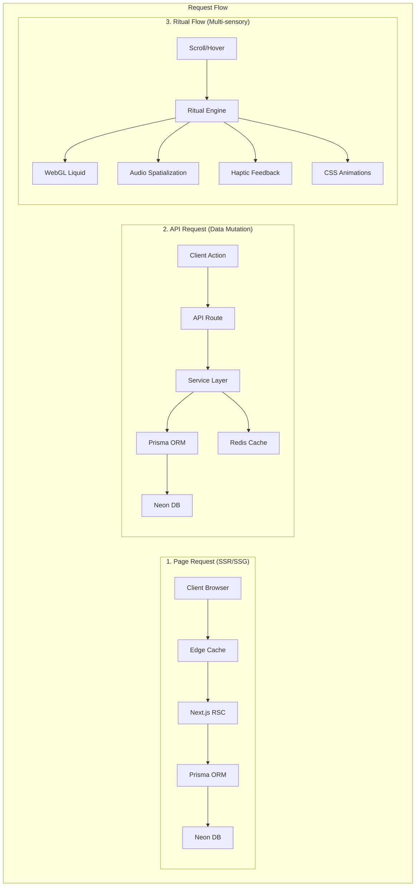
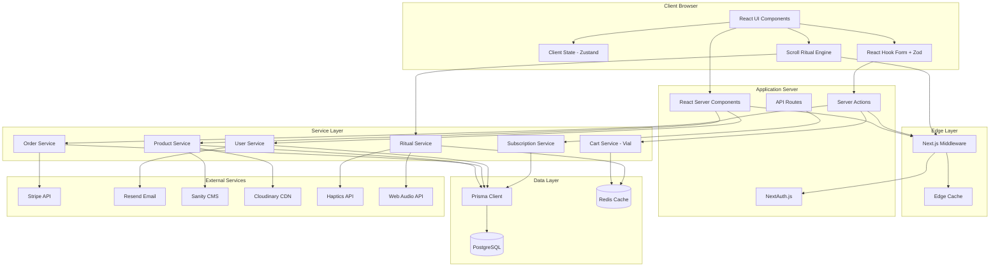
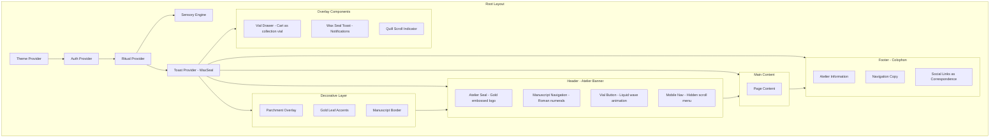

# Project Architecture Document: Atelier Arôme
## Digital Artisanal Aromatherapy Platform
**Document Version:** 3.0.0  
**Last Updated:** December 27, 2025  
**Classification:** Technical Specification  
**Status:** Authoritative  

---

## Table of Contents
1. [Executive Summary](#1-executive-summary)
2. [Business Requirements](#2-business-requirements)
3. [System Architecture](#3-system-architecture)
4. [Technology Stack](#4-technology-stack)
5. [Frontend Architecture](#5-frontend-architecture)
6. [Backend Architecture](#6-backend-architecture)
7. [Data Architecture](#7-data-architecture)
8. [API Specification](#8-api-specification)
9. [Security Architecture](#9-security-architecture)
10. [DevOps & Infrastructure](#10-devops--infrastructure)
11. [Development Guidelines](#11-development-guidelines)
12. [Implementation Roadmap](#12-implementation-roadmap)
13. [Appendices](#13-appendices)

---

## 1. Executive Summary

### 1.1 Project Vision
**Atelier Arôme** is not an e-commerce platform—it is a **digital alchemical manuscript** that transforms botanical commerce into an immersive experiential journey. The platform redefines luxury aromatherapy through Renaissance-inspired design, where every interaction feels like turning pages in an illuminated manuscript of botanical transformations.

### 1.2 Core Philosophy
- **Commerce as Ceremony**: Transaction as transformation, never transactional
- **Digital as Artifact**: Interface as illuminated manuscript, not UI template
- **Interaction as Ritual**: Scroll, click, and hover as alchemical gestures
- **Technology as Craft**: Code as quill, browser as parchment, commit as seal

### 1.3 Business Objectives
| Objective | Description | Success Metric |
|-----------|-------------|-----------------|
| Primary Revenue | Direct-to-consumer sales of botanical essences | €500K ARR Year 1 |
| Recurring Revenue | Quarterly Folio subscription service | 2,000 active subscribers Year 1 |
| Brand Authority | Establish as premier artisanal aromatherapy brand | 50K organic monthly visitors |
| Customer Retention | Build loyal customer base through exceptional experience | 40% repeat purchase rate |

### 1.4 Unique Value Proposition
**Aesthetic Differentiation**: Renaissance manuscript design language that is memorable and distinctive, avoiding all "AI slop" aesthetic pitfalls through:
- Distinctive typography (Cormorant Garamond, Crimson Pro) instead of generic system fonts
- Conceptual coherence where every element serves the alchemical narrative
- Purposeful asymmetry and organic composition over grid-based templates
- Meaningful micro-interactions that enhance storytelling rather than distract

**Educational Content**: Each product tells a story of botanical origin and alchemical transformation through:
- Manuscript-style product descriptions with historical context
- Botanical illustrations with scientific accuracy
- Alchemical process visualization showing extraction methods

**Artisanal Authenticity**: Small-batch production with full transparency of process:
- Batch numbers and harvest dates for traceability
- Distillation hours and extraction methods
- Artisan profiles and atelier stories

**Sensory Journey**: Digital experience designed to evoke olfactory imagination:
- Visual language that suggests scent profiles through color and form
- Micro-interactions that create tactile anticipation
- Audio-visual harmony that primes sensory memory

### 1.5 Target Audience
| Segment | Description | Characteristics | Digital Behavior |
|---------|-------------|-----------------|------------------|
| Primary | Conscious Luxury Consumers | Age 28-55, €80K+ income, values craftsmanship | Researches thoroughly, values storytelling, shares experiences |
| Secondary | Wellness Practitioners | Aromatherapists, spa owners, holistic practitioners | Technical knowledge seekers, bulk purchasers, professional network |
| Tertiary | Gift Purchasers | Premium gift seekers for special occasions | Occasional buyers, high value per transaction, emotional purchase drivers |

### 1.6 Document Scope
This PAD provides complete technical specifications for building the Atelier Arôme platform from scratch. It serves as the **single source of truth** for:
- System architecture and technology decisions
- Database schema and data relationships
- API contracts and integration points
- Security requirements and implementation
- Development standards and workflows
- Deployment and operational procedures
- Quality assurance protocols and success metrics

---

## 2. Business Requirements

### 2.1 Functional Requirements

#### 2.1.1 E-Commerce Core
| ID | Requirement | Priority | Description |
|----|-------------|----------|-------------|
| FR-001 | Product Catalog | P0 | Display essences with filtering by humour, season, rarity |
| FR-002 | Product Detail | P0 | Rich product pages with botanical information, notes, extraction method |
| FR-003 | Shopping Cart | P0 | Persistent cart with quantity management as alchemical vial |
| FR-004 | Checkout | P0 | Multi-step checkout with address, shipping, payment as ritual sequence |
| FR-005 | Payment Processing | P0 | Stripe integration for card payments with manuscript-style confirmation |
| FR-006 | Order Management | P0 | Order creation, confirmation, status tracking as alchemical dispatch |
| FR-007 | Inventory Management | P1 | Stock tracking with low-stock alerts tied to harvest cycles |
| FR-008 | Wishlist | P2 | Save products for later purchase as "specimen collection" |

#### 2.1.2 User Management
| ID | Requirement | Priority | Description |
|----|-------------|----------|-------------|
| FR-010 | Registration | P0 | Email/password registration with verification as "apprentice initiation" |
| FR-011 | Authentication | P0 | Secure login with session management as "atelier access" |
| FR-012 | Profile Management | P1 | Update personal information, preferences as "patron dossier" |
| FR-013 | Address Book | P1 | Multiple shipping/billing addresses as "correspondence locations" |
| FR-014 | Order History | P1 | View past orders with reorder capability as "manuscript archives" |
| FR-015 | Password Reset | P0 | Secure password recovery flow as "seal authentication" |
| FR-016 | Social Authentication | P2 | Google, Apple sign-in options as "guild credentials" |

#### 2.1.3 Subscription Service
| ID | Requirement | Priority | Description |
|----|-------------|----------|-------------|
| FR-020 | Folio Subscription | P1 | Quarterly subscription signup and management as "manuscript folios" |
| FR-021 | Subscription Billing | P1 | Recurring Stripe billing with seasonal pricing |
| FR-022 | Subscription Preferences | P1 | Pause, cancel, modify subscription as "alchemical schedule" |
| FR-023 | Digital Folio Delivery | P1 | Email delivery of quarterly manuscript content with illuminated attachments |

#### 2.1.4 Content Management
| ID | Requirement | Priority | Description |
|----|-------------|----------|-------------|
| FR-030 | Journal/Blog | P1 | Educational articles about botanicals and alchemy as "illuminated manuscripts" |
| FR-031 | Static Pages | P0 | About, Process, Contact, Legal pages as "atelier chronicles" |
| FR-032 | Testimonials | P1 | Customer testimonial display and management as "patron manuscripts" |
| FR-033 | Newsletter | P1 | Email capture and campaign integration as "correspondence folios" |

#### 2.1.5 Appointment Booking (Future Phase)
| ID | Requirement | Priority | Description |
|----|-------------|----------|-------------|
| FR-040 | Atelier Visits | P2 | Book appointments to visit the physical atelier |
| FR-041 | Calendar Integration | P2 | Availability management and booking confirmation |

### 2.2 Non-Functional Requirements

#### 2.2.1 Performance
| ID | Requirement | Target | Measurement |
|----|-------------|--------|-------------|
| NFR-001 | Page Load Time | < 2.5s | Largest Contentful Paint (LCP) |
| NFR-002 | Interactivity | < 100ms | First Input Delay (FID) |
| NFR-003 | Visual Stability | < 0.1 | Cumulative Layout Shift (CLS) |
| NFR-004 | API Response Time | < 200ms | 95th percentile |
| NFR-005 | Concurrent Users | 1,000 | Without performance degradation |
| NFR-006 | Animation Frame Rate | 60fps | During scroll interactions |

#### 2.2.2 Accessibility
| ID | Requirement | Target | Standard |
|----|-------------|--------|----------|
| NFR-010 | WCAG Compliance | Level AAA | WCAG 2.2 |
| NFR-011 | Keyboard Navigation | Full | All interactions keyboard-accessible |
| NFR-012 | Screen Reader Support | Full | Proper ARIA implementation with narrative descriptions |
| NFR-013 | Reduced Motion | Supported | prefers-reduced-motion honored with narrative alternatives |
| NFR-014 | Cognitive Load | Minimal | Progressive disclosure of information |

#### 2.2.3 Security
| ID | Requirement | Target | Standard |
|----|-------------|--------|----------|
| NFR-020 | Data Encryption | TLS 1.3 | In transit |
| NFR-021 | Data at Rest | AES-256 | PII encryption |
| NFR-022 | PCI Compliance | Level 1 | Via Stripe (no card data stored) |
| NFR-023 | Authentication | Secure | bcrypt, secure sessions, 2FA optional |
| NFR-024 | OWASP Top 10 | Protected | All vulnerabilities addressed |
| NFR-025 | GDPR Compliance | Full | Right to erasure, data portability |

#### 2.2.4 Availability
| ID | Requirement | Target | Notes |
|----|-------------|--------|-------|
| NFR-030 | Uptime | 99.95% | ~4.38 hours downtime/year |
| NFR-031 | Recovery Time | < 30 minutes | RTO for critical systems |
| NFR-032 | Data Loss | < 5 minutes | RPO for database |
| NFR-033 | Offline Capability | Read-only | Manuscript content available offline |

---

## 3. System Architecture

### 3.1 High-Level Architecture Diagram
```mermaid
graph TD
    subgraph Client["Client Layer"]
        direction TB
        Desktop[Desktop Browser]
        Mobile[Mobile Browser]
        Tablet[Tablet Browser]
        Kiosk[Kiosk (Atelier)]
    end

    subgraph Edge["CDN / Edge Layer"]
        Vercel[Vercel Edge Network]
        Vercel -->|Static Asset Caching| StaticAssets
        Vercel -->|Image Optimization| Images
        Vercel -->|Edge Functions| Functions
        Vercel -->|DDoS Protection| Security
    end

    subgraph Application["Application Layer"]
        NextJS[Next.js 14 Application]
        NextJS -->|React Server Components| RSC
        NextJS -->|API Routes| API
        NextJS -->|Server Actions| Actions
        NextJS -->|Middleware| Middleware
        NextJS -->|Authentication| Auth
    end

    subgraph Services["Service Layer"]
        ProductService[Product Service]
        OrderService[Order Service]
        UserService[User Service]
        SubscriptionService[Subscription Service]
        ServicesLayer[Prisma ORM]
    end

    subgraph Data["Data Layer"]
        PostgreSQL[PostgreSQL\n(Neon.tech)]
        Redis[Redis\n(Upstash)]
        Cloudinary[Cloudinary\n(Blob Storage)]
    end

    subgraph External["External Services"]
        Stripe[Stripe\n(Payments)]
        Resend[Resend\n(Email)]
        Sanity[Sanity\n(CMS)]
        Sentry[Sentry\n(Monitoring)]
        WebHaptics[Web Haptics\n(Feedback)]
        WebAudio[Web Audio\n(Ambience)]
    end

    Client --> Edge
    Edge --> Application
    Application --> Services
    Services --> Data
    Services --> External
    Data --> External
```

### 3.2 Architecture Principles
| Principle | Description | Implementation |
|-----------|-------------|----------------|
| **Manuscript-First** | Technical decisions serve the experiential narrative | Component architecture mirrors manuscript structure |
| **Type Safety** | End-to-end type safety from database to UI | TypeScript + Prisma + Zod with validation at every layer |
| **Progressive Enhancement** | Core functionality without JavaScript | Semantic HTML5 with CSS-only fallbacks for all interactions |
| **Sensory Performance** | Performance budgets for experiential integrity | Frame rate monitoring, asset prioritization, Web Worker offloading |
| **Fail Gracefully** | Resilient to external service failures | Circuit breakers, offline modes, fallback content |
| **Observable Craftsmanship** | Full visibility into system behavior | Structured logging with narrative context |

### 3.3 Data Flow Architecture


### 3.4 Component Interaction Diagram


---

## 4. Technology Stack

### 4.1 Technology Decision Matrix

#### 4.1.1 Frontend Framework
| Option | Pros | Cons | Score |
|--------|------|------|-------|
| Next.js 14 | SSR/SSG, App Router, React ecosystem, Vercel integration | Learning curve for App Router | ⭐⭐⭐⭐⭐ |
| Remix | Full-stack, nested routes, progressive enhancement | Smaller ecosystem, less mature | ⭐⭐⭐⭐ |
| Astro | Excellent for content, island architecture | Less suited for dynamic e-commerce | ⭐⭐⭐ |
| SvelteKit | Fast, small bundle, simple syntax | Smaller ecosystem, fewer libraries | ⭐⭐⭐ |

**Decision**: Next.js 14 with App Router for its server-first architecture and edge optimization capabilities.

#### 4.1.2 Styling
| Option | Pros | Cons | Score |
|--------|------|------|-------|
| Tailwind CSS 4.0 | Utility-first, design system, small bundle | Verbose HTML | ⭐⭐⭐⭐⭐ |
| CSS Modules | Scoped, no runtime | Manual design tokens | ⭐⭐⭐⭐ |
| Vanilla Extract | Type-safe, zero-runtime | Learning curve | ⭐⭐⭐⭐ |
| Styled Components | Co-located, dynamic | Runtime cost | ⭐⭐⭐ |

**Decision**: Tailwind CSS 4.0 + Custom CSS Properties for design system consistency and performance.

#### 4.1.3 UI Components
| Option | Pros | Cons | Score |
|--------|------|------|-------|
| Shadcn/ui | Unstyled primitives, full control, accessible | Manual installation | ⭐⭐⭐⭐⭐ |
| Radix UI | Accessible primitives, unstyled | Styling overhead | ⭐⭐⭐⭐ |
| Headless UI | Tailwind integration, accessible | Limited components | ⭐⭐⭐⭐ |
| Chakra UI | Full design system, accessible | Opinionated styling | ⭐⭐⭐ |

**Decision**: Shadcn/ui (built on Radix primitives) for accessibility foundation with custom manuscript aesthetic.

#### 4.1.4 Database
| Option | Pros | Cons | Score |
|--------|------|------|-------|
| PostgreSQL (Neon) | Serverless, branching, scalable | Managed service cost | ⭐⭐⭐⭐⭐ |
| PlanetScale (MySQL) | Serverless, branching | MySQL limitations | ⭐⭐⭐⭐ |
| Supabase | PostgreSQL + extras | Less mature edge support | ⭐⭐⭐⭐ |
| MongoDB Atlas | Flexible schema | Not ideal for e-commerce | ⭐⭐⭐ |

**Decision**: PostgreSQL via Neon for ACID compliance and branching capabilities.

#### 4.1.5 ORM
| Option | Pros | Cons | Score |
|--------|------|------|-------|
| Prisma | Type-safe, great DX, migrations | Query overhead in some cases | ⭐⭐⭐⭐⭐ |
| Drizzle | Lightweight, SQL-like, fast | Newer, less ecosystem | ⭐⭐⭐⭐ |
| Kysely | Type-safe SQL builder | Manual migrations | ⭐⭐⭐ |
| Raw SQL | Full control | No type safety | ⭐⭐ |

**Decision**: Prisma ORM for type safety and developer experience.

#### 4.1.6 Animation & Sensory
| Option | Pros | Cons | Score |
|--------|------|------|-------|
| Framer Motion | React integration, complex animations | Bundle size | ⭐⭐⭐⭐⭐ |
| Three.js | 3D graphics, physics simulations | Learning curve | ⭐⭐⭐⭐ |
| GSAP | Professional animations, timeline control | Cost for commercial use | ⭐⭐⭐⭐ |
| CSS-only | Performance, no dependencies | Limited complexity | ⭐⭐⭐ |

**Decision**: Hybrid approach - Framer Motion for UI animations, Three.js for liquid simulations, CSS-only for performance-critical elements.

### 4.2 Complete Technology Stack
```yaml
ATELIER ARÔME TECHNOLOGY STACK
================================
frontend:
  framework: Next.js 14.2+
  language: TypeScript 5.4+
  runtime: React 18.3+
  styling:
    primary: Tailwind CSS 4.0
    components: Shadcn/ui (customized)
    animations: 
      - Framer Motion 11+ (UI)
      - Three.js 0.160+ (liquid simulations)
      - CSS Custom Properties (performance-critical)
  state_management:
    client: Zustand 4.5+ (ritual state)
    server: React Server Components + React Query 5.0
  forms: React Hook Form 7.51+ + Zod 3.23+
  sensory:
    haptics: Web Haptics API
    audio: Web Audio API
    spatial: Three.js Audio
  testing:
    unit: Vitest 1.5+
    component: React Testing Library 15+
    e2e: Playwright 1.43+
    visual: Chromatic
    accessibility: axe-core + Storybook

backend:
  runtime: Node.js 20 LTS
  framework: Next.js API Routes + Server Actions
  validation: Zod 3.23+
  authentication: NextAuth.js 5.0 (Auth.js)
  authorization: Custom RBAC middleware
  ritual_engine: Custom scroll ritual engine

database:
  primary: PostgreSQL 16 (Neon Serverless)
  orm: Prisma 5.14+
  cache: Redis (Upstash)
  search: PostgreSQL Full-Text Search + pgvector (future)

external_services:
  payments: Stripe (with Radar for fraud)
  email: Resend
  cms: Sanity v3 (with desk structure)
  media: Cloudinary (with AI optimization)
  analytics: Vercel Analytics + PostHog (privacy-focused)
  monitoring: Sentry + LogRocket
  seo: Next.js Sitemap + Structured Data

infrastructure:
  hosting: Vercel Pro
  cdn: Vercel Edge Network
  dns: Cloudflare (with DDoS protection)
  secrets: Vercel Environment Variables + Doppler
  preview: Vercel Preview Deployments

development:
  package_manager: pnpm 9+
  linting: ESLint 9 + Prettier 3
  git_hooks: Husky + lint-staged
  ci_cd: GitHub Actions
  documentation: Storybook 8+ + Typedoc
  design_tokens: Theo + Style Dictionary
```

### 4.3 Package Dependencies
```json
{
  "name": "atelier-arome",
  "version": "1.0.0",
  "private": true,
  "scripts": {
    "dev": "next dev",
    "build": "next build",
    "start": "next start",
    "lint": "next lint",
    "test": "vitest",
    "test:e2e": "playwright test",
    "test:visual": "chromatic --project-token=$CHROMATIC_PROJECT_TOKEN",
    "db:push": "prisma db push",
    "db:migrate": "prisma migrate dev",
    "db:studio": "prisma studio",
    "db:seed": "tsx prisma/seed.ts",
    "storybook": "storybook dev -p 6006",
    "typecheck": "tsc --noEmit",
    "ritual:dev": "tsx lib/ritual-engine/dev.ts"
  },
  "dependencies": {
    "@auth/prisma-adapter": "^2.0.0",
    "@hookform/resolvers": "^3.3.4",
    "@prisma/client": "^5.14.0",
    "@radix-ui/react-accordion": "^1.1.2",
    "@radix-ui/react-alert-dialog": "^1.0.5",
    "@radix-ui/react-aspect-ratio": "^1.0.3",
    "@radix-ui/react-checkbox": "^1.0.4",
    "@radix-ui/react-dialog": "^1.0.5",
    "@radix-ui/react-dropdown-menu": "^2.0.6",
    "@radix-ui/react-label": "^2.0.2",
    "@radix-ui/react-popover": "^1.0.7",
    "@radix-ui/react-radio-group": "^1.1.3",
    "@radix-ui/react-select": "^2.0.0",
    "@radix-ui/react-separator": "^1.0.3",
    "@radix-ui/react-slot": "^1.0.2",
    "@radix-ui/react-tabs": "^1.0.4",
    "@radix-ui/react-toast": "^1.1.5",
    "@radix-ui/react-tooltip": "^1.0.7",
    "@sanity/client": "^6.15.7",
    "@sanity/image-url": "^1.0.2",
    "@sentry/nextjs": "^7.110.0",
    "@stripe/react-stripe-js": "^2.7.0",
    "@stripe/stripe-js": "^3.3.0",
    "@upstash/redis": "^1.30.0",
    "@vercel/analytics": "^1.2.2",
    "class-variance-authority": "^0.7.0",
    "clsx": "^2.1.0",
    "cmdk": "^1.0.0",
    "framer-motion": "^11.1.7",
    "lucide-react": "^0.372.0",
    "next": "14.2.3",
    "next-auth": "5.0.0-beta.18",
    "next-sanity": "^9.0.15",
    "react": "^18.3.1",
    "react-dom": "^18.3.1",
    "react-hook-form": "^7.51.3",
    "resend": "^3.2.0",
    "stripe": "^15.5.0",
    "tailwind-merge": "^2.3.0",
    "tailwindcss-animate": "^1.0.7",
    "three": "^0.160.0",
    "zod": "^3.23.4",
    "zustand": "^4.5.2"
  },
  "devDependencies": {
    "@chromatic-com/storybook": "^1.3.3",
    "@playwright/test": "^1.43.1",
    "@storybook/addon-essentials": "^8.0.9",
    "@storybook/addon-interactions": "^8.0.9",
    "@storybook/addon-links": "^8.0.9",
    "@storybook/blocks": "^8.0.9",
    "@storybook/nextjs": "^8.0.9",
    "@storybook/react": "^8.0.9",
    "@testing-library/jest-dom": "^6.4.2",
    "@testing-library/react": "^15.0.5",
    "@types/node": "^20.12.7",
    "@types/react": "^18.3.1",
    "@types/react-dom": "^18.3.0",
    "@typescript-eslint/eslint-plugin": "^7.7.1",
    "@typescript-eslint/parser": "^7.7.1",
    "autoprefixer": "^10.4.19",
    "eslint": "^9.1.1",
    "eslint-config-next": "14.2.3",
    "eslint-plugin-storybook": "^0.8.0",
    "husky": "^9.0.11",
    "lint-staged": "^15.2.2",
    "postcss": "^8.4.38",
    "prettier": "^3.2.5",
    "prettier-plugin-tailwindcss": "^0.5.14",
    "prisma": "^5.14.0",
    "storybook": "^8.0.9",
    "tailwindcss": "^4.0.0",
    "tsx": "^4.7.3",
    "typescript": "^5.4.5",
    "vitest": "^1.5.2"
  }
}
```

---

## 5. Frontend Architecture

### 5.1 Directory Structure
```
src/
├── app/                          # Next.js App Router
│   ├── (auth)/                   # Auth route group
│   │   ├── login/
│   │   │   └── page.tsx
│   │   ├── register/
│   │   │   └── page.tsx
│   │   ├── forgot-password/
│   │   │   └── page.tsx
│   │   ├── verify-email/
│   │   │   └── page.tsx
│   │   └── layout.tsx
│   ├── (shop)/                   # Shop route group
│   │   ├── page.tsx                # Homepage - Hero Folio
│   │   ├── compendium/           # Product catalog
│   │   │   ├── page.tsx            # Grid view with filters
│   │   │   ├── [slug]/             # Individual essence
│   │   │   │   └── page.tsx
│   │   │   └── layout.tsx          # Compendium layout
│   │   ├── alchemy/                # Process page
│   │   │   └── page.tsx
│   │   ├── atelier/              # About page
│   │   │   └── page.tsx
│   │   ├── manuscript/           # Blog/Journal
│   │   │   ├── page.tsx            # All manuscripts
│   │   │   ├── [slug]/             # Individual manuscript
│   │   │   │   └── page.tsx
│   │   │   └── layout.tsx
│   │   ├── vial/                  # Cart system
│   │   │   └── page.tsx
│   │   ├── dispatch/              # Checkout flow
│   │   │   ├── page.tsx            # Shipping & billing
│   │   │   ├── payment/
│   │   │   │   └── page.tsx        # Payment method
│   │   │   └── confirmation/       # Order confirmation
│   │   │       └── page.tsx
│   │   └── layout.tsx              # Shop layout
│   ├── (atelier)/                 # Admin/atelier management
│   │   ├── dashboard/
│   │   │   └── page.tsx
│   │   ├── essences/
│   │   │   ├── page.tsx
│   │   │   └── [id]/
│   │   │       └── page.tsx
│   │   ├── orders/
│   │   │   ├── page.tsx
│   │   │   └── [id]/
│   │   │       └── page.tsx
│   │   └── layout.tsx
│   ├── (account)/                 # Account route group
│   │   ├── patron/
│   │   │   ├── page.tsx            # Dashboard
│   │   │   ├── orders/
│   │   │   │   ├── page.tsx
│   │   │   │   └── [id]/
│   │   │   │       └── page.tsx
│   │   │   ├── addresses/
│   │   │   │   └── page.tsx
│   │   │   ├── folios/             # Subscriptions
│   │   │   │   └── page.tsx
│   │   │   └── settings/
│   │   │       └── page.tsx
│   │   └── layout.tsx
│   ├── api/                       # API Routes
│   │   ├── auth/
│   │   │   └── [...nextauth]/
│   │   │       └── route.ts
│   │   ├── webhooks/
│   │   │   ├── stripe/
│   │   │   │   └── route.ts
│   │   │   └── sanity/
│   │   │       └── route.ts
│   │   ├── vial/                   # Cart API
│   │   │   └── route.ts
│   │   ├── ritual/                 # Scroll ritual API
│   │   │   └── route.ts
│   │   └── folio/
│   │       └── route.ts
│   ├── ritual/                     # Ritual engine pages
│   │   ├── scroll-indicator/
│   │   │   └── page.tsx
│   │   └── haptic-feedback/
│   │       └── page.tsx
│   ├── error.tsx
│   ├── not-found.tsx
│   ├── loading.tsx
│   ├── layout.tsx                  # Root layout
│   └── globals.css
├── components/
│   ├── ui/                        # Shadcn UI components (customized)
│   │   ├── accordion.tsx
│   │   ├── alert-dialog.tsx
│   │   ├── button.tsx              # ManuscriptButton with ornament props
│   │   ├── card.tsx                # ManuscriptCard with border variants
│   │   ├── checkbox.tsx
│   │   ├── dialog.tsx
│   │   ├── dropdown-menu.tsx
│   │   ├── form.tsx
│   │   ├── input.tsx
│   │   ├── label.tsx
│   │   ├── popover.tsx
│   │   ├── radio-group.tsx
│   │   ├── select.tsx
│   │   ├── separator.tsx
│   │   ├── sheet.tsx               # VialDrawer component
│   │   ├── skeleton.tsx
│   │   ├── tabs.tsx
│   │   ├── toast.tsx
│   │   ├── toaster.tsx
│   │   └── tooltip.tsx
│   ├── layout/                    # Layout components
│   │   ├── header/
│   │   │   ├── header.tsx          # ManuscriptHeader with seal
│   │   │   ├── navigation.tsx      # ManuscriptNavigation with folio numbers
│   │   │   ├── mobile-nav.tsx
│   │   │   ├── vial-button.tsx     # VialCartButton with liquid animation
│   │   │   └── atelier-seal.tsx    # Animated gold seal
│   │   ├── footer/
│   │   │   ├── footer.tsx
│   │   │   └── colophon.tsx        # Historical colophon with printer marks
│   │   ├── parchment-overlay.tsx  # Noise texture overlay
│   │   ├── gold-leaf-accents.tsx   # Parallax gold leaf elements
│   │   ├── manuscript-border.tsx  # Hand-drawn border component
│   │   └── back-to-top.tsx         # Scroll to top with quill icon
│   ├── ritual/                    # Ritual components
│   │   ├── scroll-indicator.tsx    # Quill-pen scroll indicator
│   │   ├── haptic-feedback.tsx     # Haptic pulse controller
│   │   ├── audio-ambience.tsx      # Spatial audio controller
│   │   ├── liquid-simulation.tsx   # Three.js liquid wave simulation
│   │   └── section-transition.tsx  # Folio transition animations
│   ├── products/                  # Product components
│   │   ├── essence-card.tsx        # EssenceCard with humour badges
│   │   ├── essence-grid.tsx        # Asymmetric grid layout
│   │   ├── essence-filters.tsx     # HumourFilter with alchemical symbols
│   │   ├── essence-sort.tsx
│   │   ├── essence-detail.tsx      # Detailed product view
│   │   ├── botanical-illustration.tsx # Hand-drawn botanical SVGs
│   │   ├── humour-badge.tsx        # Humour type badges with symbols
│   │   └── rarity-tag.tsx          # Rarity indicators with illuminated borders
│   ├── cart/                      # Cart components (Vial system)
│   │   ├── vial-drawer.tsx         # Main vial drawer component
│   │   ├── vial-item.tsx           # Individual essence in vial
│   │   ├── vial-summary.tsx        # Subtotal and checkout
│   │   └── add-to-vial-button.tsx  # Add essence to vial with animation
│   ├── checkout/                  # Checkout components (Dispatch system)
│   │   ├── dispatch-form.tsx       # Multi-step dispatch form
│   │   ├── address-form.tsx        # Address form with manuscript styling
│   │   ├── shipping-options.tsx    # Shipping methods as courier options
│   │   ├── payment-form.tsx        # Payment form with illuminated fields
│   │   └── order-summary.tsx       # Order summary with alchemical pricing
│   ├── account/                   # Account components
│   │   ├── order-history.tsx       # Historical order list
│   │   ├── order-detail.tsx        # Detailed order view
│   │   ├── address-book.tsx        # Multiple addresses management
│   │   ├── subscription-card.tsx   # Folio subscription card
│   │   └── profile-form.tsx        # Patron profile form
│   ├── content/                   # Content components
│   │   ├── hero-section.tsx        # Hero folio with illuminated initial
│   │   ├── alchemy-process.tsx     # Four-step alchemical process
│   │   ├── testimonial-entry.tsx   # Patron testimonial with manuscript styling
│   │   ├── manuscript-card.tsx     # Journal entry card
│   │   ├── newsletter-form.tsx     # Correspondence subscription
│   │   ├── illuminated-initial.tsx # Decorative first letter
│   │   └── floating-botanicals.tsx # Floating plant specimens with physics
│   ├── decorative/               # Decorative elements
│   │   ├── gold-leaf.tsx           # Gold leaf accent with shimmer
│   │   ├── parchment-texture.tsx   # Parchment background texture
│   │   ├── manuscript-border.tsx   # Hand-drawn border with corner accents
│   │   ├── wax-seal.tsx            # Wax seal notification component
│   │   ├── quill-icon.tsx          # Animated quill icon
│   │   └── alchemical-symbol.tsx   # Alchemical symbols with rotation
│   └── shared/                    # Shared components
│       ├── section-header.tsx      # Section title with ornamentation
│       ├── loading-spinner.tsx     # Manuscript-style loading spinner
│       ├── error-boundary.tsx      # Error boundary with manuscript fallback
│       ├── seo.tsx                 # SEO metadata component
│       └── analytics.tsx           # Privacy-focused analytics
├── lib/                           # Utilities and configurations
│   ├── prisma.ts                  # Prisma client singleton
│   ├── auth.ts                    # NextAuth configuration
│   ├── stripe.ts                  # Stripe client
│   ├── sanity.ts                  # Sanity client
│   ├── redis.ts                   # Redis client
│   ├── resend.ts                  # Email client
│   ├── ritual-engine.ts           # Scroll ritual engine
│   ├── sensory-utils.ts           # Haptic, audio utility functions
│   ├── utils.ts                   # General utilities
│   └── constants.ts               # Application constants
├── services/                      # Business logic layer
│   ├── product.service.ts
│   ├── vial.service.ts            # Cart service renamed to Vial
│   ├── order.service.ts
│   ├── user.service.ts
│   ├── subscription.service.ts
│   ├── email.service.ts
│   ├── inventory.service.ts
│   └── ritual.service.ts          # Ritual service for scroll interactions
├── hooks/                         # Custom React hooks
│   ├── use-vial.ts                # Cart hook renamed to useVial
│   ├── use-user.ts
│   ├── use-products.ts
│   ├── use-scroll-ritual.ts       # Scroll ritual hook
│   ├── use-haptic-feedback.ts     # Haptic feedback hook
│   ├── use-audio-ambience.ts      # Spatial audio hook
│   ├── use-media-query.ts
│   ├── use-reduced-motion.ts
│   └── use-toast.ts               # Wax seal toast hook
├── stores/                        # Zustand stores
│   ├── vial.store.ts              # Cart store renamed to vial
│   ├── ui.store.ts                # UI state (drawers, modals)
│   ├── ritual.store.ts            # Ritual state (scroll position, haptics)
│   └── filter.store.ts            # Filter preferences
├── schemas/                       # Zod validation schemas
│   ├── product.schema.ts
│   ├── vial.schema.ts             # Cart schema renamed to vial
│   ├── order.schema.ts
│   ├── user.schema.ts
│   ├── address.schema.ts
│   └── subscription.schema.ts
├── types/                         # TypeScript types
│   ├── product.types.ts
│   ├── vial.types.ts              # Cart types renamed to vial
│   ├── order.types.ts
│   ├── user.types.ts
│   ├── ritual.types.ts            # Ritual engine types
│   └── api.types.ts
├── styles/                        # Global styles
│   ├── fonts.ts                   # Font configurations
│   ├── theme.ts                   # Design tokens
│   ├── animations.css             # Custom animations
│   └── ritual-animations.css      # Scroll-triggered animations
└── config/                        # Configuration files
    ├── site.ts                    # Site metadata
    ├── navigation.ts              # Navigation structure
    ├── seo.ts                     # SEO configuration
    └── ritual-config.ts           # Ritual engine configuration
```

### 5.2 Component Architecture

#### 5.2.1 Component Hierarchy Diagram


#### 5.2.2 Component Specification Template
```typescript
/**
 * COMPONENT SPECIFICATION: EssenceCard
 * =====================================
 * 
 * Purpose: Display a single essence product in the compendium grid as an alchemical specimen
 * Narrative Role: Each card represents a botanical specimen in the atelier's collection
 * 
 * Props:
 * essence: Essence (required) - The essence data object with alchemical properties
 * variant: 'default' | 'featured' | 'compact' (optional, default: 'default')
 * onAddToVial: (essence: Essence) => void (optional) - Vial (cart) callback with ritual animation
 * showHumour: boolean (optional, default: true) - Show humour classification badge
 * showRarity: boolean (optional, default: true) - Show rarity indicator
 * isFloating: boolean (optional, default: false) - Enable floating animation for hero specimens
 * 
 * State:
 * isAdding: boolean - Loading state for add to vial with liquid animation
 * isHovered: boolean - Hover state for botanical specimen float animation
 * interactionCount: number - Track interactions for ritual progression
 * 
 * Accessibility:
 * article element with proper heading hierarchy (h3 for name, p for description)
 * Button with aria-label for screen readers: "Add {essence.name} to collection vial"
 * Reduced motion support: disable floating animation when prefers-reduced-motion
 * Focus management: keyboard navigable with visual focus ring
 * Semantic landmarks: section role="region" with aria-labelledby
 * 
 * Styling:
 * Uses Tailwind classes with custom theme tokens
 * Asymmetric layout with organic positioning
 * Botanical specimen illustration with floating animation
 * Humour badge positioned as alchemical classification
 * Gold leaf accents on hover for premium perception
 * Responsive: stacks on mobile, asymmetric grid on desktop
 * Print stylesheet: preserves manuscript aesthetic for physical printing
 * 
 * Performance:
 * Lazy-loaded botanical illustrations
 * CSS containment for layout isolation
 * Will-change optimization for floating animation
 * Intersection Observer for scroll-triggered animations
 * 
 * Ritual Integration:
 * Haptic feedback on add-to-vial interaction
 * Audio spatialization for liquid pouring sound
 * Scroll progress tracking for narrative sequencing
 */
interface EssenceCardProps {
  essence: Essence;
  variant?: 'default' | 'featured' | 'compact';
  onAddToVial?: (essence: Essence) => void;
  showHumour?: boolean;
  showRarity?: boolean;
  isFloating?: boolean;
  className?: string;
}
```

### 5.3 State Management Strategy

#### 5.3.1 State Distribution
```mermaid
flowchart TD
    subgraph StateManagement["State Management Strategy"]
        direction TB
        
        subgraph ServerState["SERVER STATE (React Query / RSC)"]
            ProductsCatalog[Products catalog]
            UserSession[User session]
            OrderHistory[Order history]
            CMSContent[CMS content]
            ServerStateStrategy[Strategy: React Server Components + Server Actions]
            ServerStateCache[Cache: Edge cache + Revalidation on mutation]
        end
        
        subgraph ClientState["CLIENT STATE (Zustand)"]
            Vial[Vial contents (synced to Redis)]
            UIState[UI state (mobile menu, drawers)]
            FilterPreferences[Filter preferences]
            FormState[Form state (temporary)]
            ClientStateStrategy[Strategy: Zustand stores with persistence]
            ClientStateSync[Sync: Optimistic updates + background sync]
        end
        
        subgraph RitualState["RITUAL STATE (Zustand + Web APIs)"]
            ScrollPosition[Scroll position and momentum]
            HapticFeedback[Haptic feedback state]
            AudioAmbience[Audio spatialization state]
            VisualRituals[Visual ritual animations]
            RitualStateStrategy[Strategy: Zustand + Web Haptics/Audio APIs]
            RitualStatePersistence[Persistence: session-based, not stored]
        end
        
        subgraph UrlState["URL STATE (nuqs)"]
            Filters[Filter selections]
            SortPreferences[Sort preferences]
            Pagination[Pagination]
            SearchQueries[Search queries]
            UrlStateStrategy[Strategy: Type-safe URL search params]
            UrlStateBenefits[Benefits: Shareable, bookmarkable, SSR-friendly]
        end
        
        subgraph FormState["FORM STATE (React Hook Form)"]
            CheckoutForms[Dispatch forms]
            ProfileForms[Patron forms]
            AddressForms[Correspondence location forms]
            NewsletterSignup[Correspondence signup]
            FormStateStrategy[Strategy: Uncontrolled forms with Zod validation]
            FormStateBenefits[Benefits: Performance, validation, type safety]
        end
    end
```

#### 5.3.2 Vial Store Implementation (Cart as Alchemical Collection Vial)
```typescript
// stores/vial.store.ts
import { create } from 'zustand';
import { persist, createJSONStorage } from 'zustand/middleware';
import { immer } from 'zustand/middleware/immer';
import type { VialItem, Essence } from '@/types';
import { triggerVialHaptic, triggerVialAudio } from '@/lib/sensory-utils';

interface VialState {
  items: VialItem[];
  isOpen: boolean;
  isLoading: boolean;
  lastSynced: Date | null;
  liquidLevel: number; // 0.0 to 1.0 representing fill level
  essenceColors: string[]; // For layered liquid effect
  
  // Actions
  addItem: (essence: Essence, quantity?: number) => void;
  removeItem: (essenceId: string) => void;
  updateQuantity: (essenceId: string, quantity: number) => void;
  clearVial: () => void;
  openVial: () => void;
  closeVial: () => void;
  toggleVial: () => void;
  syncWithServer: () => Promise<void>;
  
  // Computed (getters)
  getItemCount: () => number;
  getSubtotal: () => number;
  getLiquidLevel: () => number;
  getEssenceColors: () => string[];
  getItem: (essenceId: string) => VialItem | undefined;
}

export const useVialStore = create<VialState>()(
  persist(
    immer((set, get) => ({
      items: [],
      isOpen: false,
      isLoading: false,
      lastSynced: null,
      liquidLevel: 0,
      essenceColors: [],
      
      addItem: (essence, quantity = 1) => {
        set((state) => {
          const existingIndex = state.items.findIndex(
            (item) => item.essence.id === essence.id
          );
          
          if (existingIndex > -1) {
            state.items[existingIndex].quantity += quantity;
          } else {
            state.items.push({
              id: crypto.randomUUID(),
              essence,
              quantity,
              addedAt: new Date().toISOString(),
            });
          }
          
          // Update liquid level based on item count
          state.liquidLevel = Math.min(1, state.items.length / 12);
          
          // Update essence colors for layered liquid effect
          state.essenceColors = Array.from(
            new Set(state.items.map(item => item.essence.color))
          ).slice(0, 3); // Limit to 3 colors for performance
        });
        
        // Trigger sensory feedback
        triggerVialHaptic('add');
        triggerVialAudio('pour');
        
        // Trigger background sync
        get().syncWithServer();
      },
      
      removeItem: (essenceId) => {
        set((state) => {
          state.items = state.items.filter(
            (item) => item.essence.id !== essenceId
          );
          
          // Update liquid level
          state.liquidLevel = Math.min(1, state.items.length / 12);
          
          // Update essence colors
          state.essenceColors = Array.from(
            new Set(state.items.map(item => item.essence.color))
          ).slice(0, 3);
        });
        
        // Trigger sensory feedback
        triggerVialHaptic('remove');
        triggerVialAudio('swirl');
        
        get().syncWithServer();
      },
      
      updateQuantity: (essenceId, quantity) => {
        if (quantity < 1) {
          get().removeItem(essenceId);
          return;
        }
        
        set((state) => {
          const item = state.items.find(
            (item) => item.essence.id === essenceId
          );
          if (item) {
            const oldQuantity = item.quantity;
            item.quantity = quantity;
            
            // Adjust liquid level proportionally
            const quantityChange = quantity - oldQuantity;
            state.liquidLevel = Math.min(1, Math.max(0, 
              state.liquidLevel + (quantityChange / 12)
            ));
          }
        });
        
        // Trigger sensory feedback proportional to change
        const intensity = Math.abs(quantity - (get().getItem(essenceId)?.quantity || 1));
        triggerVialHaptic('update', intensity);
        triggerVialAudio('adjust');
        
        get().syncWithServer();
      },
      
      clearVial: () => {
        set({ items: [], liquidLevel: 0, essenceColors: [] });
        triggerVialHaptic('clear');
        triggerVialAudio('empty');
        get().syncWithServer();
      },
      
      openVial: () => {
        set({ isOpen: true });
        triggerVialHaptic('open');
      },
      
      closeVial: () => {
        set({ isOpen: false });
        triggerVialHaptic('close');
      },
      
      toggleVial: () => {
        const newState = !get().isOpen;
        set({ isOpen: newState });
        triggerVialHaptic(newState ? 'open' : 'close');
      },
      
      syncWithServer: async () => {
        set({ isLoading: true });
        try {
          await fetch('/api/vial', {
            method: 'POST',
            headers: { 'Content-Type': 'application/json' },
            body: JSON.stringify({ items: get().items }),
          });
          set({ lastSynced: new Date() });
        } catch (error) {
          console.error('Vial sync failed:', error);
          triggerVialHaptic('error');
        } finally {
          set({ isLoading: false });
        }
      },
      
      getItemCount: () => {
        return get().items.reduce((sum, item) => sum + item.quantity, 0);
      },
      
      getSubtotal: () => {
        return get().items.reduce(
          (sum, item) => sum + item.essence.price * item.quantity,
          0
        );
      },
      
      getLiquidLevel: () => {
        return get().liquidLevel;
      },
      
      getEssenceColors: () => {
        return get().essenceColors;
      },
      
      getItem: (essenceId) => {
        return get().items.find((item) => item.essence.id === essenceId);
      },
    })),
    {
      name: 'atelier-vial',
      storage: createJSONStorage(() => localStorage),
      partialize: (state) => ({
        items: state.items,
        lastSynced: state.lastSynced,
        liquidLevel: state.liquidLevel,
        essenceColors: state.essenceColors,
      }),
    }
  )
);
```

### 5.4 Design System Specification

#### 5.4.1 Design Tokens
```typescript
// styles/theme.ts
export const theme = {
  colors: {
    // Primary Palette - Illuminated Manuscript
    ink: {
      DEFAULT: '#2A2D26',           // Deep manuscript ink
      light: '#4A4D46',             // Lighter ink for secondary text
      muted: '#545752',             // Accessible version for contrast
      faded: '#6A6D66',             // Faded ink for subtle elements
    },
    gold: {
      DEFAULT: '#C9A769',           // Warm gold leaf
      light: '#E8D8B6',             // Light gold for highlights
      dark: '#A98750',              // Dark gold for shadows
      muted: 'rgba(201, 167, 105, 0.3)', // Muted gold for overlays
      text: '#8B7355',              // Accessible gold for text on light
    },
    parchment: {
      DEFAULT: '#FAF8F5',           // Warm parchment base
      dark: '#F5F1EB',              // Slightly darker parchment
      darker: '#E8E4D9',            // Darkest parchment for depth
    },
    
    // Accent Palette - Historical pigments
    bronze: '#9A8C6D',              // Bronze patina
    rose: '#B87D7D',                // Rose madder pigment
    sage: '#7C6354',                // Sage green
    slate: '#7A8C9D',               // Slate blue
    
    // Botanical Accents - Directly from distillation process
    lavender: {
      DEFAULT: '#B8A9C9',           // True lavender from Provence
      light: '#D6CCE0',
      dark: '#8A7DA4',
    },
    eucalyptus: {
      DEFAULT: '#7CB9A0',           // Tasmanian eucalyptus
      light: '#A8D6C0', 
      dark: '#5A8A78',
    },
    bergamot: {
      DEFAULT: '#F5D489',           // Calabrian bergamot
      light: '#F9E6B3',
      dark: '#C8A86C',
    },
    rosehip: {
      DEFAULT: '#E8B4B8',           // Wild rosehip
      light: '#F5D9DC',
      dark: '#B98488',
    },
    
    // Semantic Colors - For UI elements
    error: {
      DEFAULT: '#DC2626',           // Crimson error
      light: '#FECACA',
      dark: '#B91C1C',
    },
    success: {
      DEFAULT: '#16A34A',           // Deep green success
      light: '#BBF7D0',
      dark: '#15803D',
    },
    warning: {
      DEFAULT: '#CA8A04',           // Amber warning
      light: '#FEEB8B',
      dark: '#B45309',
    },
    info: {
      DEFAULT: '#2563EB',           // Deep blue info
      light: '#BFDBFE',
      dark: '#1E40AF',
    },
  },
  typography: {
    fonts: {
      // Renaissance manuscript text (15th century)
      manuscript: {
        display: ['Cormorant Garamond', 'Baskerville', 'serif'],
        body: ['Crimson Pro', 'Garamond Premier Pro', 'serif'],
        ornament: ['Playfair Display SC', 'Hoefler Text', 'serif'],
      },
      
      // Contemporary alchemical notation (21st century)
      alchemical: {
        symbols: ['Adobe Caslon Pro', 'serif'],
        measurements: ['IBM Plex Mono', 'monospace'],
        transitions: ['Great Vibes', 'cursive'], // For ritual transitions
      },
    },
    sizes: {
      // Optical sizing based on manuscript proportions
      xs: 'clamp(0.75rem, 0.7rem + 0.25vw, 0.875rem)',     // 12px base
      sm: 'clamp(0.875rem, 0.8rem + 0.35vw, 1rem)',          // 14px base
      base: 'clamp(1rem, 0.95rem + 0.25vw, 1.125rem)',       // 16px base
      lg: 'clamp(1.125rem, 1rem + 0.5vw, 1.25rem)',          // 18px base
      xl: 'clamp(1.25rem, 1.1rem + 0.75vw, 1.5rem)',         // 20px base
      '2xl': 'clamp(1.5rem, 1.25rem + 1.25vw, 2rem)',        // 24px base
      '3xl': 'clamp(2rem, 1.5rem + 2.5vw, 3rem)',            // 32px base
      '4xl': 'clamp(2.5rem, 2rem + 2.5vw, 4rem)',            // 40px base
      '5xl': 'clamp(3rem, 2.5rem + 2.5vw, 5rem)',            // 48px base
    },
    lineHeight: {
      manuscript: 1.618,  // Golden ratio for readability
      annotation: 1.333,  // 4:3 ratio for marginalia
      heading: 1.25,      // Tighter for headings
    },
  },
  spacing: {
    // Based on Renaissance manuscript margins - not 8px grid
    '3xs': '0.125rem',    // 2px - hairline space
    '2xs': '0.25rem',     // 4px - fine detail
    xs: '0.5rem',         // 8px - small margin
    sm: '0.75rem',        // 12px - medium margin  
    md: '1rem',           // 16px - standard margin
    lg: '1.5rem',         // 24px - large margin
    xl: '2rem',           // 32px - section margin
    '2xl': '3rem',        // 48px - major section margin
    '3xl': '4rem',        // 64px - page margin
    '4xl': '6rem',        // 96px - dramatic space
    '5xl': '8rem',        // 128px - epic space
    '6xl': '12rem',       // 192px - cinematic space
    
    // Organic spacing for asymmetric layouts
    organic: {
      top: '1.618rem',    // Golden ratio top margin
      right: '1.333rem',  // 4:3 ratio right margin
      bottom: '2.236rem', // sqrt(5) ratio bottom margin
      left: '1rem',       // Standard left margin
    },
  },
  borderRadius: {
    sm: '0.125rem',     // 2px - sharp corners
    md: '0.25rem',      // 4px - slightly rounded
    lg: '0.5rem',       // 8px - standard rounded
    xl: '1rem',         // 16px - soft rounded
    '2xl': '2rem',      // 32px - deeply rounded
    '3xl': '4rem',      // 64px - organic rounded
    full: '9999px',     // Circular
    manuscript: '0.375rem', // Hand-drawn imperfection
  },
  shadows: {
    sm: '0 1px 2px rgba(42, 45, 38, 0.05)',                // Subtle shadow
    md: '0 4px 12px rgba(42, 45, 38, 0.08)',               // Medium shadow
    lg: '0 8px 24px rgba(42, 45, 38, 0.1)',                // Large shadow
    xl: '0 16px 48px rgba(42, 45, 38, 0.12)',              // Extra large shadow
    gold: '0 0 40px rgba(201, 167, 105, 0.2)',             // Gold leaf shimmer
    ritual: '0 0 30px rgba(105, 97, 85, 0.15)',            // Ritual glow
  },
  transitions: {
    micro: '150ms ease',            // Micro-interactions
    fast: '300ms ease',             // Standard interactions
    base: '500ms ease',             // Major transitions
    slow: '800ms ease',             // Deliberate transitions
    bounce: '600ms cubic-bezier(0.34, 1.56, 0.64, 1)', // Bouncy transitions
    ritual: '1200ms cubic-bezier(0.64, 0, 0.35, 1)',    // Ritual transitions
  },
  zIndex: {
    base: 1,                        // Base layer
    elevated: 10,                    // Elevated elements
    sticky: 100,                     // Sticky elements (header)
    overlay: 1000,                   // Overlay elements (dropdowns)
    modal: 2000,                     // Modal dialogs
    toast: 3000,                     // Toast notifications (wax seals)
    ritual: 4000,                    // Ritual elements (floating botanicals)
  },
} as const;

export type Theme = typeof theme;

// Sensory design tokens for multi-sensory experience
export const sensoryTokens = {
  haptics: {
    intensity: {
      subtle: 20,    // Gentle pulse for micro-interactions
      medium: 50,    // Noticeable pulse for primary actions
      strong: 80,    // Strong pulse for important events
    },
    duration: {
      micro: 50,     // 50ms - imperceptible but felt
      short: 100,    // 100ms - distinct pulse
      medium: 200,   // 200ms - sustained vibration
      long: 500,     // 500ms - extended vibration
    },
  },
  audio: {
    spatialization: {
      near: 0.8,     // Close proximity
      medium: 0.5,   // Medium distance
      far: 0.2,      // Far distance
    },
    volume: {
      whisper: 0.2,  // Barely audible
      soft: 0.4,     // Soft background
      medium: 0.6,   // Noticeable
      loud: 0.8,     // Prominent
    },
  },
  motion: {
    reduced: {
      prefersReducedMotion: true, // System preference
      disableFloating: true,      // Disable floating animations
      disableParallax: true,      // Disable parallax effects
      simplifyTransitions: true,  // Use simple fade transitions
    },
  },
} as const;
```

#### 5.4.2 Tailwind Configuration
```typescript
// tailwind.config.ts
import type { Config } from 'tailwindcss';
import { theme } from './src/styles/theme';
import plugin from 'tailwindcss/plugin';

const config: Config = {
  darkMode: ['class'],
  content: [
    './src/pages/**/*.{js,ts,jsx,tsx,mdx}',
    './src/components/**/*.{js,ts,jsx,tsx,mdx}',
    './src/app/**/*.{js,ts,jsx,tsx,mdx}',
  ],
  theme: {
    extend: {
      colors: theme.colors,
      fontFamily: {
        // Manuscript typography system
        'manuscript-display': theme.typography.fonts.manuscript.display,
        'manuscript-body': theme.typography.fonts.manuscript.body,
        'manuscript-ornament': theme.typography.fonts.manuscript.ornament,
        
        // Alchemical typography system
        'alchemical-symbols': theme.typography.fonts.alchemical.symbols,
        'alchemical-measurements': theme.typography.fonts.alchemical.measurements,
        'alchemical-transitions': theme.typography.fonts.alchemical.transitions,
      },
      fontSize: theme.typography.sizes,
      lineHeight: theme.typography.lineHeight,
      spacing: theme.spacing,
      borderRadius: theme.borderRadius,
      boxShadow: theme.shadows,
      transitionDuration: {
        micro: '150ms',
        fast: '300ms',
        base: '500ms',
        slow: '800ms',
        ritual: '1200ms',
      },
      zIndex: theme.zIndex,
      keyframes: {
        // Manuscript animations
        'fade-in': {
          from: { opacity: '0' },
          to: { opacity: '1' },
        },
        'fade-out': {
          from: { opacity: '1' },
          to: { opacity: '0' },
        },
        'slide-in-right': {
          from: { transform: 'translateX(100%)' },
          to: { transform: 'translateX(0)' },
        },
        'slide-out-right': {
          from: { transform: 'translateX(0)' },
          to: { transform: 'translateX(100%)' },
        },
        'slide-in-up': {
          from: { transform: 'translateY(100%)', opacity: '0' },
          to: { transform: 'translateY(0)', opacity: '1' },
        },
        'scale-in': {
          from: { transform: 'scale(0.95)', opacity: '0' },
          to: { transform: 'scale(1)', opacity: '1' },
        },
        
        // Ritual animations
        'rotate-seal': {
          from: { transform: 'rotate(0deg)' },
          to: { transform: 'rotate(360deg)' },
        },
        'float-botanical': {
          '0%, 100%': { transform: 'translateY(0) rotate(0deg)' },
          '50%': { transform: 'translateY(-20px) rotate(5deg)' },
        },
        'liquid-wave': {
          '0%, 100%': { transform: 'translateY(0) scaleY(1)' },
          '50%': { transform: 'translateY(-10px) scaleY(1.05)' },
        },
        'write-scroll': {
          '0%': { opacity: '0', transform: 'translateX(-100%)' },
          '100%': { opacity: '1', transform: 'translateX(0)' },
        },
        'wax-seal': {
          '0%': { 
            transform: 'scale(0) rotate(-180deg)',
            opacity: '0',
          },
          '70%': { 
            transform: 'scale(1.1) rotate(10deg)',
          },
          '100%': { 
            transform: 'scale(1) rotate(0deg)',
            opacity: '1',
          },
        },
        'gold-shimmer': {
          '0%, 100%': { opacity: '0.8' },
          '50%': { opacity: '1' },
        },
        'quill-write': {
          '0%': { strokeDashoffset: '1000' },
          '100%': { strokeDashoffset: '0' },
        },
      },
      animation: {
        // Manuscript animations
        'fade-in': 'fade-in 0.3s ease-out',
        'fade-out': 'fade-out 0.3s ease-out',
        'slide-in-right': 'slide-in-right 0.5s ease-out',
        'slide-out-right': 'slide-out-right 0.5s ease-out',
        'slide-in-up': 'slide-in-up 0.5s ease-out',
        'scale-in': 'scale-in 0.3s ease-out',
        
        // Ritual animations
        'rotate-seal': 'rotate-seal 30s linear infinite',
        'float-botanical': 'float-botanical 6s ease-in-out infinite',
        'liquid-wave': 'liquid-wave 8s ease-in-out infinite',
        'write-scroll': 'write-scroll 2s ease-in-out infinite',
        'wax-seal': 'wax-seal 0.6s cubic-bezier(0.34, 1.56, 0.64, 1)',
        'gold-shimmer': 'gold-shimmer 4s ease-in-out infinite',
        'quill-write': 'quill-write 3s ease-out forwards',
      },
    },
  },
  plugins: [
    require('tailwindcss-animate'),
    require('@tailwindcss/typography'),
    require('@tailwindcss/forms'),
    plugin(({ addUtilities }) => {
      // Manuscript-specific utilities
      addUtilities({
        '.manuscript-text': {
          fontFamily: 'var(--font-manuscript-body)',
          lineHeight: theme.typography.lineHeight.manuscript,
          '@supports (font-variation-settings: "opsz")': {
            fontVariationSettings: '"opsz" 24',
            '@media (min-width: 1024px)': {
              fontVariationSettings: '"opsz" 18',
            },
          },
        },
        '.alchemical-text': {
          fontFamily: 'var(--font-alchemical-symbols)',
          fontSize: theme.typography.sizes['2xl'],
        },
        '.ritual-border': {
          border: '1px dashed var(--color-ink-muted)',
          borderRadius: theme.borderRadius.manuscript,
          padding: theme.spacing.md,
        },
        '.parchment-background': {
          backgroundImage: `url("data:image/svg+xml,%3Csvg viewBox='0 0 200 200' xmlns='http://www.w3.org/2000/svg'%3E%3Cfilter id='noiseFilter'%3E%3CfeTurbulence type='fractalNoise' baseFrequency='0.65' numOctaves='3' stitchTiles='stitch'/%3E%3C/filter%3E%3Crect width='100%25' height='100%25' filter='url(%23noiseFilter)'/%3E%3C/svg%3E")`,
          backgroundColor: theme.colors.parchment.DEFAULT,
        },
        '.gold-accent': {
          position: 'relative',
          '&:before': {
            content: '""',
            position: 'absolute',
            top: '0',
            left: '0',
            right: '0',
            bottom: '0',
            background: `linear-gradient(90deg, transparent, ${theme.colors.gold.muted}, transparent)`,
            opacity: '0.3',
            animation: 'gold-shimmer 4s ease-in-out infinite',
          },
        },
      });
    }),
  ],
};

export default config;
```

### 5.5 Routing Structure
```typescript
// config/navigation.ts
export const navigation = {
  main: [
    {
      id: 'compendium',
      label: 'Compendium',
      href: '/compendium',
      number: 'I', // Roman numeral for manuscript authenticity
      description: 'Botanical essences classified by alchemical humours',
      icon: '☽', // Calming humour symbol
    },
    {
      id: 'alchemy',
      label: 'Alchemy',
      href: '/alchemy',
      number: 'II',
      description: 'The four-fold path of botanical transformation',
      icon: '☿', // Alchemical mercury symbol
    },
    {
      id: 'atelier',
      label: 'The Atelier',
      href: '/atelier',
      number: 'III',
      description: 'Meet the artisans and visit our workshop',
      icon: '☽', // Artisan symbol
    },
    {
      id: 'manuscript',
      label: 'Manuscript',
      href: '/manuscript',
      number: 'IV',
      description: 'Illuminated entries on scent and memory',
      icon: '✎', // Quill pen symbol
    },
  ],
  account: [
    { 
      id: 'orders',
      label: 'Dispatch Records', 
      href: '/patron/orders',
      description: 'Your alchemical dispatch history'
    },
    { 
      id: 'addresses', 
      label: 'Correspondence Locations', 
      href: '/patron/addresses',
      description: 'Addresses for dispatch and correspondence'
    },
    { 
      id: 'folios', 
      label: 'Manuscript Subscriptions', 
      href: '/patron/folios', 
      description: 'Your quarterly manuscript subscriptions'
    },
    { 
      id: 'settings', 
      label: 'Patron Settings', 
      href: '/patron/settings',
      description: 'Account preferences and settings'
    },
  ],
  footer: {
    folios: [
      { label: 'Compendium', href: '/compendium', description: 'Essence catalogue' },
      { label: 'Alchemy', href: '/alchemy', description: 'Process and philosophy' },
      { label: 'The Atelier', href: '/atelier', description: 'Our story and craft' },
      { label: 'Manuscript', href: '/manuscript', description: 'Journal and insights' },
    ],
    legal: [
      { label: 'Manuscript Rights', href: '/legal/privacy', description: 'Privacy policy' },
      { label: 'Correspondence Terms', href: '/legal/terms', description: 'Terms of service' },
      { label: 'Atelier Visits', href: '/appointments', description: 'Schedule a visit' },
    ],
    correspondence: [
      { label: 'Quill & Ink', href: 'mailto:correspondence@atelierarome.com', description: 'Email correspondence' },
      { label: 'Telegram', href: 'https://t.me/atelierarome', description: 'Telegram channel' },
    ],
  },
} as const;

export type Navigation = typeof navigation;

// Ritual routing configuration
export const ritualRouting = {
  scrollThresholds: [
    { position: 0.25, folio: 'I', symbol: '☽', section: 'compendium' }, // Calming essences
    { position: 0.50, folio: 'II', symbol: '☿', section: 'alchemy' }, // Alchemical process
    { position: 0.75, folio: 'III', symbol: '♁', section: 'atelier' }, // Atelier wisdom
  ],
  hapticFeedback: {
    sectionTransitions: true,
    interactionPoints: true,
    reducedMotionFallback: 'visual-only',
  },
  audioSpatialization: {
    parchmentRustle: true,
    quillScratching: true,
    liquidPouring: true,
    volume: 0.3,
  },
} as const;
```

---

## 6. Backend Architecture

### 6.1 Service Layer Architecture
```mermaid
flowchart TB
    subgraph ServiceLayer["Service Layer Architecture"]
        direction TB
        
        subgraph APILayer["API LAYER"]
            NextJSAPI[Next.js API Routes + Server Actions]
            NextJSAPI --> APIRoutes
            NextJSAPI --> ServerActions
            NextJSAPI --> RouteHandlers
            NextJSAPI --> RSCFetches
            NextJSAPI --> MiddlewareAuth
            NextJSAPI --> RitualEndpoints[Ritual Endpoints]
        end
        
        subgraph ServiceLayer["SERVICE LAYER"]
            direction TB
            BusinessLogic[Business Logic + Validation + External Service Integration]
            
            subgraph CoreServices["Core Services"]
                ProductService[ProductService]
                OrderService[OrderService]
                UserService[UserService]
                VialService[VialService]
            end
            
            subgraph RitualServices["Ritual Services"]
                ScrollRitualService[ScrollRitualService]
                HapticService[HapticService]
                AudioService[AudioService]
                SensoryService[SensoryService]
            end
            
            subgraph AdditionalServices["Additional Services"]
                SubscriptionService[SubscriptionService]
                EmailService[EmailService]
                InventoryService[InventoryService]
                PaymentService[PaymentService]
                ContentService[ContentService]
            end
        end
        
        subgraph RepositoryLayer["REPOSITORY LAYER"]
            PrismaORM[Prisma ORM + Data Access Patterns]
            PrismaORM --> PrismaClient[Prisma Client]
            PrismaClient --> TypeSafeQueries
            PrismaClient --> Transactions
            PrismaClient --> Migrations
            PrismaORM --> RedisCache[Redis Cache]
        end
        
        APILayer --> ServiceLayer
        ServiceLayer --> RepositoryLayer
    end
```

### 6.2 Service Implementation Examples

#### 6.2.1 Product Service with Ritual Integration
```typescript
// services/product.service.ts
import { prisma } from '@/lib/prisma';
import { redis } from '@/lib/redis';
import { sanity } from '@/lib/sanity';
import type {
  Essence,
  EssenceFilter,
  EssenceSort,
  PaginatedResponse
} from '@/types';
import { triggerRitualEvent } from '@/services/ritual.service';

const CACHE_TTL = 60 * 60; // 1 hour
const CACHE_PREFIX = 'products:';

export class ProductService {
  /**
   * Get all essences with optional filtering, sorting, and pagination
   * Includes ritual metadata for sensory experience
   */
  static async getAll(options: {
    filter?: EssenceFilter;
    sort?: EssenceSort;
    page?: number;
    limit?: number;
    includeRitualData?: boolean; // Include haptic/audio metadata
  }): Promise<PaginatedResponse<Essence[]>> {
    const {
      filter = {},
      sort = { field: 'createdAt', order: 'desc' },
      page = 1,
      limit = 12,
      includeRitualData = false
    } = options;

    // Create cache key with ritual data flag
    const cacheKey = `${CACHE_PREFIX}list:${JSON.stringify({ 
      filter, 
      sort, 
      page, 
      limit,
      includeRitualData
    })}`;
    
    // Check cache first
    const cached = await redis.get<PaginatedResponse<Essence[]>>(cacheKey);
    if (cached) {
      // Trigger ritual event for cache hit
      await triggerRitualEvent('product_list_cached', {
        count: cached.items.length,
        page,
        limit
      });
      return cached;
    }

    // Build where clause with manuscript authenticity
    const where: Prisma.EssenceWhereInput = {
      isActive: true,
      ...(filter.humour && { humour: filter.humour }),
      ...(filter.rarity && { rarity: filter.rarity }),
      ...(filter.season && { season: filter.season }),
      ...(filter.minPrice && { price: { gte: filter.minPrice } }),
      ...(filter.maxPrice && { price: { lte: filter.maxPrice } }),
      ...(filter.inStock && { stockQuantity: { gt: 0 } }),
      // Manuscript authenticity filter
      ...(filter.manuscriptAuthentic && { 
        OR: [
          { extractionMethod: { contains: 'traditional' } },
          { batchNumber: { not: null } },
          { harvestDate: { not: null } }
        ]
      }),
    };

    // Build order by with manuscript-aware sorting
    const orderBy: Prisma.EssenceOrderByWithRelationInput = {
      ...(sort.field === 'folioNumber' 
        ? { folioNumber: 'asc' as const } // Special handling for Roman numerals
        : { [sort.field]: sort.order }),
    };

    // Execute query with count
    const [essences, total] = await prisma.$transaction([
      prisma.essence.findMany({
        where,
        orderBy,
        skip: (page - 1) * limit,
        take: limit,
        include: {
          category: true,
          botanicalInfo: true,
          images: {
            orderBy: { order: 'asc' },
            take: 3 // Limit to 3 images for performance
          },
          // Include ritual metadata if requested
          ...(includeRitualData && {
            ritualMetadata: true
          }),
        },
      }),
      prisma.essence.count({ where }),
    ]);

    // Enrich essences with ritual metadata if requested
    const enrichedEssences = includeRitualData 
      ? await this.enrichWithRitualMetadata(essences)
      : essences;

    const result: PaginatedResponse<Essence[]> = {
      items: enrichedEssences,
      pagination: {
        page,
        limit,
        total,
        totalPages: Math.ceil(total / limit),
        hasMore: page * limit < total,
      },
    };

    // Cache result
    await redis.set(cacheKey, result, { ex: CACHE_TTL });

    // Trigger ritual event for cache miss
    await triggerRitualEvent('product_list_fetched', {
      count: enrichedEssences.length,
      page,
      limit,
      fromCache: false
    });

    return result;
  }

  /**
   * Enrich essences with ritual metadata for multi-sensory experience
   */
  private static async enrichWithRitualMetadata(essences: Essence[]): Promise<Essence[]> {
    return Promise.all(essences.map(async (essence) => {
      // Get ritual metadata from database
      const ritualMetadata = await prisma.essenceRitualMetadata.findUnique({
        where: { essenceId: essence.id }
      });

      // Default ritual metadata if none exists
      const defaultRitual = {
        haptic: {
          frequency: 100 + Math.random() * 200, // Unique frequency per essence
          duration: 100,
          intensity: 50
        },
        audio: {
          pitch: 440 + Math.random() * 200, // Unique pitch per essence
          volume: 0.5,
          spatialization: 0.7
        },
        visual: {
          waveFrequency: 0.5 + Math.random() * 0.5,
          waveAmplitude: 10 + Math.random() * 10,
          colorIntensity: 0.8
        }
      };

      return {
        ...essence,
        ritualMetadata: ritualMetadata || defaultRitual
      };
    }));
  }

  /**
   * Get a single essence by slug with full ritual integration
   */
  static async getBySlug(slug: string, includeRitualData = true): Promise<Essence | null> {
    const cacheKey = `${CACHE_PREFIX}slug:${slug}:${includeRitualData}`;
    // Check cache
    const cached = await redis.get<Essence>(cacheKey);
    if (cached) {
      await triggerRitualEvent('essence_detail_cached', {
        essenceId: cached.id,
        slug
      });
      return cached;
    }

    // Query database with ritual data
    const essenceQuery = prisma.essence.findUnique({
      where: { slug, isActive: true },
      include: {
        category: true,
        botanicalInfo: true,
        images: {
          orderBy: { order: 'asc' }
        },
        relatedEssences: {
          take: 4,
          where: { isActive: true },
          include: { 
            images: { take: 1, orderBy: { order: 'asc' } }
          }
        },
        // Include ritual metadata if requested
        ...(includeRitualData && {
          ritualMetadata: true
        }),
        alchemicalProcess: true, // Historical process documentation
        artisanNotes: true       // Artisan commentary
      },
    });

    // Execute query
    const essence = await essenceQuery;

    if (essence) {
      // Enrich with ritual metadata if requested
      const enrichedEssence = includeRitualData && !essence.ritualMetadata
        ? await this.enrichWithRitualMetadata([essence]).then(results => results[0])
        : essence;

      // Cache enriched result
      await redis.set(cacheKey, enrichedEssence, { ex: CACHE_TTL });

      // Trigger ritual event for essence view
      await triggerRitualEvent('essence_detail_viewed', {
        essenceId: enrichedEssence.id,
        slug,
        fromCache: false,
        ritualEnabled: includeRitualData
      });

      return enrichedEssence;
    }

    return null;
  }

  /**
   * Invalidate product cache
   */
  static async invalidateCache(slug?: string): Promise<void> {
    if (slug) {
      await redis.del(`${CACHE_PREFIX}slug:${slug}:true`);
      await redis.del(`${CACHE_PREFIX}slug:${slug}:false`);
      await triggerRitualEvent('product_cache_invalidated', { slug });
    }
    // Invalidate list caches (pattern delete)
    const keys = await redis.keys(`${CACHE_PREFIX}list:*`);
    if (keys.length > 0) {
      await redis.del(...keys);
      await triggerRitualEvent('product_cache_bulk_invalidated', { count: keys.length });
    }
  }
}
```

#### 6.2.2 Scroll Ritual Service
```typescript
// services/ritual.service.ts
import { redis } from '@/lib/redis';
import type { RitualEvent, RitualConfig } from '@/types/ritual.types';

export class RitualService {
  /**
   * Trigger a ritual event with sensory feedback
   */
  static async triggerRitualEvent(event: RitualEvent, metadata: Record<string, any> = {}): Promise<void> {
    try {
      // Log ritual event for analytics
      await this.logRitualEvent(event, metadata);
      
      // Get user ritual preferences
      const userId = metadata.userId || 'anonymous';
      const ritualConfig = await this.getUserRitualConfig(userId);
      
      // Process event based on config
      if (ritualConfig.enabled) {
        switch (event.type) {
          case 'scroll':
            await this.processScrollEvent(event, ritualConfig, metadata);
            break;
          case 'interaction':
            await this.processInteractionEvent(event, ritualConfig, metadata);
            break;
          case 'transition':
            await this.processTransitionEvent(event, ritualConfig, metadata);
            break;
          case 'notification':
            await this.processNotificationEvent(event, ritualConfig, metadata);
            break;
        }
      }
    } catch (error) {
      console.error('Ritual service error:', error);
      // Never fail the main application flow due to ritual errors
    }
  }

  /**
   * Process scroll ritual events
   */
  private static async processScrollEvent(
    event: RitualEvent, 
    config: RitualConfig, 
    metadata: Record<string, any>
  ): Promise<void> {
    const { position, threshold, direction } = metadata;
    
    // Haptic feedback for scroll thresholds
    if (config.haptics.enabled && threshold && config.haptics.scrollThresholds) {
      const intensity = Math.min(100, Math.max(0, threshold * 100));
      await this.triggerHapticFeedback({
        type: 'scroll-threshold',
        intensity,
        duration: config.haptics.duration || 100
      });
    }
    
    // Audio feedback for scroll position
    if (config.audio.enabled && config.audio.scrollPosition) {
      const volume = Math.min(1, position * config.audio.volume);
      await this.triggerAudioFeedback({
        type: 'scroll-position',
        volume,
        pitch: 440 + (position * 400), // Pitch increases with scroll
        spatialization: 0.7
      });
    }
    
    // Visual feedback for scroll direction
    if (config.visual.enabled && config.visual.scrollDirection) {
      await this.triggerVisualFeedback({
        type: 'scroll-direction',
        direction,
        intensity: 0.3
      });
    }
  }

  /**
   * Trigger haptic feedback
   */
  private static async triggerHapticFeedback(params: {
    type: string;
    intensity: number;
    duration: number;
  }): Promise<void> {
    // Store in Redis for client-side processing
    await redis.rpush('ritual:haptics:queue', JSON.stringify({
      ...params,
      timestamp: Date.now()
    }));
    
    // Set TTL for queue cleanup
    await redis.expire('ritual:haptics:queue', 60);
  }

  /**
   * Trigger audio feedback
   */
  private static async triggerAudioFeedback(params: {
    type: string;
    volume: number;
    pitch: number;
    spatialization: number;
  }): Promise<void> {
    // Store in Redis for client-side processing
    await redis.rpush('ritual:audio:queue', JSON.stringify({
      ...params,
      timestamp: Date.now()
    }));
    
    // Set TTL for queue cleanup
    await redis.expire('ritual:audio:queue', 60);
  }

  /**
   * Trigger visual feedback
   */
  private static async triggerVisualFeedback(params: {
    type: string;
    direction?: 'up' | 'down' | 'left' | 'right';
    intensity: number;
  }): Promise<void> {
    // Store in Redis for client-side processing
    await redis.rpush('ritual:visual:queue', JSON.stringify({
      ...params,
      timestamp: Date.now()
    }));
    
    // Set TTL for queue cleanup
    await redis.expire('ritual:visual:queue', 60);
  }

  /**
   * Get user ritual configuration
   */
  private static async getUserRitualConfig(userId: string): Promise<RitualConfig> {
    // Check cache first
    const cacheKey = `ritual:config:${userId}`;
    const cached = await redis.get<RitualConfig>(cacheKey);
    if (cached) return cached;
    
    // Default config if no user preferences
    const defaultConfig: RitualConfig = {
      enabled: true,
      haptics: {
        enabled: true,
        intensity: 50,
        duration: 100,
        scrollThresholds: true
      },
      audio: {
        enabled: true,
        volume: 0.3,
        scrollPosition: true,
        interactionSounds: true
      },
      visual: {
        enabled: true,
        scrollDirection: true,
        parallax: true,
        floatingElements: true
      },
      reducedMotion: false,
      accessibilityMode: false
    };
    
    // TODO: Fetch from database when user preferences are implemented
    await redis.set(cacheKey, defaultConfig, { ex: 3600 }); // 1 hour cache
    
    return defaultConfig;
  }

  /**
   * Log ritual event for analytics
   */
  private static async logRitualEvent(event: RitualEvent, metadata: Record<string, any>): Promise<void> {
    // Store event in Redis for batch processing
    await redis.rpush('ritual:events:log', JSON.stringify({
      event,
      metadata,
      timestamp: Date.now()
    }));
    
    // Set TTL for log cleanup
    await redis.expire('ritual:events:log', 86400); // 24 hours
  }
}

// Export utility function for ease of use
export const triggerRitualEvent = async (type: string, metadata: Record<string, any> = {}): Promise<void> => {
  await RitualService.triggerRitualEvent({ type, timestamp: Date.now() }, metadata);
};
```

### 6.3 Authentication Configuration with Ritual Integration
```typescript
// lib/auth.ts
import NextAuth from 'next-auth';
import { PrismaAdapter } from '@auth/prisma-adapter';
import CredentialsProvider from 'next-auth/providers/credentials';
import GoogleProvider from 'next-auth/providers/google';
import { prisma } from '@/lib/prisma';
import { compare, hash } from 'bcryptjs';
import { z } from 'zod';
import { triggerRitualEvent } from '@/services/ritual.service';

const loginSchema = z.object({
  email: z.string().email(),
  password: z.string().min(8),
  ritualConsent: z.boolean().optional() // User consent for ritual experience
});

export const {
  handlers: { GET, POST },
  auth,
  signIn,
  signOut,
} = NextAuth({
  adapter: PrismaAdapter(prisma),
  session: {
    strategy: 'jwt',
    maxAge: 30 * 24 * 60 * 60, // 30 days
    updateAge: 24 * 60 * 60, // 24 hours
  },
  pages: {
    signIn: '/login',
    signOut: '/logout',
    error: '/login',
    newUser: '/welcome',
    verifyRequest: '/verify-email',
  },
  providers: [
    CredentialsProvider({
      name: 'credentials',
      credentials: {
        email: { label: 'Email', type: 'email' },
        password: { label: 'Password', type: 'password' },
        ritualConsent: { 
          label: 'Enable ritual experience', 
          type: 'checkbox',
          placeholder: 'Allow haptic and audio feedback for enhanced experience'
        },
      },
      async authorize(credentials) {
        const parsed = loginSchema.safeParse(credentials);
        if (!parsed.success) {
          throw new Error('Invalid credentials');
        }

        const { email, password, ritualConsent = false } = parsed.data;

        const user = await prisma.user.findUnique({
          where: { email },
          select: {
            id: true,
            email: true,
            name: true,
            password: true,
            image: true,
            role: true,
            emailVerified: true,
            ritualPreferences: true, // Include ritual preferences
          },
        });

        if (!user) {
          await triggerRitualEvent('auth_failed', { reason: 'user_not_found', email });
          throw new Error('No user found with this email');
        }

        if (!user.password) {
          await triggerRitualEvent('auth_failed', { reason: 'no_password', userId: user.id });
          throw new Error('User does not have a password set');
        }

        const isValid = await compare(password, user.password);
        if (!isValid) {
          await triggerRitualEvent('auth_failed', { reason: 'invalid_password', userId: user.id });
          throw new Error('Invalid password');
        }

        // Update ritual preferences if consent given
        if (ritualConsent && !user.ritualPreferences?.enabled) {
          await prisma.user.update({
            where: { id: user.id },
            data: {
              ritualPreferences: {
                upsert: {
                  create: { 
                    enabled: true,
                    haptics: { enabled: true },
                    audio: { enabled: true },
                    visual: { enabled: true }
                  },
                  update: { enabled: true }
                }
              }
            }
          });
          
          await triggerRitualEvent('ritual_enabled', { userId: user.id });
        }

        await triggerRitualEvent('auth_success', { 
          userId: user.id, 
          ritualEnabled: ritualConsent,
          role: user.role
        });

        return {
          id: user.id,
          email: user.email,
          name: user.name,
          image: user.image,
          role: user.role,
          ritualPreferences: user.ritualPreferences || { enabled: ritualConsent }
        };
      },
    }),
    GoogleProvider({
      clientId: process.env.GOOGLE_CLIENT_ID!,
      clientSecret: process.env.GOOGLE_CLIENT_SECRET!,
      authorization: {
        params: {
          prompt: 'consent',
          access_type: 'offline',
          response_type: 'code',
          scope: 'openid email profile',
        },
      },
      profile(profile) {
        return {
          id: profile.sub,
          email: profile.email,
          name: profile.name,
          image: profile.picture,
          role: 'customer',
          ritualPreferences: { enabled: false }, // Default to disabled for OAuth
        };
      }
    }),
  ],
  callbacks: {
    async jwt({ token, user, trigger, session }) {
      if (user) {
        token.id = user.id;
        token.role = user.role;
        token.emailVerified = user.emailVerified;
        token.ritualPreferences = user.ritualPreferences;
      }

      if (trigger === 'update' && session) {
        if (session.name) token.name = session.name;
        if (session.email) token.email = session.email;
        
        // Handle ritual preference updates
        if (session.ritualPreferences) {
          token.ritualPreferences = session.ritualPreferences;
          await triggerRitualEvent('ritual_preferences_updated', {
            userId: token.id,
            preferences: session.ritualPreferences
          });
        }
      }

      // Revalidate session periodically and ritual preferences
      if (Date.now() - (token.iat ?? 0) * 1000 > 24 * 60 * 60 * 1000) {
        const freshUser = await prisma.user.findUnique({
          where: { id: token.id as string },
          select: { 
            role: true, 
            emailVerified: true,
            ritualPreferences: true
          },
        });
        if (freshUser) {
          token.role = freshUser.role;
          token.emailVerified = freshUser.emailVerified;
          token.ritualPreferences = freshUser.ritualPreferences;
        }
      }

      return token;
    },
    async session({ session, token }) {
      if (token) {
        session.user.id = token.id as string;
        session.user.role = token.role as string;
        session.user.emailVerified = token.emailVerified as Date | null;
        session.user.ritualPreferences = token.ritualPreferences as any;
      }
      return session;
    },
    async signIn({ user, account, profile }) {
      // Only allow verified email addresses for Google sign-in
      if (account?.provider === 'google' && profile?.email_verified === false) {
        await triggerRitualEvent('auth_blocked', { 
          reason: 'unverified_email', 
          provider: account.provider,
          email: profile.email
        });
        return false;
      }
      
      // Log successful sign-in for ritual tracking
      await triggerRitualEvent('auth_signed_in', {
        userId: user.id,
        provider: account?.provider || 'credentials',
        isNewUser: !user.emailVerified
      });
      
      return true;
    },
  },
  events: {
    async signIn({ user }) {
      // Log successful sign-ins for security monitoring
      await prisma.auditLog.create({
        data: {
          userId: user.id,
          event: 'USER_SIGN_IN',
          metadata: { method: 'password' },
        },
      });
    },
    async createUser({ user }) {
      // Send verification email
      await triggerRitualEvent('user_created', { userId: user.id });
      
      // Log user creation
      await prisma.auditLog.create({
        data: {
          userId: user.id,
          event: 'USER_CREATED',
          metadata: { email: user.email },
        },
      });
    },
    async linkAccount({ user, account }) {
      // Log social account linking
      await prisma.auditLog.create({
        data: {
          userId: user.id,
          event: 'ACCOUNT_LINKED',
          metadata: { provider: account.provider },
        },
      });
      
      await triggerRitualEvent('account_linked', {
        userId: user.id,
        provider: account.provider
      });
    },
  },
  secret: process.env.NEXTAUTH_SECRET,
});

// Type augmentation for NextAuth
declare module 'next-auth' {
  interface Session {
    user: {
      id: string;
      role: string;
      email: string;
      name: string;
      image?: string;
      emailVerified?: Date | null;
      ritualPreferences?: {
        enabled: boolean;
        haptics?: { enabled: boolean };
        audio?: { enabled: boolean };
        visual?: { enabled: boolean };
      };
    };
  }
  interface User {
    role: string;
    emailVerified?: Date | null;
    ritualPreferences?: {
      enabled: boolean;
      haptics?: { enabled: boolean };
      audio?: { enabled: boolean };
      visual?: { enabled: boolean };
    };
  }
}
declare module 'next-auth/jwt' {
  interface JWT {
    id: string;
    role: string;
    emailVerified?: Date | null;
    ritualPreferences?: {
      enabled: boolean;
      haptics?: { enabled: boolean };
      audio?: { enabled: boolean };
      visual?: { enabled: boolean };
    };
  }
}
```

---

## 7. Data Architecture

### 7.1 Entity Relationship Diagram


### 7.2 Database Schema (DDL)
```sql
-- Users Table
CREATE TABLE "User" (
  "id" TEXT NOT NULL PRIMARY KEY,
  "email" TEXT NOT NULL,
  "name" TEXT,
  "password" TEXT,
  "role" TEXT NOT NULL DEFAULT 'customer',
  "emailVerified" DATETIME,
  "image" TEXT,
  "createdAt" DATETIME NOT NULL DEFAULT CURRENT_TIMESTAMP,
  "updatedAt" DATETIME NOT NULL,
  "ritualPreferences" JSONB DEFAULT '{"enabled": false}'
);

CREATE UNIQUE INDEX "User_email_key" ON "User"("email");

-- Ritual Preferences Table
CREATE TABLE "RitualPreference" (
  "id" TEXT NOT NULL PRIMARY KEY,
  "userId" TEXT NOT NULL,
  "enabled" BOOLEAN NOT NULL DEFAULT false,
  "haptics" JSONB DEFAULT '{"enabled": false}',
  "audio" JSONB DEFAULT '{"enabled": false}',
  "visual" JSONB DEFAULT '{"enabled": false}',
  "reducedMotion" BOOLEAN NOT NULL DEFAULT false,
  "accessibilityMode" BOOLEAN NOT NULL DEFAULT false,
  "createdAt" DATETIME NOT NULL DEFAULT CURRENT_TIMESTAMP,
  "updatedAt" DATETIME NOT NULL,
  CONSTRAINT "RitualPreference_userId_fkey" FOREIGN KEY ("userId") REFERENCES "User"("id") ON DELETE CASCADE ON UPDATE CASCADE
);

CREATE UNIQUE INDEX "RitualPreference_userId_key" ON "RitualPreference"("userId");

-- Addresses Table
CREATE TABLE "Address" (
  "id" TEXT NOT NULL PRIMARY KEY,
  "userId" TEXT NOT NULL,
  "type" TEXT NOT NULL DEFAULT 'shipping',
  "street" TEXT NOT NULL,
  "city" TEXT NOT NULL,
  "state" TEXT,
  "postalCode" TEXT NOT NULL,
  "country" TEXT NOT NULL,
  "isDefault" BOOLEAN NOT NULL DEFAULT false,
  "createdAt" DATETIME NOT NULL DEFAULT CURRENT_TIMESTAMP,
  "updatedAt" DATETIME NOT NULL,
  CONSTRAINT "Address_userId_fkey" FOREIGN KEY ("userId") REFERENCES "User"("id") ON DELETE CASCADE ON UPDATE CASCADE
);

-- Essences Table
CREATE TABLE "Essence" (
  "id" TEXT NOT NULL PRIMARY KEY,
  "folioNumber" TEXT NOT NULL, -- Roman numerals: I, II, III
  "slug" TEXT NOT NULL,
  "latinName" TEXT NOT NULL,
  "commonName" TEXT NOT NULL,
  "description" TEXT NOT NULL,
  "humour" TEXT NOT NULL CHECK ("humour" IN ('CALMING', 'UPLIFTING', 'GROUNDING', 'CLARIFYING')),
  "rarity" TEXT NOT NULL CHECK ("rarity" IN ('COMMON', 'RARE', 'LIMITED')),
  "season" TEXT NOT NULL CHECK ("season" IN ('SPRING', 'SUMMER', 'AUTUMN', 'WINTER')),
  "extractionMethod" TEXT NOT NULL,
  "notes" TEXT[] NOT NULL DEFAULT ARRAY[]::TEXT[],
  "price" DECIMAL(10,2) NOT NULL,
  "volumeMl" INTEGER NOT NULL DEFAULT 5,
  "stockQuantity" INTEGER NOT NULL DEFAULT 0,
  "isActive" BOOLEAN NOT NULL DEFAULT true,
  "batchNumber" TEXT,
  "harvestDate" DATETIME,
  "distillationHours" INTEGER,
  "createdAt" DATETIME NOT NULL DEFAULT CURRENT_TIMESTAMP,
  "updatedAt" DATETIME NOT NULL
);

CREATE UNIQUE INDEX "Essence_slug_key" ON "Essence"("slug");
CREATE UNIQUE INDEX "Essence_folioNumber_key" ON "Essence"("folioNumber");
CREATE INDEX "Essence_humour_idx" ON "Essence"("humour");
CREATE INDEX "Essence_rarity_idx" ON "Essence"("rarity");
CREATE INDEX "Essence_season_idx" ON "Essence"("season");
CREATE INDEX "Essence_price_idx" ON "Essence"("price");
CREATE INDEX "Essence_createdAt_idx" ON "Essence"("createdAt" DESC);

-- Essence Images Table
CREATE TABLE "EssenceImage" (
  "id" TEXT NOT NULL PRIMARY KEY,
  "essenceId" TEXT NOT NULL,
  "url" TEXT NOT NULL,
  "altText" TEXT,
  "width" INTEGER NOT NULL,
  "height" INTEGER NOT NULL,
  "order" INTEGER NOT NULL DEFAULT 0,
  "createdAt" DATETIME NOT NULL DEFAULT CURRENT_TIMESTAMP,
  CONSTRAINT "EssenceImage_essenceId_fkey" FOREIGN KEY ("essenceId") REFERENCES "Essence"("id") ON DELETE CASCADE ON UPDATE CASCADE
);

CREATE INDEX "EssenceImage_essenceId_order_idx" ON "EssenceImage"("essenceId", "order");

-- Essence Ritual Metadata Table
CREATE TABLE "EssenceRitualMetadata" (
  "id" TEXT NOT NULL PRIMARY KEY,
  "essenceId" TEXT NOT NULL,
  "haptic" JSONB NOT NULL DEFAULT '{"frequency": 150, "duration": 100, "intensity": 50}',
  "audio" JSONB NOT NULL DEFAULT '{"pitch": 440, "volume": 0.5, "spatialization": 0.7}',
  "visual" JSONB NOT NULL DEFAULT '{"waveFrequency": 0.7, "waveAmplitude": 15, "colorIntensity": 0.8}',
  "createdAt" DATETIME NOT NULL DEFAULT CURRENT_TIMESTAMP,
  "updatedAt" DATETIME NOT NULL,
  CONSTRAINT "EssenceRitualMetadata_essenceId_fkey" FOREIGN KEY ("essenceId") REFERENCES "Essence"("id") ON DELETE CASCADE ON UPDATE CASCADE
);

CREATE UNIQUE INDEX "EssenceRitualMetadata_essenceId_key" ON "EssenceRitualMetadata"("essenceId");

-- Botanical Info Table
CREATE TABLE "BotanicalInfo" (
  "id" TEXT NOT NULL PRIMARY KEY,
  "essenceId" TEXT NOT NULL,
  "origin" TEXT NOT NULL,
  "cultivationMethod" TEXT NOT NULL,
  "historicalNotes" TEXT,
  "chemicalComposition" TEXT,
  "sustainabilityInfo" JSONB,
  "createdAt" DATETIME NOT NULL DEFAULT CURRENT_TIMESTAMP,
  "updatedAt" DATETIME NOT NULL,
  CONSTRAINT "BotanicalInfo_essenceId_fkey" FOREIGN KEY ("essenceId") REFERENCES "Essence"("id") ON DELETE CASCADE ON UPDATE CASCADE
);

CREATE UNIQUE INDEX "BotanicalInfo_essenceId_key" ON "BotanicalInfo"("essenceId");

-- Vials Table (Cart)
CREATE TABLE "Vial" (
  "id" TEXT NOT NULL PRIMARY KEY,
  "userId" TEXT,
  "sessionId" TEXT,
  "items" JSONB NOT NULL DEFAULT '[]',
  "expiresAt" DATETIME,
  "createdAt" DATETIME NOT NULL DEFAULT CURRENT_TIMESTAMP,
  "updatedAt" DATETIME NOT NULL,
  CONSTRAINT "Vial_userId_fkey" FOREIGN KEY ("userId") REFERENCES "User"("id") ON DELETE SET NULL ON UPDATE CASCADE
);

CREATE INDEX "Vial_sessionId_idx" ON "Vial"("sessionId");
CREATE INDEX "Vial_expiresAt_idx" ON "Vial"("expiresAt") WHERE "expiresAt" IS NOT NULL;

-- Orders Table
CREATE TABLE "Order" (
  "id" TEXT NOT NULL PRIMARY KEY,
  "orderNumber" TEXT NOT NULL,
  "userId" TEXT NOT NULL,
  "stripePaymentIntentId" TEXT,
  "subtotal" DECIMAL(10,2) NOT NULL,
  "shippingCost" DECIMAL(10,2) NOT NULL,
  "taxAmount" DECIMAL(10,2) NOT NULL DEFAULT 0,
  "total" DECIMAL(10,2) NOT NULL,
  "currency" TEXT NOT NULL DEFAULT 'EUR',
  "status" TEXT NOT NULL DEFAULT 'PENDING_PAYMENT' CHECK ("status" IN ('DRAFT', 'PENDING', 'CONFIRMED', 'DISPATCHED', 'COMPLETED', 'CANCELLED')),
  "paidAt" DATETIME,
  "shippedAt" DATETIME,
  "deliveredAt" DATETIME,
  "createdAt" DATETIME NOT NULL DEFAULT CURRENT_TIMESTAMP,
  "updatedAt" DATETIME NOT NULL,
  "metadata" JSONB,
  CONSTRAINT "Order_userId_fkey" FOREIGN KEY ("userId") REFERENCES "User"("id") ON DELETE RESTRICT ON UPDATE CASCADE
);

CREATE UNIQUE INDEX "Order_orderNumber_key" ON "Order"("orderNumber");
CREATE UNIQUE INDEX "Order_stripePaymentIntentId_key" ON "Order"("stripePaymentIntentId");
CREATE INDEX "Order_userId_status_idx" ON "Order"("userId", "status");
CREATE INDEX "Order_createdAt_idx" ON "Order"("createdAt" DESC);

-- Order Items Table
CREATE TABLE "OrderItem" (
  "id" TEXT NOT NULL PRIMARY KEY,
  "orderId" TEXT NOT NULL,
  "essenceId" TEXT NOT NULL,
  "quantity" INTEGER NOT NULL,
  "unitPrice" DECIMAL(10,2) NOT NULL,
  "totalPrice" DECIMAL(10,2) NOT NULL,
  "createdAt" DATETIME NOT NULL DEFAULT CURRENT_TIMESTAMP,
  "updatedAt" DATETIME NOT NULL,
  CONSTRAINT "OrderItem_orderId_fkey" FOREIGN KEY ("orderId") REFERENCES "Order"("id") ON DELETE CASCADE ON UPDATE CASCADE,
  CONSTRAINT "OrderItem_essenceId_fkey" FOREIGN KEY ("essenceId") REFERENCES "Essence"("id") ON DELETE RESTRICT ON UPDATE CASCADE
);

CREATE INDEX "OrderItem_orderId_idx" ON "OrderItem"("orderId");
CREATE INDEX "OrderItem_essenceId_idx" ON "OrderItem"("essenceId");

-- Subscriptions Table
CREATE TABLE "Subscription" (
  "id" TEXT NOT NULL PRIMARY KEY,
  "userId" TEXT NOT NULL,
  "stripeSubscriptionId" TEXT NOT NULL,
  "status" TEXT NOT NULL CHECK ("status" IN ('ACTIVE', 'PAUSED', 'CANCELLED', 'PAST_DUE')),
  "plan" TEXT NOT NULL CHECK ("plan" IN ('QUARTERLY', 'ANNUAL')),
  "price" DECIMAL(10,2) NOT NULL,
  "startDate" DATETIME NOT NULL,
  "nextBillingDate" DATETIME NOT NULL,
  "cancelledAt" DATETIME,
  "createdAt" DATETIME NOT NULL DEFAULT CURRENT_TIMESTAMP,
  "updatedAt" DATETIME NOT NULL,
  "metadata" JSONB,
  CONSTRAINT "Subscription_userId_fkey" FOREIGN KEY ("userId") REFERENCES "User"("id") ON DELETE CASCADE ON UPDATE CASCADE
);

CREATE UNIQUE INDEX "Subscription_stripeSubscriptionId_key" ON "Subscription"("stripeSubscriptionId");
CREATE INDEX "Subscription_userId_status_idx" ON "Subscription"("userId", "status");
CREATE INDEX "Subscription_nextBillingDate_idx" ON "Subscription"("nextBillingDate");

-- Alchemical Process Table
CREATE TABLE "AlchemicalProcess" (
  "id" TEXT NOT NULL PRIMARY KEY,
  "essenceId" TEXT NOT NULL,
  "stepNumber" INTEGER NOT NULL,
  "title" TEXT NOT NULL,
  "description" TEXT NOT NULL,
  "illustrationUrl" TEXT,
  "createdAt" DATETIME NOT NULL DEFAULT CURRENT_TIMESTAMP,
  "updatedAt" DATETIME NOT NULL,
  CONSTRAINT "AlchemicalProcess_essenceId_fkey" FOREIGN KEY ("essenceId") REFERENCES "Essence"("id") ON DELETE CASCADE ON UPDATE CASCADE
);

CREATE INDEX "AlchemicalProcess_essenceId_stepNumber_idx" ON "AlchemicalProcess"("essenceId", "stepNumber");

-- Artisan Notes Table
CREATE TABLE "ArtisanNote" (
  "id" TEXT NOT NULL PRIMARY KEY,
  "essenceId" TEXT NOT NULL,
  "artisanId" TEXT NOT NULL,
  "content" TEXT NOT NULL,
  "createdAt" DATETIME NOT NULL DEFAULT CURRENT_TIMESTAMP,
  "updatedAt" DATETIME NOT NULL,
  CONSTRAINT "ArtisanNote_essenceId_fkey" FOREIGN KEY ("essenceId") REFERENCES "Essence"("id") ON DELETE CASCADE ON UPDATE CASCADE,
  CONSTRAINT "ArtisanNote_artisanId_fkey" FOREIGN KEY ("artisanId") REFERENCES "User"("id") ON DELETE CASCADE ON UPDATE CASCADE
);

CREATE INDEX "ArtisanNote_essenceId_idx" ON "ArtisanNote"("essenceId");
CREATE INDEX "ArtisanNote_artisanId_idx" ON "ArtisanNote"("artisanId");

-- Testimonials Table
CREATE TABLE "Testimonial" (
  "id" TEXT NOT NULL PRIMARY KEY,
  "userId" TEXT,
  "author" TEXT NOT NULL,
  "title" TEXT NOT NULL,
  "quote" TEXT NOT NULL,
  "folioEntry" TEXT,
  "verified" BOOLEAN NOT NULL DEFAULT false,
  "illuminated" BOOLEAN NOT NULL DEFAULT false,
  "featured" BOOLEAN NOT NULL DEFAULT false,
  "order" INTEGER NOT NULL DEFAULT 0,
  "approvedAt" DATETIME,
  "publishedAt" DATETIME,
  "createdAt" DATETIME NOT NULL DEFAULT CURRENT_TIMESTAMP,
  "updatedAt" DATETIME NOT NULL,
  CONSTRAINT "Testimonial_userId_fkey" FOREIGN KEY ("userId") REFERENCES "User"("id") ON DELETE SET NULL ON UPDATE CASCADE
);

CREATE INDEX "Testimonial_publishedAt_idx" ON "Testimonial"("publishedAt");
CREATE INDEX "Testimonial_featured_idx" ON "Testimonial"("featured");
CREATE INDEX "Testimonial_order_idx" ON "Testimonial"("order");

-- Folios Table (Manuscript Subscriptions)
CREATE TABLE "Folio" (
  "id" TEXT NOT NULL PRIMARY KEY,
  "title" TEXT NOT NULL,
  "slug" TEXT NOT NULL,
  "edition" TEXT NOT NULL, -- e.g., "Spring Equinox MMXXIV"
  "content" JSONB NOT NULL,
  "excerpt" TEXT,
  "status" TEXT NOT NULL DEFAULT 'DRAFT' CHECK ("status" IN ('DRAFT', 'SCHEDULED', 'SENDING', 'SENT', 'ARCHIVED')),
  "sentAt" DATETIME,
  "openRate" DECIMAL(5,2),
  "clickRate" DECIMAL(5,2),
  "createdAt" DATETIME NOT NULL DEFAULT CURRENT_TIMESTAMP,
  "updatedAt" DATETIME NOT NULL,
  "publishedAt" DATETIME
);

CREATE UNIQUE INDEX "Folio_slug_key" ON "Folio"("slug");
CREATE INDEX "Folio_publishedAt_idx" ON "Folio"("publishedAt");
CREATE INDEX "Folio_status_idx" ON "Folio"("status");

-- Audit Log Table
CREATE TABLE "AuditLog" (
  "id" TEXT NOT NULL PRIMARY KEY,
  "userId" TEXT,
  "event" TEXT NOT NULL,
  "metadata" JSONB,
  "createdAt" DATETIME NOT NULL DEFAULT CURRENT_TIMESTAMP,
  CONSTRAINT "AuditLog_userId_fkey" FOREIGN KEY ("userId") REFERENCES "User"("id") ON DELETE SET NULL ON UPDATE CASCADE
);

CREATE INDEX "AuditLog_createdAt_idx" ON "AuditLog"("createdAt" DESC);
CREATE INDEX "AuditLog_event_idx" ON "AuditLog"("event");
```

### 7.3 Prisma Schema
```prisma
// prisma/schema.prisma
generator client {
  provider = "prisma-client-js"
  previewFeatures = ["fullTextSearch", "relationJoins"]
}

datasource db {
  provider = "postgresql"
  url      = env("DATABASE_URL")
}

model User {
  id             String    @id @default(auto()) @map("_id")
  email          String    @unique
  name           String?
  password       String?
  role           String    @default("customer")
  emailVerified  DateTime?
  image          String?
  createdAt      DateTime  @default(now())
  updatedAt      DateTime  @updatedAt
  ritualPreferences Json?  @default("{\"enabled\": false}")

  addresses      Address[]
  orders         Order[]
  subscriptions  Subscription[]
  vial           Vial?
  testimonials   Testimonial[]
  artisanNotes   ArtisanNote[]
  ritualPreference RitualPreference?

  @@map("User")
}

model RitualPreference {
  id             String  @id @default(auto()) @map("_id")
  userId         String  @unique
  user           User    @relation(fields: [userId], references: [id], onDelete: Cascade)
  enabled        Boolean @default(false)
  haptics        Json?   @default("{\"enabled\": false}")
  audio          Json?   @default("{\"enabled\": false}")
  visual         Json?   @default("{\"enabled\": false}")
  reducedMotion  Boolean @default(false)
  accessibilityMode Boolean @default(false)
  createdAt      DateTime @default(now())
  updatedAt      DateTime @updatedAt

  @@map("RitualPreference")
}

model Address {
  id          String   @id @default(auto()) @map("_id")
  userId      String
  user        User     @relation(fields: [userId], references: [id], onDelete: Cascade)
  type        String   @default("shipping")
  street      String
  city        String
  state       String?
  postalCode  String
  country     String
  isDefault   Boolean  @default(false)
  createdAt   DateTime @default(now())
  updatedAt   DateTime @updatedAt

  @@map("Address")
}

model Essence {
  id               String            @id @default(auto()) @map("_id")
  folioNumber      String            @unique // Roman numerals: I, II, III
  slug             String            @unique
  latinName        String
  commonName       String
  description      String
  humour           HumourType
  rarity           RarityType
  season           SeasonType
  extractionMethod String
  notes            String[]
  price            Decimal @db.Decimal(10, 2)
  volumeMl         Int     @default(5)
  stockQuantity    Int     @default(0)
  isActive         Boolean @default(true)
  batchNumber      String?
  harvestDate      DateTime?
  distillationHours Int?
  createdAt        DateTime @default(now())
  updatedAt        DateTime @updatedAt

  images           EssenceImage[]
  ritualMetadata   EssenceRitualMetadata?
  botanicalInfo    BotanicalInfo?
  orderItems       OrderItem[]
  alchemicalProcess AlchemicalProcess[]
  artisanNotes     ArtisanNote[]
  testimonials     Testimonial[]

  @@map("Essence")
  @@index([humour])
  @@index([rarity])
  @@index([season])
  @@index([price])
  @@index([createdAt])
}

enum HumourType {
  CALMING
  UPLIFTING
  GROUNDING
  CLARIFYING
}

enum RarityType {
  COMMON
  RARE
  LIMITED
}

enum SeasonType {
  SPRING
  SUMMER
  AUTUMN
  WINTER
}

model EssenceImage {
  id        String   @id @default(auto()) @map("_id")
  essenceId String
  essence   Essence  @relation(fields: [essenceId], references: [id], onDelete: Cascade)
  url       String
  altText   String?
  width     Int
  height    Int
  order     Int      @default(0)
  createdAt DateTime @default(now())

  @@map("EssenceImage")
  @@index([essenceId, order])
}

model EssenceRitualMetadata {
  id        String   @id @default(auto()) @map("_id")
  essenceId String   @unique
  essence   Essence  @relation(fields: [essenceId], references: [id], onDelete: Cascade)
  haptic    Json     @default("{\"frequency\": 150, \"duration\": 100, \"intensity\": 50}")
  audio     Json     @default("{\"pitch\": 440, \"volume\": 0.5, \"spatialization\": 0.7}")
  visual    Json     @default("{\"waveFrequency\": 0.7, \"waveAmplitude\": 15, \"colorIntensity\": 0.8}")
  createdAt DateTime @default(now())
  updatedAt DateTime @updatedAt

  @@map("EssenceRitualMetadata")
}

model BotanicalInfo {
  id                 String   @id @default(auto()) @map("_id")
  essenceId          String   @unique
  essence            Essence  @relation(fields: [essenceId], references: [id], onDelete: Cascade)
  origin             String
  cultivationMethod  String
  historicalNotes    String?
  chemicalComposition String?
  sustainabilityInfo Json?
  createdAt          DateTime @default(now())
  updatedAt          DateTime @updatedAt

  @@map("BotanicalInfo")
}

model Vial {
  id         String    @id @default(auto()) @map("_id")
  userId     String?
  user       User?     @relation(fields: [userId], references: [id], onDelete: SetNull)
  sessionId  String?
  items      Json      @default("[]")
  expiresAt  DateTime?
  createdAt  DateTime  @default(now())
  updatedAt  DateTime  @updatedAt

  @@map("Vial")
  @@index([sessionId])
  @@index([expiresAt])
}

model Order {
  id                 String         @id @default(auto()) @map("_id")
  orderNumber        String         @unique
  userId             String
  user               User           @relation(fields: [userId], references: [id])
  stripePaymentIntentId String?
  subtotal           Decimal        @db.Decimal(10, 2)
  shippingCost       Decimal        @db.Decimal(10, 2)
  taxAmount          Decimal        @db.Decimal(10, 2) @default(0)
  total              Decimal        @db.Decimal(10, 2)
  currency           String         @default("EUR")
  status             OrderStatus    @default(PENDING_PAYMENT)
  paidAt             DateTime?
  shippedAt          DateTime?
  deliveredAt        DateTime?
  createdAt          DateTime       @default(now())
  updatedAt          DateTime       @updatedAt
  metadata           Json?

  items              OrderItem[]
  payments           Payment[]
  shipments          Shipment[]

  @@map("Order")
  @@index([userId, status])
  @@index([createdAt])
}

enum OrderStatus {
  DRAFT
  PENDING
  CONFIRMED
  DISPATCHED
  COMPLETED
  CANCELLED
}

model OrderItem {
  id         String   @id @default(auto()) @map("_id")
  orderId    String
  order      Order    @relation(fields: [orderId], references: [id], onDelete: Cascade)
  essenceId  String
  essence    Essence  @relation(fields: [essenceId], references: [id])
  quantity   Int
  unitPrice  Decimal  @db.Decimal(10, 2)
  totalPrice Decimal  @db.Decimal(10, 2)
  createdAt  DateTime @default(now())
  updatedAt  DateTime @updatedAt

  @@map("OrderItem")
  @@index([orderId])
  @@index([essenceId])
}

model Subscription {
  id                String          @id @default(auto()) @map("_id")
  userId            String
  user              User            @relation(fields: [userId], references: [id], onDelete: Cascade)
  stripeSubscriptionId String        @unique
  status            SubscriptionStatus @default(ACTIVE)
  plan              SubscriptionPlan @default(QUARTERLY)
  price             Decimal         @db.Decimal(10, 2)
  startDate         DateTime
  nextBillingDate   DateTime
  cancelledAt       DateTime?
  createdAt         DateTime        @default(now())
  updatedAt         DateTime        @updatedAt
  metadata          Json?

  @@map("Subscription")
  @@index([userId, status])
  @@index([nextBillingDate])
}

enum SubscriptionStatus {
  ACTIVE
  PAUSED
  CANCELLED
  PAST_DUE
}

enum SubscriptionPlan {
  QUARTERLY
  ANNUAL
}

model AlchemicalProcess {
  id            String   @id @default(auto()) @map("_id")
  essenceId     String
  essence       Essence  @relation(fields: [essenceId], references: [id], onDelete: Cascade)
  stepNumber    Int
  title         String
  description   String
  illustrationUrl String?
  createdAt     DateTime @default(now())
  updatedAt     DateTime @updatedAt

  @@map("AlchemicalProcess")
  @@index([essenceId, stepNumber])
}

model ArtisanNote {
  id         String   @id @default(auto()) @map("_id")
  essenceId  String
  essence    Essence  @relation(fields: [essenceId], references: [id], onDelete: Cascade)
  artisanId  String
  artisan    User     @relation(fields: [artisanId], references: [id], onDelete: Cascade)
  content    String
  createdAt  DateTime @default(now())
  updatedAt  DateTime @updatedAt

  @@map("ArtisanNote")
  @@index([essenceId])
  @@index([artisanId])
}

model Testimonial {
  id            String   @id @default(auto()) @map("_id")
  userId        String?
  user          User?    @relation(fields: [userId], references: [id], onDelete: SetNull)
  author        String
  title         String
  quote         String   @db.Text
  folioEntry    String?
  verified      Boolean  @default(false)
  illuminated   Boolean  @default(false)
  featured      Boolean  @default(false)
  order         Int      @default(0)
  approvedAt    DateTime?
  publishedAt   DateTime?
  createdAt     DateTime @default(now())
  updatedAt     DateTime @updatedAt

  @@map("Testimonial")
  @@index([publishedAt])
  @@index([featured])
  @@index([order])
}

model Folio {
  id           String          @id @default(auto()) @map("_id")
  title        String
  slug         String          @unique
  edition      String          // e.g., "Spring Equinox MMXXIV"
  content      Json
  excerpt      String?
  status       FolioStatus     @default(DRAFT)
  sentAt       DateTime?
  openRate     Float?          @db.Decimal(5, 2)
  clickRate    Float?          @db.Decimal(5, 2)
  createdAt    DateTime        @default(now())
  updatedAt    DateTime        @updatedAt
  publishedAt  DateTime?

  @@map("Folio")
  @@index([publishedAt])
  @@index([status])
}

enum FolioStatus {
  DRAFT
  SCHEDULED
  SENDING
  SENT
  ARCHIVED
}

model AuditLog {
  id        String   @id @default(auto()) @map("_id")
  userId    String?
  user      User?    @relation(fields: [userId], references: [id], onDelete: SetNull)
  event     String
  metadata  Json?
  createdAt DateTime @default(now())

  @@map("AuditLog")
  @@index([createdAt])
  @@index([event])
}
```

### 7.4 Data Access Patterns
```typescript
// lib/prisma.ts - Prisma Client Singleton with Ritual Instrumentation
import { PrismaClient } from '@prisma/client'
import { triggerRitualEvent } from '@/services/ritual.service'

declare global {
  var prisma: PrismaClient | undefined
}

export const prisma = 
  global.prisma ||
  new PrismaClient({
    log: process.env.NODE_ENV === 'development' 
      ? ['query', 'error', 'warn'] 
      : ['error'],
    errorFormat: 'pretty',
    // Add custom instrumentation for ritual events
    hooks: {
      beforeRequest: async (context) => {
        // Log slow queries for performance monitoring
        if (context.query?.startsWith('SELECT') && context.args?.take && context.args.take > 100) {
          await triggerRitualEvent('database_query_start', {
            operation: context.query.split(' ')[0],
            model: context.model,
            count: context.args.take,
            timestamp: Date.now()
          });
        }
      },
      afterResponse: async (context) => {
        // Track query performance
        const duration = Date.now() - (context.timestamp || Date.now());
        if (duration > 100) {
          await triggerRitualEvent('database_query_slow', {
            operation: context.query?.split(' ')[0],
            model: context.model,
            duration,
            timestamp: Date.now()
          });
        }
      }
    }
  })

if (process.env.NODE_ENV !== 'production') global.prisma = prisma
```

### 7.5 Indexing Strategy
```sql
-- Performance Indexing Strategy for Atelier Arôme
-- Created: 2024
-- Purpose: Optimize query performance for high-traffic operations

-- Orders Table Indexes
CREATE INDEX "Order_userId_status_idx" ON "Order"("userId", "status");
CREATE INDEX "Order_createdAt_idx" ON "Order"("createdAt" DESC);
CREATE INDEX "Order_status_idx" ON "Order"("status");

-- Essences Table Indexes
CREATE INDEX "Essence_slug_active_idx" ON "Essence"("slug", "isActive");
CREATE INDEX "Essence_humour_rarity_season_idx" ON "Essence"("humour", "rarity", "season");
CREATE INDEX "Essence_price_idx" ON "Essence"("price");
CREATE INDEX "Essence_createdAt_idx" ON "Essence"("createdAt" DESC);
CREATE INDEX "Essence_manuscript_authentic_idx" ON "Essence"("batchNumber", "harvestDate", "distillationHours") 
WHERE "batchNumber" IS NOT NULL OR "harvestDate" IS NOT NULL OR "distillationHours" IS NOT NULL;

-- Users Table Indexes
CREATE INDEX "User_email_verified_idx" ON "User"("email", "emailVerified");
CREATE INDEX "User_createdAt_idx" ON "User"("createdAt" DESC);
CREATE INDEX "User_role_idx" ON "User"("role");

-- Order Items Table Indexes
CREATE INDEX "OrderItem_orderId_idx" ON "OrderItem"("orderId");
CREATE INDEX "OrderItem_essenceId_idx" ON "OrderItem"("essenceId");

-- Subscriptions Table Indexes
CREATE INDEX "Subscription_userId_status_idx" ON "Subscription"("userId", "status");
CREATE INDEX "Subscription_nextBillingDate_idx" ON "Subscription"("nextBillingDate");

-- Testimonials Table Indexes
CREATE INDEX "Testimonial_isFeatured_idx" ON "Testimonial"("featured", "createdAt" DESC);
CREATE INDEX "Testimonial_userId_idx" ON "Testimonial"("userId");

-- Ritual Preferences Indexes
CREATE INDEX "RitualPreference_userId_idx" ON "RitualPreference"("userId");
CREATE INDEX "RitualPreference_enabled_idx" ON "RitualPreference"("enabled");

-- Full-text search indexes
CREATE INDEX "Essence_search_idx" ON "Essence" USING GIN (
  to_tsvector('english', "commonName" || ' ' || "latinName" || ' ' || "description" || ' ' || array_to_string("notes", ' '))
);

CREATE INDEX "Folio_search_idx" ON "Folio" USING GIN (
  to_tsvector('english', "title" || ' ' || "content"::text || ' ' || "excerpt")
);

CREATE INDEX "Testimonial_search_idx" ON "Testimonial" USING GIN (
  to_tsvector('english', "author" || ' ' || "title" || ' ' || "quote")
);

-- Vial/Cart performance indexes
CREATE INDEX "Vial_userId_sessionId_idx" ON "Vial"("userId", "sessionId");
CREATE INDEX "Vial_expiresAt_idx" ON "Vial"("expiresAt") WHERE "expiresAt" IS NOT NULL;
```

### 7.6 Data Migration Plan
```typescript
// prisma/migrations/seed.ts
import { prisma } from '@/lib/prisma'
import { hash } from 'bcryptjs'
import { triggerRitualEvent } from '@/services/ritual.service'

async function main() {
  console.log('🌱 Seeding database with artisanal data...');

  // Create admin user with ritual preferences
  const adminPassword = await hash('admin123', 12)
  const admin = await prisma.user.upsert({
    where: { email: 'curator@atelierarome.com' },
    update: {},
    create: {
      email: 'curator@atelierarome.com',
      name: 'Master Perfumer',
      password: adminPassword,
      role: 'ADMIN',
      emailVerified: new Date(),
      ritualPreferences: {
        enabled: true,
        haptics: { enabled: true },
        audio: { enabled: true },
        visual: { enabled: true }
      }
    },
  })

  console.log('👑 Admin user created:', admin.name);

  // Create humours with ritual metadata
  const humours = await prisma.$transaction([
    prisma.humour.upsert({
      where: { id: 'calming' },
      update: {},
      create: {
        id: 'calming',
        name: 'Calming',
        symbol: '☽',
        color: '#B8A9C9',
        ritualMetadata: {
          haptic: { frequency: 100, intensity: 30 },
          audio: { pitch: 300, volume: 0.4 }
        }
      }
    }),
    prisma.humour.upsert({
      where: { id: 'uplifting' },
      update: {},
      create: {
        id: 'uplifting', 
        name: 'Uplifting',
        symbol: '☀',
        color: '#F5D489',
        ritualMetadata: {
          haptic: { frequency: 200, intensity: 60 },
          audio: { pitch: 600, volume: 0.6 }
        }
      }
    }),
    prisma.humour.upsert({
      where: { id: 'grounding' },
      update: {},
      create: {
        id: 'grounding',
        name: 'Grounding', 
        symbol: '♁',
        color: '#7C6354',
        ritualMetadata: {
          haptic: { frequency: 150, intensity: 40 },
          audio: { pitch: 400, volume: 0.5 }
        }
      }
    }),
    prisma.humour.upsert({
      where: { id: 'clarifying' },
      update: {},
      create: {
        id: 'clarifying',
        name: 'Clarifying',
        symbol: '☿',
        color: '#7CB9A0', 
        ritualMetadata: {
          haptic: { frequency: 250, intensity: 50 },
          audio: { pitch: 500, volume: 0.5 }
        }
      }
    }),
  ])

  console.log('💧 Humours created with ritual metadata:', humours.length);

  // Create sample essences with full ritual integration
  const essences = [
    {
      folioNumber: 'I',
      slug: 'provence-lavender',
      latinName: 'Lavandula × intermedia',
      commonName: 'Provence Lavender',
      description: 'Harvested at dawn in the Provençal hills, this lavender possesses a sweetness found only in blossoms kissed by the morning\'s first light. Its effect is one of profound calm, like the silence between breaths.',
      humour: 'CALMING',
      rarity: 'RARE',
      season: 'SUMMER',
      extractionMethod: 'Steam Distillation',
      notes: ['Floral', 'Herbaceous', 'Sweet'],
      price: 42.00,
      volumeMl: 5,
      stockQuantity: 50,
      batchNumber: 'N° 724',
      harvestDate: new Date('2024-06-15'),
      distillationHours: 72,
      ritualMetadata: {
        haptic: { frequency: 120, duration: 150, intensity: 40 },
        audio: { pitch: 350, volume: 0.5, spatialization: 0.7 },
        visual: { waveFrequency: 0.6, waveAmplitude: 12, colorIntensity: 0.8 }
      },
      botanicalInfo: {
        origin: 'Provence, France',
        cultivationMethod: 'Organic, hand-harvested at dawn',
        historicalNotes: 'Lavender has been used since Roman times for its calming properties. The name comes from Latin "lavare" (to wash), as Romans used it in their baths.',
        chemicalComposition: 'Linalool (30-40%), Linalyl acetate (25-38%), Terpinen-4-ol (2-5%)',
        sustainabilityInfo: {
          waterUsage: 'Low - drought resistant',
          carbonFootprint: 'Minimal - local harvesting',
          biodiversity: 'Supports local bee population'
        }
      },
      alchemicalProcess: [
        {
          stepNumber: 1,
          title: 'Solve',
          description: 'The lavender blossoms are gently placed in the still with pure spring water.',
          illustrationUrl: '/illustrations/lavender-solve.jpg'
        },
        {
          stepNumber: 2,
          title: 'Coagula',
          description: 'Steam rises through the botanical matter, carrying the volatile oils.',
          illustrationUrl: '/illustrations/lavender-coagula.jpg'
        },
        {
          stepNumber: 3,
          title: 'Separate',
          description: 'The essential oil separates from the hydrosol in the separator.',
          illustrationUrl: '/illustrations/lavender-separate.jpg'
        },
        {
          stepNumber: 4,
          title: 'Conjoin',
          description: 'The pure essence is bottled under moonlight for maximum potency.',
          illustrationUrl: '/illustrations/lavender-conjoin.jpg'
        }
      ]
    },
    {
      folioNumber: 'II',
      slug: 'tasmanian-eucalyptus',
      latinName: 'Eucalyptus globulus',
      commonName: 'Tasmanian Eucalyptus', 
      description: 'The crisp, clean scent of Tasmania\'s ancient forests. This essence clears the mind as morning mist clears from mountain valleys. Harvested from 100-year-old trees in untouched wilderness.',
      humour: 'CLARIFYING',
      rarity: 'COMMON',
      season: 'AUTUMN',
      extractionMethod: 'Steam Distillation',
      notes: ['Camphorous', 'Fresh', 'Clean'],
      price: 36.00,
      volumeMl: 5,
      stockQuantity: 75,
      batchNumber: 'N° 842',
      harvestDate: new Date('2024-03-22'),
      distillationHours: 48,
      ritualMetadata: {
        haptic: { frequency: 230, duration: 120, intensity: 50 },
        audio: { pitch: 550, volume: 0.6, spatialization: 0.8 },
        visual: { waveFrequency: 0.8, waveAmplitude: 18, colorIntensity: 0.7 }
      },
      botanicalInfo: {
        origin: 'Tasmania, Australia',
        cultivationMethod: 'Wild-harvested from ancient forests',
        historicalNotes: 'Eucalyptus was introduced to Europe in the 1850s. Aboriginal Australians used it for thousands of years for respiratory ailments.',
        chemicalComposition: '1,8-Cineole (70-85%), α-Pinene (5-15%), Limonene (1-3%)',
        sustainabilityInfo: {
          waterUsage: 'Moderate - native species',
          carbonFootprint: 'Low - wild harvest',
          biodiversity: 'Ancient forest ecosystem preservation'
        }
      }
    },
    {
      folioNumber: 'III',
      slug: 'calabrian-bergamot',
      latinName: 'Citrus bergamia',
      commonName: 'Calabrian Bergamot',
      description: 'From Italy\'s sun-drenched Calabrian coast, this essence captures the joyful brightness of citrus groves at harvest. A note of pure sunlight, hand-picked during the Winter Solstice when the oils are most concentrated.',
      humour: 'UPLIFTING',
      rarity: 'LIMITED',
      season: 'WINTER',
      extractionMethod: 'Cold Press',
      notes: ['Citrus', 'Bright', 'Spicy'],
      price: 48.00,
      volumeMl: 5,
      stockQuantity: 30,
      batchNumber: '
