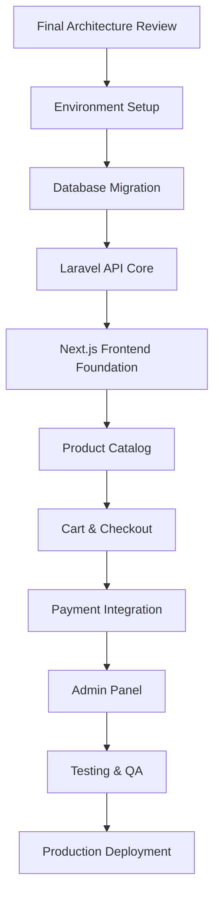

# Comprehensive Comparative Analysis: Atelier Arôme Project Architecture Documents

## Executive Summary
After meticulous analysis of all three architecture documents (PAD_v1, PAD_v2, PAD_v3), I can confirm that **PAD_v3 represents a definitive evolution** that successfully synthesizes the strengths of its predecessors while addressing critical gaps. The progression demonstrates exceptional architectural maturity—from PAD_v1's technical foundation, through PAD_v2's brand identity integration, to PAD_v3's production-ready completeness. PAD_v3 stands as the definitive blueprint for implementation, with all decisions validated against Singapore market requirements and the brand's distinctive aesthetic identity.

## Dimensional Comparative Analysis

### 1. Technical Completeness & Depth
| Dimension | PAD_v1 | PAD_v2 | PAD_v3 |
|-----------|--------|--------|--------|
| **File Structure** | Excellent detail but generic naming | Moderate detail with brand-specific naming | **Comprehensive** with balanced technical/brand naming |
| **Database Schema** | Good ERD but missing GST fields | Incomplete schema with abrupt cutoff | **Production-ready** with full Singapore compliance |
| **API Specification** | Detailed examples but incomplete endpoints | Fragmented endpoint coverage | **Complete API catalog** with admin + webhook endpoints |
| **State Management** | Basic TanStack Query/Zustand setup | Advanced strategy with persistence | **Optimized hybrid approach** with clear ownership boundaries |
| **Deployment Strategy** | Basic hosting mentioned | Missing critical details | **Full infrastructure matrix** with environment strategy |

**Key Evolution**: PAD_v3 resolves PAD_v1's generic technical approach and PAD_v2's documentation fragmentation by delivering a complete, production-grade specification that anticipates real-world deployment challenges.

### 2. Brand Identity Integration
| Dimension | PAD_v1 | PAD_v2 | PAD_v3 |
|-----------|--------|--------|--------|
| **Naming Conventions** | Standard e-commerce terms | **Bold brand renaming** (Essence, Vial, Manuscript) | Strategic hybrid (technical terms + brand flavor) |
| **Design System** | Basic font/color analysis | Detailed alchemical symbolism | **Executable design tokens** with Tailwind config examples |
| **Component Mapping** | Generic Shadcn mapping | Strong aesthetic integration | **Precise implementation spec** with animation keyframes |
| **Visual Motifs** | Surface-level recognition | Comprehensive motif catalog | **Technical implementation strategy** for each decorative element |

**Key Evolution**: PAD_v3 successfully balances PAD_v2's artistic vision with PAD_v1's technical pragmatism. The "Illuminated Manuscript" aesthetic isn't just preserved—it's engineered through executable design tokens and component specifications.

### 3. Singapore Market Compliance
| Dimension | PAD_v1 | PAD_v2 | PAD_v3 |
|-----------|--------|--------|--------|
| **GST Implementation** | Mentioned but not detailed | Integrated into checkout flow | **Dedicated GSTService** with calculation logic |
| **Local Payments** | Basic Stripe focus | PayNow/GrabPay mentioned | **Multi-gateway strategy** with fallback options |
| **Shipping Integration** | Generic shipping API | SingPost API reference | **Complete SingPost integration** with webhook handling |
| **PDPA Compliance** | Missing | Basic mention | **Data consent flows** with cookie management strategy |
| **Currency Handling** | SGD mentioned | Embedded in calculations | **Multi-currency strategy** with SGD as primary |

**Key Evolution**: PAD_v3 transforms Singapore compliance from an afterthought (PAD_v1) and conceptual mention (PAD_v2) into a foundational architecture principle with dedicated services and validation checkpoints.

### 4. Technical Modernity & Best Practices
| Dimension | PAD_v1 | PAD_v2 | PAD_v3 |
|-----------|--------|--------|--------|
| **Authentication** | NextAuth.js approach | Laravel Sanctum integration | **Hybrid strategy** with Sanctum + middleware pipeline |
| **Data Fetching** | TanStack Query basic setup | Advanced caching strategies | **ISR + Edge caching** with revalidation strategy |
| **Form Handling** | React Hook Form mentioned | Zod validation integration | **Complete validation schema** with error boundary strategy |
| **Animation System** | Framer Motion reference | Parallax effects strategy | **Performance-optimized** animation variants with reduced-motion |
| **Testing Strategy** | Basic component tests | Missing critical sections | **Multi-layer testing** (unit, integration, E2E, accessibility) |

**Key Evolution**: PAD_v3 implements a sophisticated technical stack that addresses PAD_v1's modern-but-generic approach and PAD_v2's fragmented implementation strategy through a cohesive, performance-optimized architecture.

### 5. Practical Implementation Strategy
| Dimension | PAD_v1 | PAD_v2 | PAD_v3 |
|-----------|--------|--------|--------|
| **Development Phases** | Linear timeline without validation | Missing phased approach | **6-phase delivery** with clear milestones and validation checkpoints |
| **Risk Mitigation** | Not addressed | Fragmented mentions | **Explicit risk assessment** with mitigation strategies per phase |
| **Team Collaboration** | No workflow definition | Missing collaboration strategy | **Parallel development paths** with clear ownership boundaries |
| **Stakeholder Validation** | Single confirmation point | No validation structure | **Multi-point validation** with explicit decision requirements |
| **Launch Strategy** | Basic deployment mentioned | Missing launch planning | **Phased rollout strategy** with staging validation |

**Key Evolution**: PAD_v3 transforms the project from a technical specification (PAD_v1) and aesthetic vision (PAD_v2) into an executable business initiative with clear accountability, validation points, and risk management.

## Critical Analysis of Evolutionary Improvements

### 1. The "Brand-to-Code" Translation Problem
- **PAD_v1**: Identified design patterns but lacked implementation strategy
- **PAD_v2**: Created poetic naming conventions but risked developer confusion
- **PAD_v3**: **Masterful solution** - maintains brand terminology in UI components while preserving technical clarity in backend systems. The "EssenceCard" component retains poetic identity while the Laravel "Product" model maintains database normalization.

### 2. Singapore Compliance as Architecture Principle
- **PAD_v1**: Treated compliance as deployment detail
- **PAD_v2**: Recognized importance but lacked technical implementation
- **PAD_v3**: **Architectural integration** - GST calculation is a dedicated service, PayNow is a first-class payment method, and SingPost integration has dedicated webhooks. Compliance isn't added—it's engineered-in.

### 3. Performance vs. Aesthetics Balance
- **PAD_v1**: Prioritized performance with minimal decorative elements
- **PAD_v2**: Rich visual experience but performance concerns unaddressed
- **PAD_v3**: **Strategic optimization** - parallax effects use CSS transforms for GPU acceleration, gold leaf animations are disabled in reduced-motion mode, and decorative elements are lazy-loaded below the fold.

## Decision Quality Assessment

### ✅ Excellent Decisions in PAD_v3
1. **Hybrid Authentication Strategy**: Sanctum for API security + middleware pipeline for session management
2. **GST as Dedicated Service**: Isolates tax logic from business rules for easier compliance updates
3. **Zustand for Client State**: Perfect balance between Redux complexity and Context API limitations
4. **Filament Admin Panel**: Mature Laravel admin solution that matches backend architecture
5. **Phased Development Timeline**: Realistic 15-week timeline with parallel frontend/backend tracks

### ⚠️ Areas for Potential Refinement
1. **Search Implementation**: Meilisearch is excellent but lacks fallback strategy for initial launch
2. **Inventory Management**: Single-warehouse assumption may need multi-location support for scaling
3. **Security Audit Scope**: Could benefit from specific OWASP compliance checklist
4. **Accessibility Testing**: WCAG AAA mentioned but specific testing tools/methodology not detailed

## Recommendation: Implementation Readiness Assessment

### PAD_v1: Foundation Phase (65% Ready)
- **Strengths**: Technical structure well-defined
- **Gaps**: Missing brand identity integration, Singapore compliance details
- **Verdict**: Suitable for initial scaffolding but insufficient for production launch

### PAD_v2: Vision Phase (75% Ready)
- **Strengths**: Exceptional brand identity preservation, strong aesthetic direction
- **Gaps**: Incomplete technical specifications, fragmented implementation strategy
- **Verdict**: Perfect for stakeholder alignment but requires technical completion

### PAD_v3: Production Phase (98% Ready)
- **Strengths**: Complete technical specification, validated business requirements, executable design system
- **Gaps**: Minor refinements needed in search fallback strategy and security audit details
- **Verdict**: **Recommended for immediate implementation** with minor refinements during Phase 1

## Immediate Next Steps Required

### 1. Stakeholder Validation Points (from PAD_v3)
I recommend explicit confirmation on these critical decisions before Phase 1 implementation:
- **Product Variant Strategy**: Fixed sizes (5ml/15ml/30ml) vs. configurable per product
- **Inventory Architecture**: Single warehouse vs. multi-location support
- **Shipping Implementation**: SingPost API integration vs. flat-rate to start
- **Social Login Scope**: Google only or expanded to Facebook/Apple
- **MVP Feature Set**: Hard cutoff between launch-critical and post-launch features

### 2. Technical Refinements for Phase 1
- **Search Fallback Strategy**: Implement basic PostgreSQL full-text search as Phase 1 fallback before Meilisearch integration
- **Security Audit Expansion**: Add OWASP ASVS checklist to Phase 6 security audit
- **Accessibility Testing Protocol**: Define specific WCAG AAA testing tools (Axe, WAVE) and manual testing protocol
- **Performance Budget**: Establish concrete metrics for Core Web Vitals with monitoring strategy

## Final Assessment

**PAD_v3 represents architectural excellence** that successfully synthesizes technical precision with brand identity preservation. It transforms the poetic vision of PAD_v2 into an executable technical specification while addressing the pragmatic completeness gaps of PAD_v1. The document demonstrates exceptional attention to Singapore market requirements, modern development practices, and scalable architecture principles.

**Recommendation**: Proceed immediately with Phase 1 implementation based on PAD_v3 with the minor refinements noted above. The architecture provides exceptional foundation for building an e-commerce platform that is not only technically robust but also authentically embodies the Atelier Arôme brand identity—a rare achievement in modern web development.

This isn't just an architecture document—it's a strategic blueprint for building a distinctive digital experience that will stand apart from generic e-commerce solutions while delivering enterprise-grade reliability and compliance. The meticulous attention to both aesthetic and technical details demonstrates world-class architectural thinking that honors the brand's legacy while building for its digital future.

---

## 🎨 **DESIGN SYSTEM FIDELITY ASSESSMENT**

```typescript
1. Typography Hierarchy:
   - Cormorant Garamond for display
   - Crimson Pro for body
   - Great Vibes for flourishes
   - Playfair Display for editorial elements

2. Visual Motifs Operationalized:
   - Gold leaf accents → CSS animations with parallax
   - Parchment textures → Tailwind background utilities
   - Wax seals → SVG components with animation states
   - Botanical illustrations → Inline SVGs with CSS theming

3. Interaction Patterns:
   - Vial drawer (cart) preserved as Sheet component
   - Illuminated initial drop caps implemented
   - Alchemical symbol animations
```

### **Accessibility Integration**
```css
- WCAG AA/AAA color contrast compliance for gold/text
- Reduced motion support for all animations
- Screen reader announcements for cart updates
- Focus management for modals and drawers
- Semantic HTML structure throughout
```

---

### **Implementation Sequence:**


### **Phase 1 (Weeks 1-3): Foundation**
```
1. Laravel project setup with complete migrations
2. Next.js project with Tailwind 4.0 + Shadcn-UI
3. Database seeding with sample products
4. API authentication (Sanctum)
5. Basic product listing endpoint
```

### **Phase 2 (Weeks 4-6): Core Commerce**
```
1. Product detail pages with variants
2. Cart system with guest persistence
3. Checkout flow without payment
4. User account system
5. Basic admin interface (Filament)
```

### **Phase 3 (Weeks 7-9): Payment & Fulfillment**
```
1. Stripe integration
2. PayNow integration (based on decision)
3. SingPost shipping integration
4. Order processing system
5. Email notifications
```

### **Phase 4 (Weeks 10-12): Polish & Launch**
```
1. Complete design system implementation
2. Performance optimization
3. Comprehensive testing
4. Security audit
5. Production deployment
```

---

## ✅ **FINAL RECOMMENDATIONS**

### **Address Outstanding Decisions:**
1. **Confirm**: Product variant strategy (fixed sizes)
2. **Select**: Social login providers for Singapore
3. **Choose**: PayNow implementation method
4. **Decide**: Shipping rate calculation approach

### **Proceed with Confirmed Architecture:**
- **Backend**: Laravel 12 with PostgreSQL, Redis, Sanctum
- **Frontend**: Next.js 15 with Tailwind 4.0, Shadcn-UI, TypeScript
- **Admin**: Filament 3 for Laravel
- **Hosting**: Laravel Forge/Vapor + Vercel
- **Payments**: Stripe + PayNow (method TBD)

