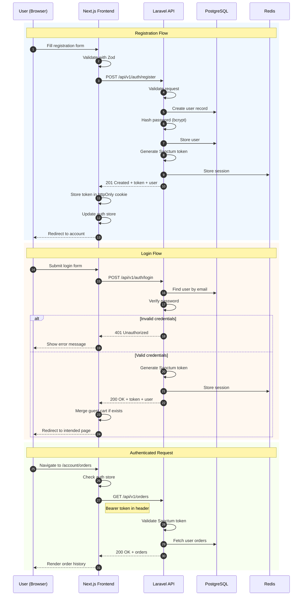
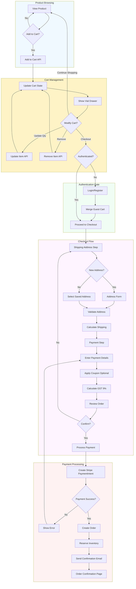
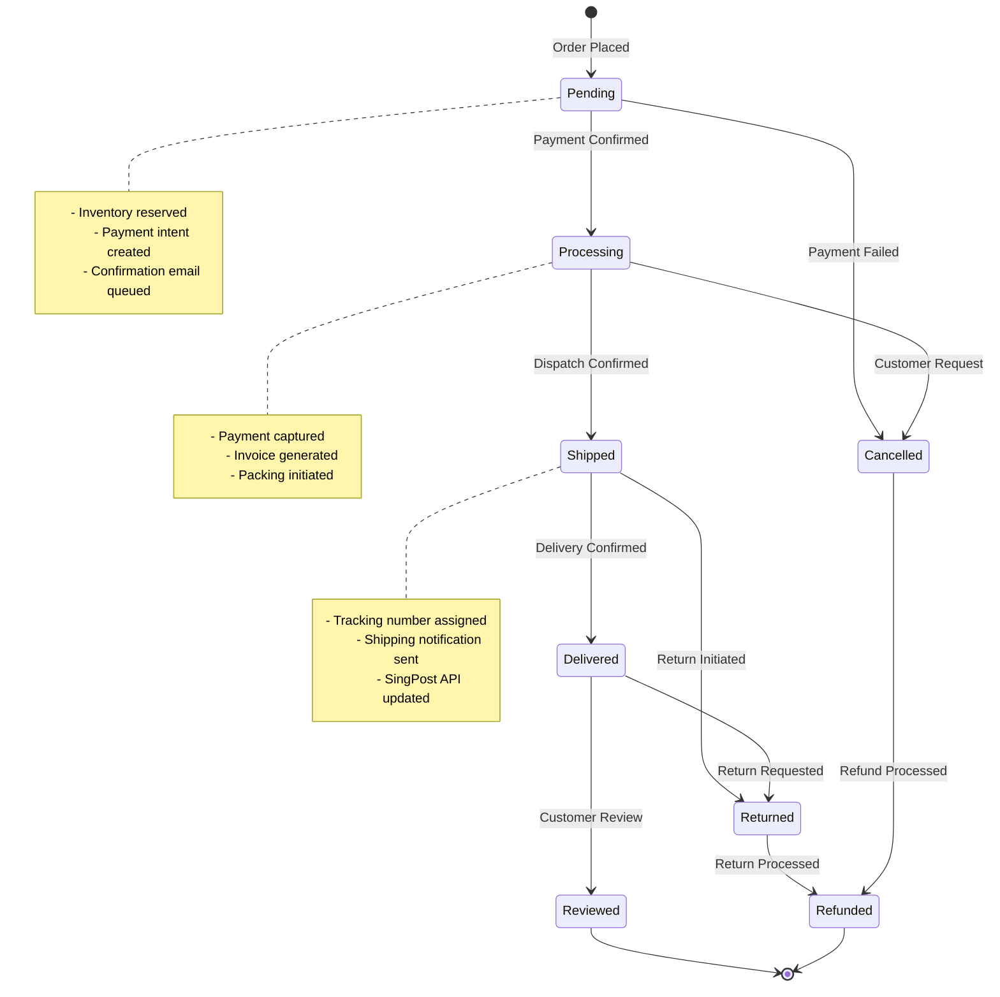
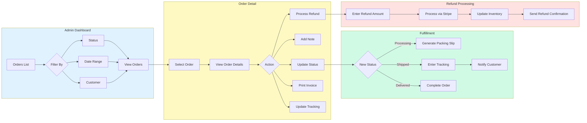
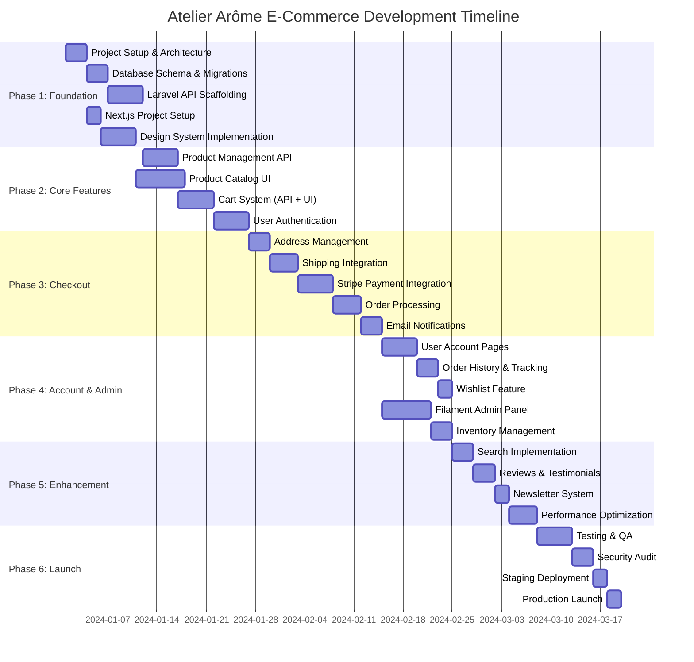

# Project Architecture Document
## Atelier Arôme — E-Commerce Platform

---

# 📋 Executive Summary

**Project**: Full-featured production e-commerce platform for Atelier Arôme, a Singapore-based artisanal aromatherapy company.

**Architecture**: Decoupled headless commerce with Laravel 12 API backend and Next.js 15 frontend.

**Aesthetic Preservation**: The distinctive "Illuminated Manuscript" design language is preserved through a custom Tailwind theme extension and Shadcn-UI component variants.

**Singapore Compliance**: Built-in GST calculation (9%), PayNow integration, SingPost shipping API, and SGD currency handling.

---

# 🏗️ Technology Stack Specification

## Backend Stack

| Layer | Technology | Version | Purpose |
|-------|------------|---------|---------|
| **Runtime** | PHP | 8.3+ | Server-side execution |
| **Framework** | Laravel | 12.x | API architecture, business logic |
| **Database** | PostgreSQL | 16+ | Primary data store |
| **Cache** | Redis | 7.x | Session, cache, queue driver |
| **ORM** | Eloquent | - | Database abstraction |
| **Auth** | Laravel Sanctum | 4.x | API token authentication |
| **Queue** | Laravel Horizon | 5.x | Job processing dashboard |
| **Search** | Meilisearch | 1.x | Full-text product search |
| **File Storage** | Cloudinary / S3 | - | Media CDN |
| **Email** | Resend | - | Transactional email |
| **Payments** | Stripe SDK | - | Payment processing |
| **Admin** | Filament | 3.x | Admin panel |

## Frontend Stack

| Layer | Technology | Version | Purpose |
|-------|------------|---------|---------|
| **Framework** | Next.js | 15.x | React meta-framework |
| **Runtime** | React | 19.x | UI library |
| **Language** | TypeScript | 5.x | Type safety |
| **Styling** | Tailwind CSS | 4.0 | Utility-first CSS |
| **Components** | Shadcn-UI | latest | Radix primitives |
| **Animations** | Framer Motion | 11.x | Complex animations |
| **State (Client)** | Zustand | 5.x | Client-side state |
| **State (Server)** | TanStack Query | 5.x | Server state cache |
| **Forms** | React Hook Form | 7.x | Form management |
| **Validation** | Zod | 3.x | Schema validation |
| **Icons** | Lucide React | - | Icon system |

## Infrastructure

| Component | Service | Purpose |
|-----------|---------|---------|
| **API Hosting** | Laravel Forge / Vapor | Laravel deployment |
| **Frontend Hosting** | Vercel | Edge deployment |
| **Database** | Neon / Supabase | Managed PostgreSQL |
| **CDN** | Cloudflare | Edge caching |
| **Monitoring** | Sentry | Error tracking |
| **Analytics** | Plausible | Privacy-focused analytics |

---

# 📁 Complete File Hierarchy

## Backend (Laravel 12)

```
atelier-arome-api/
├── .env.example
├── .gitignore
├── artisan
├── composer.json
├── composer.lock
├── phpunit.xml
├── README.md
│
├── app/
│   ├── Console/
│   │   ├── Commands/
│   │   │   ├── SyncInventoryCommand.php      # Inventory sync scheduler
│   │   │   ├── GenerateSitemapCommand.php    # SEO sitemap generation
│   │   │   ├── CleanExpiredCartsCommand.php  # Cart cleanup
│   │   │   └── SendAbandonedCartEmailsCommand.php
│   │   └── Kernel.php
│   │
│   ├── Enums/
│   │   ├── OrderStatus.php                   # Pending, Processing, Shipped, Delivered, Cancelled
│   │   ├── PaymentStatus.php                 # Pending, Completed, Failed, Refunded
│   │   ├── PaymentMethod.php                 # Card, PayNow, GrabPay
│   │   ├── ProductHumour.php                 # Calming, Uplifting, Grounding, Clarifying
│   │   ├── ProductRarity.php                 # Common, Rare, Limited
│   │   ├── ProductSeason.php                 # Spring, Summer, Autumn, Winter
│   │   └── UserRole.php                      # Customer, Admin, SuperAdmin
│   │
│   ├── Events/
│   │   ├── OrderPlaced.php
│   │   ├── OrderStatusChanged.php
│   │   ├── PaymentReceived.php
│   │   ├── InventoryLow.php
│   │   └── NewsletterSubscribed.php
│   │
│   ├── Exceptions/
│   │   ├── Handler.php
│   │   ├── InsufficientInventoryException.php
│   │   ├── PaymentFailedException.php
│   │   └── InvalidCouponException.php
│   │
│   ├── Http/
│   │   ├── Controllers/
│   │   │   ├── Controller.php
│   │   │   │
│   │   │   ├── Api/
│   │   │   │   ├── V1/
│   │   │   │   │   ├── AuthController.php           # Login, register, logout, me
│   │   │   │   │   ├── ProductController.php        # CRUD products, variants
│   │   │   │   │   ├── CategoryController.php       # Product categories
│   │   │   │   │   ├── CartController.php           # Cart operations
│   │   │   │   │   ├── CheckoutController.php       # Checkout flow
│   │   │   │   │   ├── OrderController.php          # Order history, details
│   │   │   │   │   ├── AddressController.php        # Saved addresses
│   │   │   │   │   ├── WishlistController.php       # Bookmarked essences
│   │   │   │   │   ├── ReviewController.php         # Product reviews
│   │   │   │   │   ├── TestimonialController.php    # Patron testimonials
│   │   │   │   │   ├── NewsletterController.php     # Subscription management
│   │   │   │   │   ├── SearchController.php         # Product search
│   │   │   │   │   ├── ShippingController.php       # Shipping rates, SingPost
│   │   │   │   │   └── PaymentController.php        # Stripe webhooks
│   │   │   │   │
│   │   │   │   └── V1/Admin/
│   │   │   │       ├── DashboardController.php      # Analytics, metrics
│   │   │   │       ├── ProductManagementController.php
│   │   │   │       ├── OrderManagementController.php
│   │   │   │       ├── CustomerManagementController.php
│   │   │   │       ├── InventoryController.php
│   │   │   │       ├── CouponController.php
│   │   │   │       ├── ReportController.php
│   │   │   │       └── SettingsController.php
│   │   │   │
│   │   │   └── Webhook/
│   │   │       ├── StripeWebhookController.php
│   │   │       └── SingPostWebhookController.php
│   │   │
│   │   ├── Middleware/
│   │   │   ├── EnsureEmailIsVerified.php
│   │   │   ├── EnsureIsAdmin.php
│   │   │   ├── TrackCartSession.php              # Guest cart tracking
│   │   │   ├── CalculateGST.php                  # Singapore GST middleware
│   │   │   └── RateLimiter.php
│   │   │
│   │   ├── Requests/
│   │   │   ├── Auth/
│   │   │   │   ├── LoginRequest.php
│   │   │   │   ├── RegisterRequest.php
│   │   │   │   └── ForgotPasswordRequest.php
│   │   │   │
│   │   │   ├── Cart/
│   │   │   │   ├── AddToCartRequest.php
│   │   │   │   ├── UpdateCartItemRequest.php
│   │   │   │   └── ApplyCouponRequest.php
│   │   │   │
│   │   │   ├── Checkout/
│   │   │   │   ├── InitiateCheckoutRequest.php
│   │   │   │   ├── SetShippingAddressRequest.php
│   │   │   │   ├── SetPaymentMethodRequest.php
│   │   │   │   └── ConfirmOrderRequest.php
│   │   │   │
│   │   │   ├── Product/
│   │   │   │   ├── StoreProductRequest.php
│   │   │   │   ├── UpdateProductRequest.php
│   │   │   │   └── ProductFilterRequest.php
│   │   │   │
│   │   │   ├── Address/
│   │   │   │   └── StoreAddressRequest.php
│   │   │   │
│   │   │   └── Newsletter/
│   │   │       └── SubscribeRequest.php
│   │   │
│   │   └── Resources/
│   │       ├── ProductResource.php
│   │       ├── ProductCollection.php
│   │       ├── ProductVariantResource.php
│   │       ├── CategoryResource.php
│   │       ├── CartResource.php
│   │       ├── CartItemResource.php
│   │       ├── OrderResource.php
│   │       ├── OrderItemResource.php
│   │       ├── AddressResource.php
│   │       ├── UserResource.php
│   │       ├── TestimonialResource.php
│   │       ├── ReviewResource.php
│   │       └── ShippingRateResource.php
│   │
│   ├── Jobs/
│   │   ├── ProcessPayment.php
│   │   ├── SendOrderConfirmation.php
│   │   ├── SendShippingNotification.php
│   │   ├── SendAbandonedCartEmail.php
│   │   ├── SyncInventoryWithShopify.php      # Optional integration
│   │   ├── GenerateInvoicePdf.php
│   │   └── UpdateSearchIndex.php
│   │
│   ├── Listeners/
│   │   ├── SendOrderConfirmationEmail.php
│   │   ├── UpdateInventoryOnOrder.php
│   │   ├── NotifyAdminOfLowInventory.php
│   │   ├── SendWelcomeEmail.php
│   │   └── LogPaymentEvent.php
│   │
│   ├── Mail/
│   │   ├── OrderConfirmation.php
│   │   ├── OrderShipped.php
│   │   ├── AbandonedCart.php
│   │   ├── WelcomeEmail.php
│   │   ├── PasswordReset.php
│   │   ├── NewsletterConfirmation.php
│   │   └── QuarterlyFolio.php                # Newsletter template
│   │
│   ├── Models/
│   │   ├── User.php                          # Customer + Admin unified
│   │   ├── Product.php                       # Essence products
│   │   ├── ProductVariant.php                # Size variants (5ml, 15ml, 30ml)
│   │   ├── ProductImage.php                  # Multiple product images
│   │   ├── Category.php                      # Singles, Blends, Sets, Gift
│   │   ├── Tag.php                           # Scent notes tagging
│   │   ├── Cart.php                          # Shopping cart
│   │   ├── CartItem.php                      # Cart line items
│   │   ├── Order.php                         # Completed orders
│   │   ├── OrderItem.php                     # Order line items
│   │   ├── Address.php                       # Shipping/billing addresses
│   │   ├── Payment.php                       # Payment records
│   │   ├── Coupon.php                        # Discount codes
│   │   ├── CouponUsage.php                   # Coupon redemption tracking
│   │   ├── Review.php                        # Product reviews
│   │   ├── Testimonial.php                   # Patron testimonials
│   │   ├── Wishlist.php                      # User wishlists
│   │   ├── WishlistItem.php                  # Wishlist line items
│   │   ├── NewsletterSubscriber.php          # Email subscribers
│   │   ├── Inventory.php                     # Stock tracking
│   │   ├── InventoryMovement.php             # Stock history
│   │   └── Setting.php                       # Site configuration
│   │
│   ├── Notifications/
│   │   ├── OrderPlacedNotification.php
│   │   ├── OrderShippedNotification.php
│   │   ├── LowInventoryNotification.php
│   │   └── NewCustomerNotification.php
│   │
│   ├── Observers/
│   │   ├── ProductObserver.php               # Search index sync
│   │   ├── OrderObserver.php                 # Order lifecycle
│   │   └── InventoryObserver.php             # Stock alerts
│   │
│   ├── Policies/
│   │   ├── OrderPolicy.php
│   │   ├── AddressPolicy.php
│   │   ├── ReviewPolicy.php
│   │   └── ProductPolicy.php
│   │
│   ├── Providers/
│   │   ├── AppServiceProvider.php
│   │   ├── AuthServiceProvider.php
│   │   ├── EventServiceProvider.php
│   │   ├── RouteServiceProvider.php
│   │   └── StripeServiceProvider.php
│   │
│   └── Services/
│       ├── CartService.php                   # Cart business logic
│       ├── CheckoutService.php               # Checkout orchestration
│       ├── PaymentService.php                # Stripe integration
│       ├── ShippingService.php               # SingPost integration
│       ├── GSTService.php                    # Singapore tax calculation
│       ├── InventoryService.php              # Stock management
│       ├── CouponService.php                 # Discount validation
│       ├── SearchService.php                 # Meilisearch wrapper
│       ├── PdfService.php                    # Invoice generation
│       └── MediaService.php                  # Cloudinary integration
│
├── bootstrap/
│   ├── app.php
│   ├── cache/
│   └── providers.php
│
├── config/
│   ├── app.php
│   ├── auth.php
│   ├── cache.php
│   ├── cors.php                              # CORS for Next.js frontend
│   ├── database.php
│   ├── filesystems.php
│   ├── horizon.php
│   ├── logging.php
│   ├── mail.php
│   ├── queue.php
│   ├── sanctum.php
│   ├── services.php                          # Stripe, Cloudinary keys
│   ├── session.php
│   └── shop.php                              # Custom e-commerce config
│       # - gst_rate: 0.09
│       # - currency: SGD
│       # - max_cart_items: 12
│       # - abandoned_cart_hours: 24
│
├── database/
│   ├── factories/
│   │   ├── UserFactory.php
│   │   ├── ProductFactory.php
│   │   ├── ProductVariantFactory.php
│   │   ├── OrderFactory.php
│   │   ├── ReviewFactory.php
│   │   └── TestimonialFactory.php
│   │
│   ├── migrations/
│   │   ├── 0001_01_01_000001_create_users_table.php
│   │   ├── 0001_01_01_000002_create_password_reset_tokens_table.php
│   │   ├── 0001_01_01_000003_create_sessions_table.php
│   │   ├── 2024_01_01_000001_create_categories_table.php
│   │   ├── 2024_01_01_000002_create_products_table.php
│   │   ├── 2024_01_01_000003_create_product_variants_table.php
│   │   ├── 2024_01_01_000004_create_product_images_table.php
│   │   ├── 2024_01_01_000005_create_tags_table.php
│   │   ├── 2024_01_01_000006_create_product_tag_table.php
│   │   ├── 2024_01_01_000007_create_addresses_table.php
│   │   ├── 2024_01_01_000008_create_carts_table.php
│   │   ├── 2024_01_01_000009_create_cart_items_table.php
│   │   ├── 2024_01_01_000010_create_orders_table.php
│   │   ├── 2024_01_01_000011_create_order_items_table.php
│   │   ├── 2024_01_01_000012_create_payments_table.php
│   │   ├── 2024_01_01_000013_create_coupons_table.php
│   │   ├── 2024_01_01_000014_create_coupon_usages_table.php
│   │   ├── 2024_01_01_000015_create_reviews_table.php
│   │   ├── 2024_01_01_000016_create_testimonials_table.php
│   │   ├── 2024_01_01_000017_create_wishlists_table.php
│   │   ├── 2024_01_01_000018_create_wishlist_items_table.php
│   │   ├── 2024_01_01_000019_create_newsletter_subscribers_table.php
│   │   ├── 2024_01_01_000020_create_inventories_table.php
│   │   ├── 2024_01_01_000021_create_inventory_movements_table.php
│   │   └── 2024_01_01_000022_create_settings_table.php
│   │
│   └── seeders/
│       ├── DatabaseSeeder.php
│       ├── UserSeeder.php
│       ├── CategorySeeder.php
│       ├── ProductSeeder.php                 # Sample essences
│       ├── TestimonialSeeder.php
│       └── SettingsSeeder.php
│
├── public/
│   ├── index.php
│   └── .htaccess
│
├── resources/
│   └── views/
│       ├── emails/
│       │   ├── order-confirmation.blade.php
│       │   ├── order-shipped.blade.php
│       │   ├── abandoned-cart.blade.php
│       │   ├── welcome.blade.php
│       │   └── quarterly-folio.blade.php
│       │
│       └── pdf/
│           └── invoice.blade.php
│
├── routes/
│   ├── api.php                               # V1 API routes
│   ├── channels.php                          # Broadcast channels
│   ├── console.php                           # Artisan commands
│   └── web.php                               # Filament admin
│
├── storage/
│   ├── app/
│   ├── framework/
│   └── logs/
│
└── tests/
    ├── Feature/
    │   ├── Api/
    │   │   ├── AuthTest.php
    │   │   ├── ProductTest.php
    │   │   ├── CartTest.php
    │   │   ├── CheckoutTest.php
    │   │   └── OrderTest.php
    │   │
    │   └── Admin/
    │       ├── ProductManagementTest.php
    │       └── OrderManagementTest.php
    │
    └── Unit/
        ├── Services/
        │   ├── CartServiceTest.php
        │   ├── GSTServiceTest.php
        │   ├── CouponServiceTest.php
        │   └── InventoryServiceTest.php
        │
        └── Models/
            ├── ProductTest.php
            └── OrderTest.php
```

## Frontend (Next.js 15)

```
atelier-arome-web/
├── .env.local.example
├── .eslintrc.json
├── .gitignore
├── .prettierrc
├── components.json                           # Shadcn-UI config
├── next.config.ts
├── package.json
├── postcss.config.mjs
├── tailwind.config.ts
├── tsconfig.json
├── README.md
│
├── public/
│   ├── fonts/
│   │   ├── cormorant-garamond/
│   │   │   ├── CormorantGaramond-Light.woff2
│   │   │   ├── CormorantGaramond-Regular.woff2
│   │   │   ├── CormorantGaramond-Medium.woff2
│   │   │   ├── CormorantGaramond-SemiBold.woff2
│   │   │   └── CormorantGaramond-Bold.woff2
│   │   │
│   │   ├── crimson-pro/
│   │   │   └── ... (similar structure)
│   │   │
│   │   └── great-vibes/
│   │       └── GreatVibes-Regular.woff2
│   │
│   ├── images/
│   │   ├── og-image.jpg                      # Social preview
│   │   ├── logo-seal.svg                     # Atelier seal
│   │   └── botanicals/                       # Static botanical SVGs
│   │
│   ├── favicon.ico
│   ├── apple-touch-icon.png
│   └── manifest.json
│
├── src/
│   ├── app/
│   │   ├── layout.tsx                        # Root layout
│   │   ├── page.tsx                          # Homepage
│   │   ├── loading.tsx                       # Global loading UI
│   │   ├── error.tsx                         # Global error UI
│   │   ├── not-found.tsx                     # 404 page
│   │   ├── globals.css                       # Global styles + Tailwind
│   │   │
│   │   ├── (marketing)/                      # Marketing pages group
│   │   │   ├── layout.tsx
│   │   │   ├── about/
│   │   │   │   └── page.tsx                  # The Atelier story
│   │   │   ├── alchemy/
│   │   │   │   └── page.tsx                  # Our process
│   │   │   ├── contact/
│   │   │   │   └── page.tsx
│   │   │   └── faq/
│   │   │       └── page.tsx
│   │   │
│   │   ├── (shop)/                           # E-commerce pages group
│   │   │   ├── layout.tsx
│   │   │   ├── compendium/                   # Product catalog
│   │   │   │   ├── page.tsx                  # Product listing
│   │   │   │   ├── loading.tsx
│   │   │   │   └── [slug]/
│   │   │   │       ├── page.tsx              # Product detail
│   │   │   │       └── loading.tsx
│   │   │   │
│   │   │   ├── collections/                  # Category pages
│   │   │   │   ├── page.tsx                  # All collections
│   │   │   │   └── [category]/
│   │   │   │       └── page.tsx
│   │   │   │
│   │   │   └── search/
│   │   │       └── page.tsx                  # Search results
│   │   │
│   │   ├── (checkout)/                       # Checkout flow group
│   │   │   ├── layout.tsx                    # Minimal checkout layout
│   │   │   ├── cart/
│   │   │   │   └── page.tsx                  # Full cart page
│   │   │   │
│   │   │   └── checkout/
│   │   │       ├── page.tsx                  # Checkout redirect
│   │   │       ├── shipping/
│   │   │       │   └── page.tsx              # Shipping address step
│   │   │       ├── payment/
│   │   │       │   └── page.tsx              # Payment step
│   │   │       └── confirmation/
│   │   │           └── page.tsx              # Order confirmation
│   │   │
│   │   ├── (account)/                        # User account group
│   │   │   ├── layout.tsx
│   │   │   ├── account/
│   │   │   │   ├── page.tsx                  # Account dashboard
│   │   │   │   ├── orders/
│   │   │   │   │   ├── page.tsx              # Order history
│   │   │   │   │   └── [id]/
│   │   │   │   │       └── page.tsx          # Order detail
│   │   │   │   ├── addresses/
│   │   │   │   │   └── page.tsx
│   │   │   │   ├── wishlist/
│   │   │   │   │   └── page.tsx              # Bookmarked essences
│   │   │   │   └── settings/
│   │   │   │       └── page.tsx
│   │   │   │
│   │   │   ├── login/
│   │   │   │   └── page.tsx
│   │   │   ├── register/
│   │   │   │   └── page.tsx
│   │   │   ├── forgot-password/
│   │   │   │   └── page.tsx
│   │   │   └── reset-password/
│   │   │       └── page.tsx
│   │   │
│   │   └── api/                              # Next.js API routes (BFF)
│   │       ├── auth/
│   │       │   └── [...nextauth]/
│   │       │       └── route.ts              # NextAuth.js handlers
│   │       │
│   │       ├── cart/
│   │       │   └── route.ts                  # Cart session handler
│   │       │
│   │       ├── newsletter/
│   │       │   └── route.ts
│   │       │
│   │       └── revalidate/
│   │           └── route.ts                  # On-demand ISR revalidation
│   │
│   ├── components/
│   │   ├── ui/                               # Shadcn-UI base components
│   │   │   ├── button.tsx
│   │   │   ├── card.tsx
│   │   │   ├── dialog.tsx
│   │   │   ├── drawer.tsx                    # Vial drawer base
│   │   │   ├── dropdown-menu.tsx
│   │   │   ├── form.tsx
│   │   │   ├── input.tsx
│   │   │   ├── label.tsx
│   │   │   ├── select.tsx
│   │   │   ├── separator.tsx
│   │   │   ├── sheet.tsx
│   │   │   ├── skeleton.tsx
│   │   │   ├── toast.tsx
│   │   │   ├── toaster.tsx
│   │   │   └── tooltip.tsx
│   │   │
│   │   ├── layout/                           # Layout components
│   │   │   ├── header/
│   │   │   │   ├── header.tsx
│   │   │   │   ├── atelier-seal.tsx          # Animated logo
│   │   │   │   ├── nav-link.tsx
│   │   │   │   ├── header-tools.tsx
│   │   │   │   ├── mobile-nav.tsx
│   │   │   │   └── search-dialog.tsx
│   │   │   │
│   │   │   ├── footer/
│   │   │   │   ├── colophon.tsx
│   │   │   │   └── newsletter-form.tsx
│   │   │   │
│   │   │   ├── atelier-banner.tsx
│   │   │   ├── texture-overlay.tsx
│   │   │   ├── gold-leaf-accents.tsx
│   │   │   └── skip-link.tsx
│   │   │
│   │   ├── sections/                         # Page sections
│   │   │   ├── hero/
│   │   │   │   ├── hero.tsx
│   │   │   │   ├── illuminated-initial.tsx
│   │   │   │   ├── hero-vessel.tsx           # Animated vessel
│   │   │   │   ├── botanical-specimens.tsx
│   │   │   │   └── scroll-indicator.tsx
│   │   │   │
│   │   │   ├── compendium/
│   │   │   │   ├── compendium-section.tsx
│   │   │   │   ├── filter-bar.tsx
│   │   │   │   ├── sort-select.tsx
│   │   │   │   └── load-more-button.tsx
│   │   │   │
│   │   │   ├── alchemy/
│   │   │   │   ├── alchemy-section.tsx
│   │   │   │   ├── alchemy-step.tsx
│   │   │   │   └── apparatus-display.tsx
│   │   │   │
│   │   │   ├── manuscript/
│   │   │   │   ├── manuscript-section.tsx
│   │   │   │   ├── testimonial-card.tsx
│   │   │   │   └── pagination-controls.tsx
│   │   │   │
│   │   │   └── correspondence/
│   │   │       ├── correspondence-section.tsx
│   │   │       ├── subscription-form.tsx
│   │   │       └── envelope-visual.tsx
│   │   │
│   │   ├── product/                          # Product components
│   │   │   ├── essence-card.tsx              # Product card
│   │   │   ├── essence-card-featured.tsx
│   │   │   ├── product-gallery.tsx
│   │   │   ├── product-info.tsx
│   │   │   ├── variant-selector.tsx
│   │   │   ├── add-to-cart-button.tsx
│   │   │   ├── product-notes.tsx
│   │   │   ├── humour-badge.tsx
│   │   │   ├── rarity-badge.tsx
│   │   │   ├── product-reviews.tsx
│   │   │   └── related-essences.tsx
│   │   │
│   │   ├── cart/                             # Cart components
│   │   │   ├── vial-drawer.tsx               # Slide-out cart
│   │   │   ├── cart-item.tsx
│   │   │   ├── cart-summary.tsx
│   │   │   ├── quantity-controls.tsx
│   │   │   ├── empty-cart.tsx
│   │   │   └── cart-total.tsx
│   │   │
│   │   ├── checkout/                         # Checkout components
│   │   │   ├── checkout-progress.tsx
│   │   │   ├── address-form.tsx
│   │   │   ├── address-selector.tsx
│   │   │   ├── shipping-options.tsx
│   │   │   ├── payment-form.tsx
│   │   │   ├── order-summary.tsx
│   │   │   ├── coupon-input.tsx
│   │   │   └── gst-display.tsx
│   │   │
│   │   ├── account/                          # Account components
│   │   │   ├── auth-form.tsx
│   │   │   ├── order-card.tsx
│   │   │   ├── order-timeline.tsx
│   │   │   ├── address-card.tsx
│   │   │   └── wishlist-item.tsx
│   │   │
│   │   ├── shared/                           # Shared components
│   │   │   ├── section-header.tsx
│   │   │   ├── section-border.tsx
│   │   │   ├── ornamental-rule.tsx
│   │   │   ├── wax-seal.tsx
│   │   │   ├── price-display.tsx
│   │   │   ├── currency-formatter.tsx
│   │   │   ├── loading-spinner.tsx
│   │   │   ├── animated-counter.tsx
│   │   │   └── back-to-top.tsx
│   │   │
│   │   └── seo/
│   │       ├── structured-data.tsx           # JSON-LD for products
│   │       └── meta-tags.tsx
│   │
│   ├── hooks/                                # Custom React hooks
│   │   ├── use-cart.ts                       # Cart state hook
│   │   ├── use-wishlist.ts
│   │   ├── use-auth.ts
│   │   ├── use-checkout.ts
│   │   ├── use-scroll-position.ts
│   │   ├── use-intersection-observer.ts
│   │   ├── use-debounce.ts
│   │   ├── use-local-storage.ts
│   │   ├── use-media-query.ts
│   │   ├── use-reduced-motion.ts
│   │   └── use-toast.ts
│   │
│   ├── lib/                                  # Utilities and configs
│   │   ├── api/
│   │   │   ├── client.ts                     # Axios/fetch wrapper
│   │   │   ├── endpoints.ts                  # API endpoint constants
│   │   │   ├── products.ts                   # Product API calls
│   │   │   ├── cart.ts                       # Cart API calls
│   │   │   ├── checkout.ts
│   │   │   ├── orders.ts
│   │   │   ├── auth.ts
│   │   │   └── newsletter.ts
│   │   │
│   │   ├── utils/
│   │   │   ├── cn.ts                         # Class name merger
│   │   │   ├── format-currency.ts
│   │   │   ├── format-date.ts
│   │   │   ├── calculate-gst.ts
│   │   │   ├── get-humour-data.ts
│   │   │   ├── get-season-label.ts
│   │   │   └── slugify.ts
│   │   │
│   │   ├── constants/
│   │   │   ├── alchemical-data.ts            # Humours, seasons, rarities
│   │   │   ├── navigation.ts
│   │   │   └── site-config.ts
│   │   │
│   │   └── validations/
│   │       ├── auth-schema.ts                # Zod schemas
│   │       ├── checkout-schema.ts
│   │       ├── address-schema.ts
│   │       └── newsletter-schema.ts
│   │
│   ├── stores/                               # Zustand stores
│   │   ├── cart-store.ts
│   │   ├── wishlist-store.ts
│   │   ├── ui-store.ts                       # Modal, drawer, toast states
│   │   └── checkout-store.ts
│   │
│   ├── providers/
│   │   ├── query-provider.tsx                # TanStack Query
│   │   ├── auth-provider.tsx
│   │   ├── cart-provider.tsx
│   │   ├── theme-provider.tsx
│   │   └── toast-provider.tsx
│   │
│   ├── styles/
│   │   ├── fonts.ts                          # Font declarations
│   │   └── animations.ts                     # Framer Motion variants
│   │
│   └── types/
│       ├── product.ts
│       ├── cart.ts
│       ├── order.ts
│       ├── user.ts
│       ├── address.ts
│       ├── checkout.ts
│       ├── testimonial.ts
│       └── api.ts                            # API response types
│
└── tests/
    ├── components/
    │   ├── essence-card.test.tsx
    │   ├── vial-drawer.test.tsx
    │   └── checkout-flow.test.tsx
    │
    └── e2e/
        ├── checkout.spec.ts
        └── product-browsing.spec.ts
```

---

# 📊 Database Schema (Mermaid ERD)

```mermaid
erDiagram
    USERS {
        uuid id PK
        string name
        string email UK
        string password
        string phone
        enum role "customer|admin|superadmin"
        boolean email_verified
        timestamp email_verified_at
        string remember_token
        timestamp created_at
        timestamp updated_at
        timestamp deleted_at
    }

    CATEGORIES {
        uuid id PK
        string name
        string slug UK
        text description
        string image_url
        integer sort_order
        boolean is_active
        timestamp created_at
        timestamp updated_at
    }

    PRODUCTS {
        uuid id PK
        uuid category_id FK
        string name
        string slug UK
        string latin_name
        text description
        text long_description
        enum humour "calming|uplifting|grounding|clarifying"
        enum rarity "common|rare|limited"
        enum season "spring|summer|autumn|winter"
        string extraction_method
        string folio_number
        boolean is_featured
        boolean is_active
        integer sort_order
        jsonb meta_data
        timestamp created_at
        timestamp updated_at
        timestamp deleted_at
    }

    PRODUCT_VARIANTS {
        uuid id PK
        uuid product_id FK
        string name "5ml|15ml|30ml"
        string sku UK
        decimal price_sgd "precision:10,2"
        decimal compare_at_price
        integer weight_grams
        boolean is_default
        boolean is_active
        timestamp created_at
        timestamp updated_at
    }

    PRODUCT_IMAGES {
        uuid id PK
        uuid product_id FK
        string url
        string alt_text
        integer sort_order
        boolean is_primary
        timestamp created_at
    }

    TAGS {
        uuid id PK
        string name UK
        string slug UK
        timestamp created_at
    }

    PRODUCT_TAG {
        uuid product_id FK
        uuid tag_id FK
    }

    INVENTORIES {
        uuid id PK
        uuid variant_id FK
        integer quantity
        integer reserved_quantity
        integer low_stock_threshold
        timestamp last_restocked_at
        timestamp created_at
        timestamp updated_at
    }

    INVENTORY_MOVEMENTS {
        uuid id PK
        uuid inventory_id FK
        uuid order_id FK
        enum type "addition|subtraction|reservation|release"
        integer quantity
        string reason
        timestamp created_at
    }

    ADDRESSES {
        uuid id PK
        uuid user_id FK
        string label "Home|Office|etc"
        string recipient_name
        string phone
        string line_1
        string line_2
        string postal_code
        string city
        string country "SG default"
        boolean is_default_shipping
        boolean is_default_billing
        timestamp created_at
        timestamp updated_at
    }

    CARTS {
        uuid id PK
        uuid user_id FK "nullable for guest"
        string session_id "for guest carts"
        uuid coupon_id FK
        decimal subtotal
        decimal discount_amount
        decimal gst_amount
        decimal total
        timestamp expires_at
        timestamp created_at
        timestamp updated_at
    }

    CART_ITEMS {
        uuid id PK
        uuid cart_id FK
        uuid variant_id FK
        integer quantity
        decimal unit_price
        decimal total_price
        timestamp created_at
        timestamp updated_at
    }

    ORDERS {
        uuid id PK
        uuid user_id FK
        string order_number UK "AA-YYYYMMDD-XXXX"
        enum status "pending|processing|shipped|delivered|cancelled"
        enum payment_status "pending|paid|failed|refunded"
        uuid shipping_address_id FK
        uuid billing_address_id FK
        uuid coupon_id FK
        decimal subtotal
        decimal discount_amount
        decimal shipping_amount
        decimal gst_amount
        decimal total
        text notes
        text admin_notes
        string tracking_number
        string tracking_url
        timestamp shipped_at
        timestamp delivered_at
        timestamp created_at
        timestamp updated_at
    }

    ORDER_ITEMS {
        uuid id PK
        uuid order_id FK
        uuid variant_id FK
        string product_name "snapshot"
        string variant_name "snapshot"
        string sku "snapshot"
        integer quantity
        decimal unit_price
        decimal total_price
        timestamp created_at
    }

    PAYMENTS {
        uuid id PK
        uuid order_id FK
        string stripe_payment_intent_id UK
        string stripe_charge_id
        enum method "card|paynow|grabpay"
        enum status "pending|succeeded|failed|refunded"
        decimal amount
        string currency "SGD"
        jsonb metadata
        string failure_reason
        timestamp paid_at
        timestamp refunded_at
        timestamp created_at
        timestamp updated_at
    }

    COUPONS {
        uuid id PK
        string code UK
        text description
        enum type "percentage|fixed_amount|free_shipping"
        decimal value
        decimal minimum_order_amount
        integer usage_limit
        integer usage_count
        boolean is_active
        timestamp starts_at
        timestamp expires_at
        timestamp created_at
        timestamp updated_at
    }

    COUPON_USAGES {
        uuid id PK
        uuid coupon_id FK
        uuid user_id FK
        uuid order_id FK
        timestamp used_at
    }

    REVIEWS {
        uuid id PK
        uuid product_id FK
        uuid user_id FK
        uuid order_id FK
        integer rating "1-5"
        text title
        text body
        boolean is_verified_purchase
        boolean is_approved
        timestamp created_at
        timestamp updated_at
    }

    TESTIMONIALS {
        uuid id PK
        string author_name
        string author_title
        text quote
        boolean is_verified
        boolean is_illuminated "featured style"
        string folio_reference
        integer sort_order
        boolean is_active
        timestamp created_at
        timestamp updated_at
    }

    WISHLISTS {
        uuid id PK
        uuid user_id FK
        string name "default: Bookmarked Essences"
        timestamp created_at
        timestamp updated_at
    }

    WISHLIST_ITEMS {
        uuid id PK
        uuid wishlist_id FK
        uuid product_id FK
        timestamp added_at
    }

    NEWSLETTER_SUBSCRIBERS {
        uuid id PK
        string email UK
        string name
        boolean is_confirmed
        string confirmation_token
        timestamp confirmed_at
        timestamp unsubscribed_at
        timestamp created_at
        timestamp updated_at
    }

    SETTINGS {
        uuid id PK
        string key UK
        text value
        string type "string|integer|boolean|json"
        timestamp created_at
        timestamp updated_at
    }

    %% Relationships
    USERS ||--o{ ADDRESSES : "has many"
    USERS ||--o{ ORDERS : "places"
    USERS ||--o{ REVIEWS : "writes"
    USERS ||--o{ WISHLISTS : "has"
    USERS ||--o| CARTS : "has one"

    CATEGORIES ||--o{ PRODUCTS : "contains"

    PRODUCTS ||--o{ PRODUCT_VARIANTS : "has variants"
    PRODUCTS ||--o{ PRODUCT_IMAGES : "has images"
    PRODUCTS }o--o{ TAGS : "tagged with"
    PRODUCTS ||--o{ REVIEWS : "receives"
    PRODUCTS ||--o{ WISHLIST_ITEMS : "bookmarked in"

    PRODUCT_VARIANTS ||--|| INVENTORIES : "tracks stock"
    PRODUCT_VARIANTS ||--o{ CART_ITEMS : "added to"
    PRODUCT_VARIANTS ||--o{ ORDER_ITEMS : "ordered as"

    INVENTORIES ||--o{ INVENTORY_MOVEMENTS : "logs"

    CARTS ||--o{ CART_ITEMS : "contains"
    CARTS }o--o| COUPONS : "applies"

    ORDERS ||--o{ ORDER_ITEMS : "contains"
    ORDERS ||--o{ PAYMENTS : "paid via"
    ORDERS ||--|| ADDRESSES : "ships to"
    ORDERS }o--o| COUPONS : "used"

    WISHLISTS ||--o{ WISHLIST_ITEMS : "contains"

    COUPONS ||--o{ COUPON_USAGES : "tracked by"
```



---

# 🔄 Application Flow Diagrams

## User Authentication Flow



## Cart to Checkout Flow



## Order Lifecycle Flow



## Admin Order Management Flow



---

# 🔌 API Route Specification

## Authentication Endpoints

```
POST   /api/v1/auth/register          # User registration
POST   /api/v1/auth/login             # User login
POST   /api/v1/auth/logout            # User logout (authenticated)
GET    /api/v1/auth/me                # Get current user
POST   /api/v1/auth/forgot-password   # Request password reset
POST   /api/v1/auth/reset-password    # Reset password with token
POST   /api/v1/auth/verify-email      # Verify email address
POST   /api/v1/auth/resend-verification
```

## Product Endpoints

```
GET    /api/v1/products               # List products (paginated, filterable)
GET    /api/v1/products/:slug         # Get single product
GET    /api/v1/products/featured      # Get featured products
GET    /api/v1/products/search        # Search products (Meilisearch)

GET    /api/v1/categories             # List all categories
GET    /api/v1/categories/:slug       # Get category with products

GET    /api/v1/tags                   # List all scent tags
```

## Cart Endpoints

```
GET    /api/v1/cart                   # Get current cart
POST   /api/v1/cart/items             # Add item to cart
PATCH  /api/v1/cart/items/:id         # Update cart item quantity
DELETE /api/v1/cart/items/:id         # Remove item from cart
DELETE /api/v1/cart                   # Clear entire cart
POST   /api/v1/cart/merge             # Merge guest cart after login
POST   /api/v1/cart/coupon            # Apply coupon code
DELETE /api/v1/cart/coupon            # Remove coupon
```

## Checkout Endpoints

```
POST   /api/v1/checkout/initiate      # Start checkout, validate cart
POST   /api/v1/checkout/shipping      # Set shipping address
GET    /api/v1/checkout/shipping-rates # Get available shipping options
POST   /api/v1/checkout/payment-intent # Create Stripe PaymentIntent
POST   /api/v1/checkout/confirm       # Confirm and place order
```

## Order Endpoints

```
GET    /api/v1/orders                 # List user's orders
GET    /api/v1/orders/:id             # Get order details
GET    /api/v1/orders/:id/invoice     # Download invoice PDF
POST   /api/v1/orders/:id/cancel      # Request cancellation
```

## Account Endpoints

```
GET    /api/v1/addresses              # List saved addresses
POST   /api/v1/addresses              # Create address
PATCH  /api/v1/addresses/:id          # Update address
DELETE /api/v1/addresses/:id          # Delete address

GET    /api/v1/wishlist               # Get wishlist
POST   /api/v1/wishlist/:productId    # Add to wishlist
DELETE /api/v1/wishlist/:productId    # Remove from wishlist

PATCH  /api/v1/account                # Update account settings
PATCH  /api/v1/account/password       # Change password
```

## Public Endpoints

```
GET    /api/v1/testimonials           # Get approved testimonials
POST   /api/v1/newsletter/subscribe   # Subscribe to newsletter
POST   /api/v1/newsletter/unsubscribe # Unsubscribe
POST   /api/v1/contact                # Contact form submission
```

## Webhook Endpoints

```
POST   /api/webhooks/stripe           # Stripe webhook handler
POST   /api/webhooks/singpost         # SingPost tracking updates
```

## Admin Endpoints (Protected)

```
# Dashboard
GET    /api/v1/admin/dashboard/stats  # Key metrics
GET    /api/v1/admin/dashboard/revenue # Revenue charts
GET    /api/v1/admin/dashboard/orders  # Recent orders

# Products
GET    /api/v1/admin/products         # List all products
POST   /api/v1/admin/products         # Create product
GET    /api/v1/admin/products/:id     # Get product for editing
PATCH  /api/v1/admin/products/:id     # Update product
DELETE /api/v1/admin/products/:id     # Soft delete product

# Variants
POST   /api/v1/admin/products/:id/variants
PATCH  /api/v1/admin/variants/:id
DELETE /api/v1/admin/variants/:id

# Orders
GET    /api/v1/admin/orders           # List all orders
GET    /api/v1/admin/orders/:id       # Get order details
PATCH  /api/v1/admin/orders/:id/status # Update order status
POST   /api/v1/admin/orders/:id/refund # Process refund
POST   /api/v1/admin/orders/:id/tracking # Add tracking info

# Customers
GET    /api/v1/admin/customers        # List customers
GET    /api/v1/admin/customers/:id    # Customer details + orders

# Inventory
GET    /api/v1/admin/inventory        # Stock levels
PATCH  /api/v1/admin/inventory/:variantId # Adjust stock

# Coupons
GET    /api/v1/admin/coupons
POST   /api/v1/admin/coupons
PATCH  /api/v1/admin/coupons/:id
DELETE /api/v1/admin/coupons/:id

# Testimonials
GET    /api/v1/admin/testimonials
POST   /api/v1/admin/testimonials
PATCH  /api/v1/admin/testimonials/:id
DELETE /api/v1/admin/testimonials/:id

# Settings
GET    /api/v1/admin/settings
PATCH  /api/v1/admin/settings
```

---

# 🎨 Design System Mapping

## Tailwind Theme Extension

```typescript
// tailwind.config.ts
import type { Config } from 'tailwindcss'

const config: Config = {
  darkMode: ['class'],
  content: ['./src/**/*.{ts,tsx}'],
  theme: {
    extend: {
      // Color System - Illuminated Manuscript
      colors: {
        // Ink colors
        ink: {
          DEFAULT: '#2A2D26',
          light: '#4A4D46',
          muted: '#545752', // Accessible version
        },
        // Gold system
        gold: {
          DEFAULT: '#C9A769',
          light: '#E8D8B6',
          dark: '#A98750',
          muted: 'rgba(201, 167, 105, 0.3)',
          text: '#8B7355', // Accessible for text
        },
        // Parchment background
        parchment: {
          DEFAULT: '#FAF8F5',
          dark: '#F5F1EB',
          darker: '#E8E4D9',
        },
        // Accent colors
        bronze: '#9A8C6D',
        rose: '#B87D7D',
        sage: '#7C6354',
        slate: '#7A8C9D',
        // Botanical accents
        lavender: '#B8A9C9',
        eucalyptus: '#7CB9A0',
        bergamot: '#F5D489',
        rosehip: '#E8B4B8',
      },
      
      // Typography
      fontFamily: {
        display: ['Cormorant Garamond', 'Georgia', 'serif'],
        body: ['Crimson Pro', 'Georgia', 'serif'],
        accent: ['Great Vibes', 'cursive'],
        ornament: ['Playfair Display', 'serif'],
      },
      
      // Fluid Typography Scale
      fontSize: {
        xs: ['clamp(0.75rem, 0.7rem + 0.25vw, 0.875rem)', { lineHeight: '1.5' }],
        sm: ['clamp(0.875rem, 0.8rem + 0.35vw, 1rem)', { lineHeight: '1.5' }],
        base: ['clamp(1rem, 0.95rem + 0.25vw, 1.125rem)', { lineHeight: '1.6' }],
        lg: ['clamp(1.125rem, 1rem + 0.5vw, 1.25rem)', { lineHeight: '1.6' }],
        xl: ['clamp(1.25rem, 1.1rem + 0.75vw, 1.5rem)', { lineHeight: '1.4' }],
        '2xl': ['clamp(1.5rem, 1.25rem + 1.25vw, 2rem)', { lineHeight: '1.3' }],
        '3xl': ['clamp(2rem, 1.5rem + 2.5vw, 3rem)', { lineHeight: '1.1' }],
        '4xl': ['clamp(2.5rem, 2rem + 2.5vw, 4rem)', { lineHeight: '0.95' }],
        '5xl': ['clamp(3rem, 2.5rem + 2.5vw, 5rem)', { lineHeight: '0.9' }],
      },
      
      // Spacing - Golden Ratio inspired
      spacing: {
        '3xs': '0.125rem',
        '2xs': '0.25rem',
        'xs': '0.5rem',
        'sm': '0.75rem',
        'md': '1rem',
        'lg': '1.5rem',
        'xl': '2rem',
        '2xl': '3rem',
        '3xl': '4rem',
        '4xl': '6rem',
        '5xl': '8rem',
        '6xl': '12rem',
      },
      
      // Border Radius
      borderRadius: {
        sm: '0.125rem',
        md: '0.25rem',
        lg: '0.5rem',
        xl: '1rem',
        '2xl': '2rem',
        '3xl': '4rem',
      },
      
      // Box Shadows
      boxShadow: {
        sm: '0 1px 2px rgba(42, 45, 38, 0.05)',
        md: '0 4px 12px rgba(42, 45, 38, 0.08)',
        lg: '0 8px 24px rgba(42, 45, 38, 0.1)',
        xl: '0 16px 48px rgba(42, 45, 38, 0.12)',
        gold: '0 0 40px rgba(201, 167, 105, 0.2)',
      },
      
      // Transitions
      transitionDuration: {
        micro: '150ms',
        fast: '300ms',
        base: '500ms',
        slow: '800ms',
      },
      
      // Z-Index
      zIndex: {
        base: '1',
        elevated: '10',
        sticky: '100',
        overlay: '1000',
        modal: '2000',
        toast: '3000',
      },
      
      // Container
      maxWidth: {
        container: '1400px',
      },
      
      // Animations
      keyframes: {
        'liquid-wave': {
          '0%, 100%': { transform: 'translateY(0) scaleY(1)' },
          '50%': { transform: 'translateY(-10px) scaleY(1.05)' },
        },
        'float-botanical': {
          '0%, 100%': { transform: 'translateY(0) rotate(0deg)' },
          '50%': { transform: 'translateY(-20px) rotate(5deg)' },
        },
        'rotate-seal': {
          from: { transform: 'rotate(0deg)' },
          to: { transform: 'rotate(360deg)' },
        },
        'write-scroll': {
          '0%, 100%': { transform: 'translateY(0) rotate(0deg)' },
          '50%': { transform: 'translateY(10px) rotate(5deg)' },
        },
        pulse: {
          '0%, 100%': { opacity: '1', transform: 'scale(1)' },
          '50%': { opacity: '0.7', transform: 'scale(1.05)' },
        },
      },
      animation: {
        'liquid-wave': 'liquid-wave 8s ease-in-out infinite',
        'float-botanical': 'float-botanical 6s ease-in-out infinite',
        'rotate-seal': 'rotate-seal 30s linear infinite',
        'write-scroll': 'write-scroll 2s ease-in-out infinite',
        pulse: 'pulse 3s ease-in-out infinite',
      },
    },
  },
  plugins: [
    require('tailwindcss-animate'),
    require('@tailwindcss/typography'),
  ],
}

export default config
```

## Shadcn-UI Component Customization

```typescript
// components.json (Shadcn config)
{
  "$schema": "https://ui.shadcn.com/schema.json",
  "style": "default",
  "rsc": true,
  "tsx": true,
  "tailwind": {
    "config": "tailwind.config.ts",
    "css": "src/app/globals.css",
    "baseColor": "neutral",
    "cssVariables": true,
    "prefix": ""
  },
  "aliases": {
    "components": "@/components",
    "utils": "@/lib/utils",
    "ui": "@/components/ui",
    "lib": "@/lib",
    "hooks": "@/hooks"
  }
}
```

---

# 🚀 Development Phases & Timeline



## Phase Deliverables Summary

| Phase | Duration | Key Deliverables |
|-------|----------|------------------|
| **1. Foundation** | 2 weeks | Project setup, database, API scaffold, design system |
| **2. Core Features** | 3 weeks | Products, catalog, cart, authentication |
| **3. Checkout** | 3 weeks | Addresses, shipping, payments, orders, emails |
| **4. Account & Admin** | 3 weeks | User accounts, admin panel, inventory |
| **5. Enhancement** | 2 weeks | Search, reviews, newsletter, optimization |
| **6. Launch** | 2 weeks | Testing, security, deployment |

**Total Estimated Duration: 15 weeks**

---

# ✅ Validation Checkpoint

Before I begin implementation, please confirm:

1. **Stack Confirmed**: Laravel 12 API + Next.js 15 frontend ✓
2. **Database**: PostgreSQL with the schema defined above
3. **Payment Priority**: Stripe primary, PayNow secondary
4. **Hosting**: Laravel Forge/Vapor + Vercel
5. **Admin Panel**: Filament 3.x for Laravel
6. **Scope**: Full e-commerce with the features outlined

**Questions for you:**

1. **Product Variants**: Do you want fixed sizes (5ml, 15ml, 30ml) or configurable per product?

2. **Inventory**: Single warehouse or multiple stock locations?

3. **Shipping**: SingPost API integration, or flat-rate shipping to start?

4. **Social Login**: Google only, or also Facebook/Apple?

5. **Launch Priority**: Which features are MVP vs. post-launch?

---

**Ready to proceed to Phase 1 implementation upon your confirmation.**
